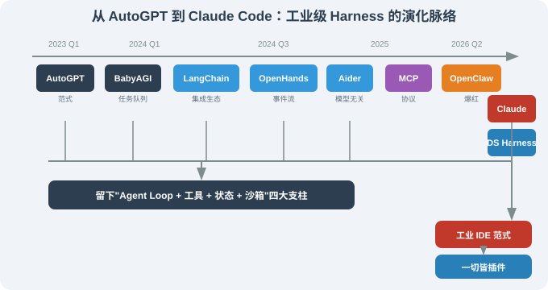

# 16.1 工业级 Harness 的前世：从 AutoGPT 到 Claude Code

> 🛠️ *"Claude Code 不是凭空冒出来的，它站在 AutoGPT、BabyAGI、OpenHands 这一连串项目的肩膀上。"*

---

## 一、为什么本章从 AutoGPT 开始

很多读者第一次看到 Claude Code，会觉得它"突然就出现了"。其实不是——它是**一连串 Agent 框架 / Harness 演化的最近一棒**。理解这条脉络，才能看懂 Claude Code"做了什么新的事"、又"延续了哪些老范式"。

本章把这条脉络梳理清楚——从 2023 年的 AutoGPT / BabyAGI 一路讲到 2026 年的 Claude Code，让你明白：

- Claude Code **不是**"AI 编程工具的首创"——它首开的是"工业级 Claude 系 IDE 范式";
- 一路上每个项目都贡献了 1~2 个核心范式（事件流 / 状态图 / 代码即动作 …）；
- 这些范式今天依然在 Claude Code 里"埋伏"着——你想真正理解它，先得认识它们。

---

## 二、AutoGPT（2023 年 4 月）——"Agent"概念的破圈

### 2.1 它是什么

**AutoGPT** 是 Significant Gravitas 在 2023 年 4 月发布的开源项目——本质上就是"让 GPT-4 + 一堆工具 + 一个持续运行的循环"组合在一起。它的意义不在于"做到什么"，而在于**让'Agent'这个词进入主流视野**。

GitHub 上 AutoGPT 的最早几次 commit 让人觉得（现在回看）几乎粗糙：

```python
# AutoGPT 早期 main loop（简化复刻）
while True:
    response = llm(prompt=PROMPT_TEMPLATE.format(history=...))
    action = parse(response)
    if action.type == "finish":
        return action.result
    result = execute(action)
    history.append((action, result))
```

但 2023 年 4 月那个时间点，**没人见过 Agent 自己执行 + 自己继续决策 + 试图长期跑下去** 的真实运行。

### 2.2 AutoGPT 的范式遗产

尽管 AutoGPT 在工程上很快被证明"完不成严肃任务"（循环非常容易跑偏、token 消耗巨大、没有持久状态），它留下的几个核心抽象在今天仍然成立：

- **Agent Loop** ——"思考-行动-观察"循环作为 Agent 的最小可执行单元；
- **Tool Taxonomy** ——一套统一的工具描述 schema，让 LLM 自选调用；
- **Memory Layer** ——把对话历史抽象为向量 / 摘要数据库；
- **Goal-Directed Loop** ——给系统一个 goal，子目标由 LLM 自生。

> 📌 **AutoGPT 真正改变的不是工程，是术语。** 在它出现之前，叫"AI assistant""chatbot"；在它之后，"Agent"成为一个新的产品门类。

### 2.3 AutoGPT 暴露的问题

- **失败成本**：每轮 LLM 决策错误 → 累计 token 消耗是 GPT-4 的 10–100 倍；
- **不可恢复**：循环跑偏后无法回到之前的稳定点（没有检查点）；
- **不可观测**：开发者看着 token 在燃烧但只能干瞪眼。

---

## 三、BabyAGI（2023 年 4 月）——任务管理型 Agent 的雏形

### 3.1 它是什么

**BabyAGI** 由 Yohei Nakajima 在 2023 年 4 月发布——比 AutoGPT 晚了几天，但思路完全不同：它的核心循环是 **"从任务队列取下一个 → LLM 执行（带上下文）→ 把结果存入向量存储 → 重新生成任务 → 循环"**。

BabyAGI 的核心创新是**"任务分解 + 任务队列"**——它把 AutoGPT 模糊的"goal"具体化成"task list"，然后让 LLM 不断**生成新任务、消费旧任务**。

### 3.2 BabyAGI 留下的两个抽象

1. **Task as first-class citizen**——任务不再只是 prompt 里的字符串，而是数据结构（包含 description / status / result）；
2. **Re-prioritization loop**——让 LLM 在每次循环中重排任务优先级。

这两个抽象后来在 LangChain 的 PlanAndExecute（第 5 章）、AutoGen 的 Task 抽象、Claude Code 的 Sub-Agent 里都有体现。

---

## 四、OpenHands（原 OpenDevin，2024 年 3 月）——第一个"行动型"开源 Agent

### 4.1 它是什么

**OpenHands**（早期叫 OpenDevin）是 2024 年 3 月由 All-Hands-AI 团队发布的开源项目——它面向"软件工程 Agent"，主张 Agent 应该在真实环境里**读代码、改代码、跑命令**。

这是"行动型 Agent"在软件工程场景的第一棒。

### 4.2 OpenHands 的核心抽象

OpenHands 给后来所有行动型 Agent 都提供了至少 5 个抽象：

1. **EventStream（事件流中枢）**
   ```python
   # 简化
   async def agent_loop(state):
       while state.status == "running":
           action = await llm.decide(state)
           observation = await runtime.execute(action)   # runtime 是沙箱
           state.append(ActionEvent(action))
           state.append(ObservationEvent(observation))
   ```

2. **Sandbox Runtime** —— 默认 Docker 沙箱（`cap-drop ALL`、`no-new-privileges`），跑命令不会泄漏到主机；

3. **LiteLLM 模型抽象** —— 接入 100+ 模型；
   ```python
   from litellm import completion
   response = completion(
       model="gpt-4.1",
       messages=[...],
   )
   ```

4. **LLMSummarizingCondenser** —— 上下文压缩的关键模块，超过 N 轮就触发摘要；

5. **Action Type System** —— 每个动作（FileWriteAction / CmdRunAction / IPythonAction 等）是一个 Pydantic 模型，LLM 输出按 schema 解析。

### 4.3 OpenHands 的直接继承者

OpenHands 直接影响了后来的：

| 项目 | 继承了什么 |
|------|----------|
| **Claude Code** | 事件流 + 沙箱 + Action Type |
| **Aider** | 终端原生 + LiteLLM 接入 |
| **Continue.dev** | 多模型 + Action Type |
| **Devin** | 商业化版本 |

### 4.4 一个外延观察

OpenHands 是"行动型 Agent"在开源生态的第一个成熟样本。它让"Claude Code 后面才有的很多东西"在开源里就被讨论过了——只是没有人能像 Anthropic 那样把工程做到"终端用户体验上的极致"。

---

## 五、AutoGen（2023 年底—2024）——多 Agent 对话框架

### 5.1 它是什么

**AutoGen** 是 Microsoft Research 在 2023 年底发布的"多 Agent 协作框架"——它强调"用对话本身完成多 Agent 协作"。每个 Agent 是一个 actor，actor 之间通过对话消息协作。

```python
# AutoGen 简化示例
from autogen import AssistantAgent, UserProxyAgent

assistant = AssistantAgent("assistant", llm_config=...)
user_proxy = UserProxyAgent("user_proxy", code_execution_config={"use_docker": True})

user_proxy.initiate_chat(assistant, message="读 ./src/ 帮我找出性能问题")
```

### 5.2 AutoGen 与 Claude Code 的关系

AutoGen 是**通用框架**——它可以构建任何 Agent 协作；Claude Code 是**特定产品**——它把"软件工程"场景的协作固化下来。

Claude Code 没有"采纳" AutoGen 的代码，但**继承了**它的几个思想：

1. **Role-based Agent** —— 系统里多个"角色"：主 Agent / Sub-Agent / Bash Runner / Tool 各自独立；
2. **Group Chat Pattern** —— 主 Agent 知道可以派遣 Sub-Agent 处理复杂子任务；
3. **Code Execution in Sandbox** —— Docker / Sandbox 里跑 Python / Shell 是 AutoGen 早就在做的。

### 5.3 AutoGen 在本书的位置

AutoGen 的"对话编排"思想后来在第 19 章"Agent 通信协议"里会和 MCP / A2A / ANP 协议联系起来。本章只是铺垫。

---

## 六、CrewAI（2024 年初）——角色扮演式框架

### 6.1 它是什么

**CrewAI** 把"多 Agent 协作"建模为"团队"——`Agent`（角色）+ `Task`（任务）+ `Crew`（团队）/ `Flow`（事件驱动工作流）。

```python
# CrewAI 简化
researcher = Agent(role="Researcher", goal="Find facts about X", backstory="...")
writer = Agent(role="Writer", goal="Write article from research", backstory="...")

crew = Crew(agents=[researcher, writer], tasks=[research_task, writing_task])
result = crew.kickoff()
```

### 6.2 角色化思想的影响

CrewAI 让"角色扮演"成为 Agent 协作的一种产品化路径。Claude Code 用的不是这种"人类角色"建模，而是"工程角色"建模：

| 维度 | CrewAI | Claude Code |
|------|--------|-------------|
| **角色示例** | "研究分析师" | "Sub-Agent" / "Bash Runner" |
| **决策依据** | LLM 决定下一步交给谁 | 主 Agent 显式派遣 |
| **典型场景** | 内容生产 / 销售流程 | 软件工程 |

这种"工程角色"建模让 Claude Code 比 CrewAI **更可预测、更易调试**——这是为什么它能被软件工程师接受的关键。

---

## 七、MCP 与 A2A 协议（2024 年 11 月）——Agent 互操作的早期雏形

### 7.1 为什么提 MCP？

Claude Code 在 2025 年 H2 大力推广 **MCP**（Model Context Protocol），让"Agent 接入外部工具"成为开放协议。本书第 17 章（Agent 通信协议）会专章讲。本节**先**把它当作"Claude Code 之前就有的'Agent 互操作'思路"。

MCP 的核心思想其实早就散见在 OpenHands 的"工具注册"、LangChain 的"ToolGroup"、AutoGen 的"Function Schema"里——**Claude Code 把它们标准化为协议**，并让生态做出来。

### 7.2 协议抽象的三个关键点

MCP 的核心抽象是：**LLM 驱动的 Agent 不再直接调用外部工具，而是通过 ToolRegistry 走一个「协议层」，由协议层转发给外部工具（MCP Server）**。协议层的价值在于——它让"工具"和"Agent"解耦：Agent 不需要知道工具的实现在哪、用什么语言写的，只要会讲 MCP 协议就行。

这一点在第 17 章会展开。这里只需要知道：**Claude Code 没有发明互操作，但把互操作标准化了**。

---

## 八、把整条脉络画成一张图



要点：

1. **任何一个现代 Harness / 框架都不是凭空发明的**——它们都站在 AutoGPT / BabyAGI / OpenHands 的肩头。
2. **2024 年之后的差异化是产品形态**——同样是"事件流 + 工具 + 沙箱 + 状态"，Claude Code 选了 IDE，OpenClaw 选了聊天 App，Hermes 选了自进化，DeepSeek 选了插件化。
3. **理解 Claude Code 的关键是回头看 OpenHands**——如果 OpenHands 没把"事件流 + Action Type"做出来，Claude Code 的六层架构不会是现在这样。

---

## 九、本节小结

| 主题 | 关键要点 |
|------|---------|
| AutoGPT | 破圈者，留下 Agent Loop / Tool Taxonomy / Memory Layer / Goal Loop |
| BabyAGI | 把任务管理抽象成 first-class 数据结构 + 重新优先级化 |
| OpenHands | 第一个"行动型"开源 Agent；事件流 + 沙箱 + LiteLLM + Action Type 是后续项目的母模板 |
| AutoGen | 通用多 Agent 框架，把"对话编排"做出来 |
| CrewAI | "角色扮演"的多 Agent；Claude Code 走"工程角色"路线 |
| MCP | Claude Code 把"工具互操作"标准化为协议 |
| 关键启示 | Claude Code 不是凭空发明，是站在 5 年开源积累之上 |

---

*下一节：[16.2 认识 Claude Code：从零到上手](./02_introduction.md)*
