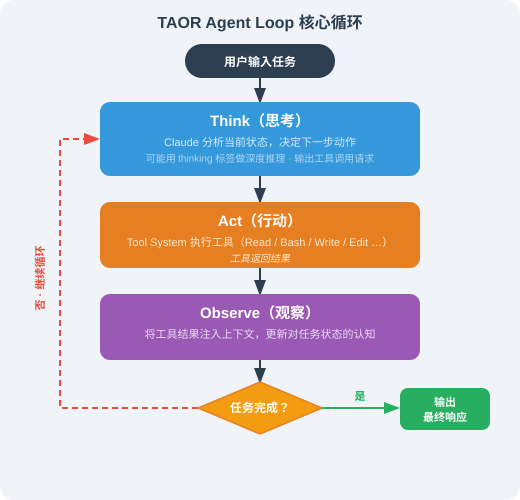

# 16.3 核心架构深度解析

> 🏗️ *"最好的架构，是那些设计决策隐形到——你只有在出错时才会注意到它们。"*  
> —— 源自 Claude Code 源码注释（社区源码分析可见）

---

## 从外到内：Claude Code 是怎么运行的？

当你在终端输入 `claude` 并按下回车，接下来发生了什么？

表面上看，你得到了一个交互式的 AI 助手。但在这背后，运行着一套精心设计的六层架构，处理着从用户输入到 LLM 推理、工具执行、权限控制的完整流程。

社区对源码的分析，让工程师们第一次完整地看到了这套系统的全貌。**这一节我们把它拆开，看它"怎么跑"**——而不是"有什么功能"。

---

## 一、六层分层架构总览

Claude Code 采用严格的六层分层架构，每一层职责清晰、边界明确：


| 层 | 职责 | 关键模块 |
|----|------|---------|
| **入口层** | 解析启动参数，决定运行模式 | `setup.ts`（CLI/Headless/MCP/SDK 四种模式） |
| **展示层** | 终端 UI 渲染 | React + Ink（约 5005 行组件） |
| **QueryEngine** | 与 LLM 交互的全部逻辑 | 上下文管理、流式推理、压缩 |
| **执行层** | 工具执行 + 权限控制 | 52 个工具 + 6 阶段权限流水线 |
| **协作层** | 子 Agent 派遣 | Sub-agents、SendMessage |
| **管理层** | 配置、状态、日志 | CLAUDE.md、settings.json |

**技术栈**：TypeScript + Bun 运行时（而非传统 Node.js），通过 esbuild 打包为单一 `cli.js` 文件分发。

> **为什么用 Bun 而不是 Node.js？** Bun 的启动速度快一个数量级——CLI 工具每次键入命令都要重新启动进程，启动速度直接决定用户体验。这是"CLI 场景选运行时"的一个典型决策：**不是看生态，而是看冷启动时间**。

---

## 二、运行主链路：一次请求的完整旅程

理解 Claude Code 最直接的方式，是跟踪一次用户输入从进入到响应的完整路径：


这个循环可以持续数十轮甚至更多，直到 Claude 判断任务完成或用户中断。

---

## 三、TAOR Agent Loop：核心循环详解

TAOR（Think → Act → Observe → Repeat）是 Claude Code 的执行核心，也是它区别于"一问一答"式 AI 的根本所在：



### 3.1 一次完整的 TAOR trace

用户输入"帮我看看 `src/main.ts` 里有没有内存泄漏，有的话修掉"。完整循环是这样的：

```
[Think]  Claude 分析任务：要"看"文件 → 读文件；要"判断泄漏" → 需要理解代码
[Act]   并行调用 3 个工具：Read(src/main.ts) + Glob(src/**/*.ts) + Grep("setInterval|addEventListener")
[Observe] 拿到 3 个工具的结果：main.ts 全文 + 所有 ts 文件列表 + 可疑监听点
[Think]  Claude 分析：发现 main.ts 第 42 行有个 setInterval 从没被 clearInterval 清掉 → 判断是泄漏
[Act]   调用 Edit(main.ts, "加 clearInterval 逻辑")
[Observe] Edit 返回成功 + diff
[Think]  Claude 判断：修复完成，任务结束
[Repeat 终止] 输出总结给用户
```

**关键设计细节**（对照这个 trace 理解）：

| 设计 | trace 中的体现 | 为什么 |
|------|--------------|--------|
| **并行工具调用** | 第 2 步同时 Read + Glob + Grep | 三个操作互不依赖，串行要等 3 次往返，并行只要 1 次 |
| **循环上限**（约 200 轮） | 如果一直修不好，最多循环 200 轮 | 防止无限循环烧 token |
| **状态感知** | 第 4 步 Think 时能看到第 1-3 步的全部结果 | 每次循环看到"累积的完整上下文"，不是只有最新一步 |
| **中断机制** | 用户随时 ESC/Ctrl+C | 让用户保留最终控制权 |

### 3.2 为什么 TAOR 是"区别于问答式 AI"的根本

一问一答式的 AI（比如早期 ChatGPT）是：**输入 → 一次推理 → 输出**，它不会"回头看自己做了什么"。

TAOR 的关键在于 **Observe（观察）这一环**：Claude 每执行一个工具，都要**观察工具的结果，再决定下一步**。这让它从"预测下一个词"变成了"根据环境反馈持续决策"——这是 Agent 和普通 LLM 的本质区别。

> 对比本书第 5 章的 ReAct，TAOR 就是 ReAct 的一个具体工业实现：Think 对应 Reasoning，Act 对应 Acting，Observe 对应 Observation。**理解了 ReAct，TAOR 只是"加上了并行工具调用 + 循环上限 + 权限拦截"的工程加固版**。

---

## 四、QueryEngine：约 46,000 行的大脑

QueryEngine 是 Claude Code 中最核心、最复杂的模块，约 4.6 万行 TypeScript（以源码为准，随版本变化），承担了几乎所有与 LLM 交互相关的核心逻辑。

### 4.1 核心职责（接口骨架示意）

> 下面代码是**接口骨架**（`buildContextWindow` / `processStream` 等方法只列职责、未展开实现），用来展示 QueryEngine 各职责如何串联，不是可运行的完整源码。Claude Code 闭源，这些是社区源码分析的归纳。

```typescript
class QueryEngine {
  // 1. 会话状态管理：保存完整对话历史 + 会话 ID
  private conversationHistory: Message[];
  private sessionId: string;

  // 2. 核心方法：提交用户消息
  async submitMessage(userInput: string): Promise<void> {
    // ① 构建完整上下文（System Prompt + 历史 + 新消息）
    //    注意：System Prompt 是动态生成的——它要带上当前可用的工具 schema
    const messages = this.buildContextWindow();

    // ② 流式调用 Anthropic API
    //    stream() 而不是 invoke()：边生成边返回，用户体验"打字机"效果
    const stream = await anthropic.messages.stream({
      model: this.model,
      messages,
      system: await getSystemPrompt(this.tools, this.model),  // 动态 system prompt
      tools: this.tools.map(t => t.definition),                // 工具 schema 也动态注入
    });

    // ③ 处理流式响应（区分"文本输出"和"工具调用"）
    await this.processStream(stream);
  }

  // 3. 上下文预算控制：超阈值就压缩
  private checkContextBudget(): void {
    const usage = this.calculateContextUsage();
    if (usage > 0.4) {  // 40% 触发压缩
      this.triggerCompaction();
    }
  }
}
```

**逐段解读**：

| 代码 | 做了什么 | 为什么 |
|------|---------|--------|
| `buildContextWindow()` | 拼装 System Prompt + 历史 + 新消息 | 上下文窗口是 LLM 唯一的信息来源，拼装质量决定回答质量 |
| `getSystemPrompt(this.tools, this.model)` | **动态**生成 system prompt | 工具集变了（装了新 MCP），system prompt 也要变——不能写死 |
| `messages.stream()` | 流式调用 | 边生成边渲染，用户不用等完整回复 |
| `tools.map(t => t.definition)` | 把工具定义注入请求 | LLM 要知道"有哪些工具可用"才能调用 |
| `checkContextBudget()` | 超 40% 触发压缩 | 上下文是有限资源，必须主动管理 |

### 4.2 三级上下文压缩策略

当上下文窗口利用率升高时，QueryEngine 会按需触发压缩：

| 级别 | 触发条件 | 策略 | 信息保留 |
|------|---------|------|---------|
| **microcompact** | 利用率 > 40% | 轻量摘要 | 保留关键决策和文件变更记录 |
| **autocompact** | 利用率 > 60% | 深度压缩 | 只保留最重要的上下文摘要 |
| **full compact** | 手动 `/compact` 或利用率 > 80% | 完全重置 | 只保留核心状态，重新加载 CLAUDE.md |

**为什么分三级，而不是一超就压？** 因为压缩是有损的——摘要会丢失细节。三级策略让"能保留就保留，实在放不下才逐级压缩"，在**上下文长度**和**信息完整性**之间做权衡。这和第 14.3 节 OpenClaw 的三级压缩是同一种思路。

**长期记忆（memdir）**：独立于上下文压缩，用于跨会话持久化重要信息，会话结束后写入磁盘，下次会话恢复。它和"上下文压缩"的区别是：压缩是**当前会话内**的临时处理，memdir 是**跨会话**的永久记忆。

---

## 五、Tool System：工具执行引擎

### 5.1 工具调用生命周期


### 5.2 内置工具分类

Claude Code 内置一组工具（数量以版本为准），按类型分组：

**文件操作类**（最常用）：
- `Read`：读取文件，支持行号范围、PDF、图片、Jupyter Notebook
- `Write`：写入/覆盖文件（使用前必须先 Read）
- `Edit`：精确字符串替换（比 Write 更安全，只发送 diff）
- `Glob`：文件模式搜索（`**/*.tsx`）
- `Grep`：内容搜索（基于 ripgrep，支持正则）

**执行类**：
- `Bash`：执行任意 Shell 命令（受权限控制）

**Agent 协作类**：
- `Agent`：创建并派遣子 Agent
- `SendMessage`：向 teammate 发送消息
- `TaskCreate/Update/List`：任务管理

**UI 交互类**：
- `AskUserQuestion`：向用户提问（支持单选/多选/代码预览）
- `EnterPlanMode`：进入规划模式等待用户审批

### 5.3 FileEditTool 的"先读再改"原则

这是 Claude Code 中一个重要的工程约束，值得单独讲透：

> **编辑任何文件之前，必须先调用 Read 工具读取该文件的当前内容。**

这不是提示词层面的"建议"，而是**工具层面的强制约束**——如果没有先 Read，Edit 工具会直接返回错误。为什么要这样设计？三个原因：

1. **防止基于"假设内容"盲目修改**：LLM 如果不读文件就直接 Edit，它改的可能是"它以为文件长这样"，而不是"文件实际长这样"；
2. **确保 `old_string` 真的存在**：Edit 工具要求你提供要替换的原文（`old_string`），如果没读过文件，你给的 `old_string` 大概率匹配不上，Edit 就会失败；
3. **避免版本不一致**：文件可能在你上次读之后被别人改过，先读能拿到最新版本。

**这背后的设计哲学**：**把"正确的使用方式"从"靠 LLM 自觉"变成"靠工具强制"**。LLM 可能会忘记"先读再改"，但工具不会——它会直接拒绝。这和 14.3 节 OpenClaw 的"白名单拦截 rm"是同一思路：**安全边界交给代码，而不是交给模型自律**。

---

## 六、React + Ink：为什么用 React 渲染终端？

一个令人意外的架构决策：Claude Code 使用 **React + Ink** 来构建终端 UI。

### 6.1 Ink 是什么？

[Ink](https://github.com/vadimdemedes/ink) 是一个允许用 React 组件构建命令行界面的库。它把 React 的虚拟 DOM 映射到终端的 ANSI 转义码输出：

```tsx
// Claude Code 的终端输出就是这样生成的
function ConversationView({ messages }: Props) {
  return (
    <Box flexDirection="column">
      {messages.map(msg => (
        <MessageBlock
          key={msg.id}
          role={msg.role}
          content={msg.content}
          isStreaming={msg.isStreaming}   // 流式输出时高亮
        />
      ))}
      <InputBox onSubmit={handleSubmit} />
    </Box>
  );
}
```

### 6.2 为什么选这个方案？

| 理由 | 说明 |
|------|------|
| **实时更新** | React 的响应式更新让流式渲染变简单——LLM 每输出一个 token，只需更新 state，React 自动 diff 并刷新终端 |
| **复杂交互** | 单选/多选提示、代码预览、进度条等复杂交互，用 React 组件描述比手写 ANSI 转义码清晰得多 |
| **代码复用** | 部分 UI 逻辑可在 CLI 和 Web 版本之间复用 |
| **开发效率** | Anthropic 团队熟悉 React，用 Ink 复用已有知识 |

**代价**：5005 行 React 组件、22 层嵌套深度，是 Claude Code 代码库里最复杂的部分之一。

> 💡 **这里有一个反直觉的工程启示**：终端 UI 听起来"简单"，但 Claude Code 用了 React + 5005 行代码来渲染它。**因为流式输出 + 实时交互 + 复杂组件（代码块、diff 预览、进度条）的组合，手写 ANSI 会变成维护噩梦**——这时候"用熟悉的高级抽象"（React）反而比"用底层的简单工具"（ANSI）更划算。

---

## 七、四个入口模式

`setup.ts` 在启动时根据参数决定以哪种模式运行：

| 入口模式 | 触发方式 | 特点 |
|---------|---------|------|
| **CLI 模式** | 直接运行 `claude` | 交互式终端 UI，支持所有功能 |
| **Headless 模式** | `claude -p "..."` 或 `--print` | 无 UI，适合 CI/CD，单次任务执行 |
| **MCP Server 模式** | `claude --mcp-server` | 以 MCP 服务端形式运行，供其他工具调用 |
| **SDK 模式** | 通过 Agent SDK 调用 | 被另一个 Claude Code 实例作为子 Agent 调用 |

**为什么需要 Headless 模式？** 因为 CI/CD 里没有"终端交互"这回事——你没法在流水线里等用户按 ESC。`claude -p "跑测试并修复失败"` 让 Claude Code 变成**脚本里的一个命令**，这是它从"交互工具"走向"自动化组件"的关键一步。

---

## 小结

| 概念 | 要点 |
|------|------|
| **六层架构** | 入口→展示→QueryEngine→执行→协作→管理，职责清晰分层 |
| **TAOR 循环** | Think→Act→Observe→Repeat，Observe 是区别于"问答式 AI"的关键 |
| **QueryEngine** | 约 46K 行核心引擎，动态 system prompt + 流式推理 + 三级压缩 |
| **Tool System** | 52 个工具，"先读再改"是工具层强制约束而非提示词建议 |
| **React + Ink** | 用 React 渲染终端，流式更新 + 复杂交互 |
| **四入口** | CLI / Headless / MCP Server / SDK |

> 💡 **核心洞察**：Claude Code 的架构将"AI 智能"（QueryEngine）和"可靠执行"（Tool System + 权限管理）明确分层——这正是第 8 章 Harness Engineering 的工程哲学在实践中的体现。**"先读再改"和"白名单拦截 rm"是同一个原则的两种表现：把安全边界交给代码，而不是交给模型自律。**

> 💡 **延伸阅读**：关于 Computer Use 和 GUI Agent 的核心循环与安全边界设计，详见 [25.5 Computer Use 与 GUI Agent](../chapter_25_multimodal/05_computer_use_agent.md)。

---

*上一节：[16.2 认识 Claude Code：从零到上手](./02_introduction.md)*  
*下一节：[16.4 System Prompt、权限工程与 Prompt Cache](./04_system_prompt_and_permissions.md)*
