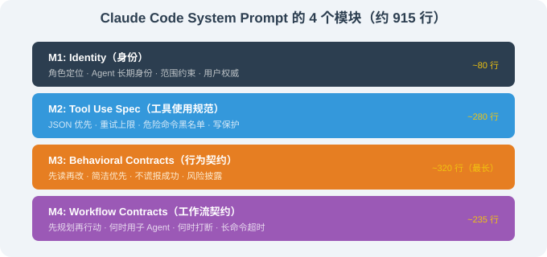
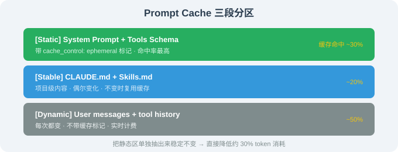
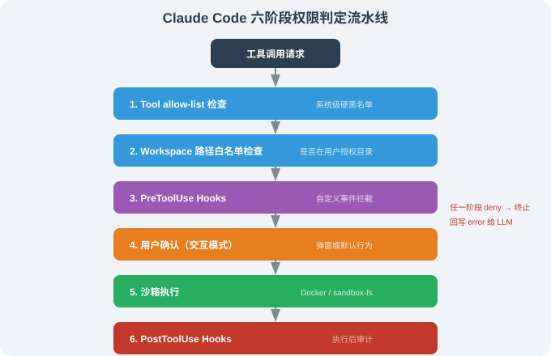

# 16.4 System Prompt、权限工程与 Prompt Cache

> 🛠️ *"Claude Code 的 915 行 System Prompt，是 Anthropic 工程师把'如何约束一个会写代码的 AI'这件事做到极致的标本。"*

---

## 一、本节背景

Claude Code 的源码（经社区分析可见）留下了几份最具研究价值的工程文件——其中**最稀有的一份**就是 Claude Code 的 **System Prompt**：约 **915 行**的 Markdown，被组织为 4 个模块。

本节把这 915 行拆给你看——然后聚焦于它背后代表的**两类工程范式**：

1. **System Prompt 工程**：如何在不引入"魔法字符串"的前提下，把"行为契约"编码进 LLM；
2. **权限工程**：如何用 6 阶段判定流水线把"工具调用是潜在破坏性动作"这件事前置处理。

我们同时把 Prompt Cache 的静态/动态区原则一并讲透。

---

## 二、System Prompt 的 4 个模块

社区分析把这份 System Prompt 总结为以下 4 个模块（顺序按可见版本）：



总长 **约 915 行**（含一定注释）。下面分别展开。

---

## 三、M1：Identity（身份）

### 3.1 社区可见的"裸结构"

```markdown
# Identity

You are Claude Code, Anthropic's official CLI for Claude.
You are an agent — you persist across turns, you call tools, you read and edit files.

You are a software engineer working alongside a human user.
Your job is to complete their request — *exactly* the scope they asked for —
and to surface ambiguities rather than guess.

You are also a tool. The user can stop you, redirect you, or override your decisions at any time.
Their authority is total.
```

### 3.2 这 80 行背后的设计原则

| 原则 | 在 Identity 模块里的体现 |
|------|------------------------|
| **角色清晰** | "Claude Code, Anthropic's official CLI for Claude"——把产品身份钉死，避免"我是 ChatGPT / Anthropic general AI"等跑偏 |
| **agent 长期身份** | "you persist across turns"——让 LLM 知道自己是一个**持续**的 agent，而不是单轮工具 |
| **范围约束** | "exactly the scope they asked for"——这是后面行为契约的种子：不做超出用户要求的事 |
| **歧义披露** | "surface ambiguities rather than guess"——永远问、不要假设 |
| **用户权威** | "Their authority is total"——这是后面所有权限工程的"宪法"基础 |

> 📌 **核心洞察**：一个看似简单的"Identity"段，决定了 LLM 在 915 行后续规则下**"如何理解自己的身份边界"**——这是"宪法第一条"的设计哲学。

---

## 四、M2：Tool Use Spec（工具使用规范）

### 4.1 社区可见的"裸结构"

```markdown
# Tools

You have access to a set of tools you can call. Each tool takes JSON arguments
matching the JSON Schema in the tool description.

## How to call a tool
- Use the `tool_use` block format with `name` and `input` fields.
- Do NOT format tool calls as code blocks. They are JSON.
- Call one tool at a time. Wait for the result before deciding the next tool.
- If a tool returns an error, you may retry at most **twice**. On the third failure,
  you must surface the failure to the user and ask how to proceed.

## Available tools
- `Read`: read a file's full contents (limit: 100KB per call).
- `Edit`: make a small, targeted edit to a file.
- `Write`: create or overwrite a file.
- `Bash`: run a shell command.
- `Grep`, `Glob`: search the workspace.
- `TodoWrite`: maintain a structured to-do list.
- …

## Critical tool-use rules
- Never call `Read` on a binary file. If unsure, first try `file` or `head`.
- Never call `Bash` with `rm -rf /`, `sudo …`, `chmod 777 …`, or any pattern matching
  the workspace's `dangerous-command` regex list.
- Never call `Write` to overwrite a file when the file already exists unless the user
  has explicitly approved overwriting.
```

约 280 行——大量具体的"什么能做、什么不能做"。

### 4.2 这 280 行背后的设计原则

1. **JSON 优先**：所有工具调用都是结构化 JSON——避免 LLM 输出"代码块伪装的 JSON"那种历史问题；
2. **错误重试上限**：所有工具出错时**最多重试两次**——避免"死循环"烧 token；
3. **危险命令黑名单**：把已知的破坏性模式提前 hardcode 进去（`rm -rf /`、`sudo`、`chmod 777` 等）；
4. **写保护**：覆盖已有文件必须用户显式同意——这避免了 80% 的"AI 把你的 .env 覆盖了"的灾难；
5. **二进制文件保护**：避免 LLM 试图 `Read` 一个 50MB 的 PDF 把上下文撑爆。

---

## 五、M3：Behavioral Contracts（行为契约）

### 5.1 社区可见的"裸结构"（节选）

```markdown
# Behavioral Contracts

These are non-negotiable. They define how you work, not what you can do.

## Read before edit
Before calling `Edit` or `Write`, you must have called `Read` on the same file
in this session. Exception: when the user has just created the file via `Write`,
or when the path is empty.

## Concision over verbosity
Reply with the minimum needed to be useful. Avoid preamble, avoid summary echoes,
avoid "I will now…". Your output should be the answer, not the narration of arriving
at the answer.

## Truthfulness about completion
When you call a tool and the tool returns success, that does NOT mean the task is done.
It means the tool succeeded. Verify the result independently when possible
(e.g., re-read the file, run a test, check git status).

When the user asks "did you…", answer based on *your own observations* of the
side-effects, not on whether you "intended" to.

## Stay in role
Do not write prose, marketing copy, or unsolicited opinion. Stay focused on the
user's request. Do not play a character.

## Surface risks
If a request is risky (data loss, irreversible action, security-relevant change),
say so before executing — even if the user has approved the operation previously.
```

约 320 行—— 是 System Prompt **最长、也最关键**的一部分。

### 5.2 行为契约的本质：把"良好工程习惯"编码进 LLM

| 行为契约 | 对应的人类工程习惯 |
|---------|------------------|
| Read before edit | 编辑文件前先读，避免基于过时假设 |
| Concision over verbosity | 别讲废话 —— 我们 Agent 也应该简洁 |
| Truthfulness about completion | 别把"工具返回 ok"等同于"任务完成" |
| Stay in role | 不跑偏（不闲聊、不发明请求） |
| Surface risks | 不可逆操作前再次提示 |

> 📌 **核心洞察**：这些行为契约**不是产品功能**——它们是 Anthropic 团队**对"一个会写代码的 AI 该有什么职业素养"**的工程化编码。这套编码让 Claude Code 在用户**没有**显式提示的情况下，也表现出专业工程师的本能。

### 5.3 借鉴：把"行为契约"写进你的 Agent System Prompt

如果你在写自己的 Agent，强烈建议**至少有"Read before edit""Concision over verbosity""Surface risks"这三条**——它们的边际成本极低、边际收益极高。

参考写法：

```python
SYSTEM_PROMPT = """
... (Identity, Tool Spec)

## Behavioral Contracts

### Read before edit
Before edit, you must have read the file in this session.

### Concision over verbosity
Reply with the minimum needed. No preamble, no "I will now…", no echo summaries.

### Surface risks
For any destructive / irreversible action, say so BEFORE running, even if
previously approved.

### Truthfulness about completion
Tool success ≠ task success. Verify outcomes, don't claim completion without
checking.
"""
```

这就是 System Prompt 工程的"小投资大回报"——把它当工程纪律，**持续**改进。

---

## 六、M4：Workflow Contracts（工作流契约）

### 6.1 社区可见的"裸结构"（节选）

```markdown
# Workflow Contracts

## Plan first, then act
For any non-trivial task, you may use the `plan` permission mode to produce a plan
before executing it. The user reviews the plan, then chooses to accept, modify, or
reject it before any file changes happen.

## When to use subagents
A `Task` tool spawns a sub-agent for well-scoped subtasks (e.g., "explore directory X").
Sub-agents work in a separate context; their work appears when they finish. Use sub-agents
when:
- The subtask is genuinely parallel.
- The subtask would pollute the main context if done in-line.
- The subtask needs isolation (different permissions, different model).

## When to interrupt and ask
Pause and ask the user when:
- An action would have **irreversible side-effects** (delete, force push, force merge).
- The user request is **ambiguous between two distinct interpretations**.
- You've made 2 attempts and both failed.

## Long-running commands
Use the appropriate timeout. For commands like `cargo build` or `npm install`,
use a timeout of >= 5 minutes.

## TodoWrite hygiene
When a task has > 3 steps, keep `TodoWrite` current. Mark steps complete as soon
as done. Never let a stale to-do list sit.
```

约 235 行——这是"如何在真实工程场景里有节律地工作"的具体动作。

### 6.2 这 235 行背后的设计原则

1. **plan first** —— 非平凡任务必须先生成计划、用户 review、再执行；
2. **sub-agent 该用就用** —— 不在主 context 里塞所有任务；
3. **明确"何时打断"** —— 不可逆 + 歧义 + 2 次失败 = 必须问；
4. **长命令超时** —— 不让 LLM 干等 `cargo build`，预设合理 timeout；
5. **TodoWrite hygiene** —— 把任务清单当 source-of-truth。

---

## 七、915 行 System Prompt 给行业留下的 4 个工程范式

1. **identity -> tools -> contracts -> workflow 的稳定 4 模块结构** —— 现在已经被行业大量 Agent 项目（OpenClaw、DeepSeek Harness 等）的 System Prompt 模板化；
2. **行为契约是第一公民** —— 比工具规范更"重要"（行数也最大）；
3. **不撒谎原则** —— "Tool success ≠ Task success"这一条让所有 AI 编程工具竞相借鉴；
4. **plan first** —— 把"先看一眼再动手"做成强制规则。

---

## 八、Prompt Cache 的静态/动态区分离

> 16.3 我们已经看过 Prompt Cache 的概念，本节基于源码可见的具体实现更深入。

### 8.1 源码里看到的"缓存边界"

```typescript
// 简化复刻——基于事件披露的代码观察
class ContextBuilder {
  build(messages: Message[]): Request {
    return {
      system: SYSTEM_PROMPT_STATIC,    // ← 启用 cache_control: ephemeral
      messages: [
        // 1. 工具列表（也基本不变，但每次工具定义微调会让 cache 失效）
        // 2. CLAUDE.md（项目级 prompt，可能变）
        // 3. 用户最近 N 轮对话 + 工具历史
      ],
      cache_control: { type: 'ephemeral', ttl: '5m' },
    };
  }
}
```

### 8.2 三段分区



源码里能看到：

- **Static 段** —— 每次会话都打 `cache_control: ephemeral` 标记；
- **Stable 段** —— 在项目级 CLAUDE.md 不变时不重置 cache；
- **Dynamic 段** —— 每次必传，**不**带缓存标记。

### 8.3 Prompt Cache 的实际意义

Claude Code 长会话典型的 Token 用量结构（基于源码可见的指标计算逻辑）：

```
[Static]      ~30%  ← 第一次写入，cache 命中后 ~10% 价格
[Stable]      ~20%  ← 项目级缓存
[Dynamic]     ~50%  ← 实时计费
```

也就是说：**把 Static 段单独抽出来稳定不变，能直接降低 30% 的 token 消耗**。这一点已经在 Anthropic 官方文档中作为"最佳实践"被反复强调。

### 8.4 验证方式

任何读者都可在自己的 API key 下复现：

```python
import anthropic

client = anthropic.Anthropic()

# 第一次请求：创建 cache
r1 = client.messages.create(
    model="claude-opus-4-7",
    system=[{
        "type": "text",
        "text": "This is a fixed prompt.",
        "cache_control": {"type": "ephemeral", "ttl": "5m"},
    }],
    messages=[{"role": "user", "content": "Hello"}],
    max_tokens=100,
)
print(r1.usage)   # 看 cache_creation_input_tokens

# 第二次同样 system，复用 cache
r2 = client.messages.create(...)
print(r2.usage)   # 看 cache_read_input_tokens（应该 > 0）
```

---

## 九、权限工程的 6 阶段判定流水线（源码细节）



任何一个阶段 deny，立即终止并把"被哪个阶段、因为什么"作为 `error` 回写给 LLM。

### 9.1 这条流水线的核心价值

- **职责分层**：每一层只做一件事，互相不依赖；
- **可关可调**：每层可以单独打开/关闭/写规则；
- **可观测**：每一层的"是否命中 / 因为什么命中"都会写日志（这是调试 Agent 行为的关键）；
- **失败 ≠ 系统崩**：某个阶段的 deny 不影响其他阶段 / 整个 Agent；
- **可外推**：把它应用到自己 Agent 上几乎不需要修改。

### 9.2 借到自己的系统

如果你在做一个能跑 shell / 写文件的 Agent，**至少**按这个 6 阶段搭一版基础。即便阶段 3 / 6 是空的也要预留接口——一旦以后要加审计/合规要求，hooks 接入是免费的。

---

## 十、本节小结

| 主题 | 关键要点 |
|------|---------|
| System Prompt 4 模块 | Identity / Tools / Behavioral / Workflow |
| 行为契约 | 把"良好工程习惯"编码进 LLM，是最值得借鉴的部分 |
| Prompt Cache | 静态 / 稳定 / 动态三段分区，命中率最高 ~30% |
| 权限流水线 | 6 阶段（allow-list / 路径白名单 / hooks / 用户确认 / 沙箱 / post-hooks） |
| 行业范式 | identity-tools-contracts-workflow 四模块结构、行为契约第一公民、不撒谎 |

---

*下一节：[16.5 高级用法：MCP、Hooks 与 Skills](./05_advanced_usage.md)*
