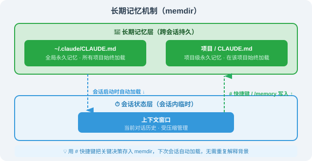

# 16.5 高级用法：MCP、Hooks 与 Skills

> 🔧 *"工具不是障碍，工具是杠杆。真正厉害的工程师，不是自己跑得快，而是把 Agent 配得好。"*

---

## 开篇：从"用工具"到"构建工具"

大多数人使用 Claude Code 的方式是：打开终端，开始对话，让它帮你写代码或修 Bug。

但 Claude Code 真正的威力，在于它的扩展能力。通过 **MCP、Hooks、Skills** 三大机制，你可以把它改造成一个完全适配你团队工作流的专属 Agent——连接数据库、自动化 CI/CD、封装团队最佳实践。

这些机制的工程实现，源自社区对 Claude Code 六层架构（详见 16.3）的源码分析。MCP / Hooks / Skills 是源码中 Orchestrator 与 Tool Runtime 层最显眼的几个抽象模块。下面我们基于这些公开事实，按"协议 / 事件 / 模板"三类展开。

本节深入三大进阶机制：**MCP**（连接外部工具生态）、**Hooks**（事件驱动自动化）、**Skills**（可复用能力包），以及**子 Agent + 上下文压缩**（驾驭复杂长任务）。

> 💡 **一句话心智模型**：MCP 决定 Claude 能"触达"什么世界，Hooks 决定 Claude 的每一步都"受控"于什么规则，Skills 决定 Claude 默认"懂"什么工作流。三者共同把"通用助手"变成"你的专属工程师"。

---

## 一、MCP（Model Context Protocol）：连接外部世界

### 1.1 MCP 是什么？

MCP 是 Anthropic 主导的开放协议，让 AI 模型以标准化方式调用外部系统。可以把它理解为 AI 工具的 **USB 接口**——任何符合协议规范的"MCP 服务器"都能即插即用地连上 Claude Code。

**MCP 的三个核心原语**：

| 原语类型 | 作用 | 典型示例 |
|---------|------|---------|
| **Tools** | AI 可以调用的操作/函数 | 执行数据库查询、发送 API 请求、创建 GitHub Issue |
| **Resources** | AI 可以读取的数据资源 | 知识库文档、实时监控数据、项目 Wiki |
| **Prompts** | 可复用的提示模板 | 代码审查模板、PR 描述生成器、发布说明生成器 |

没有 MCP 时，Claude Code 只能操作本地文件系统和执行 Shell 命令。有了 MCP，它的边界被彻底打开：


> 📌 **源码视角**：从 16.4 事件暴露的代码看，MCP 不是"挂载在某个角落的扩展"——它是 Orchestrator 层**内建**的工具发现协议，每启动一个新 MCP server，Claude Code 都重新走一次 16.5 描述的 6 阶段权限流水线。

### 1.2 配置 MCP 服务器

MCP 通过配置文件注册，支持两种级别：**项目级**（`.mcp.json`，提交 git，团队共享）与**用户级**（settings.json，个人私有）。核心约定是**敏感凭证绝不硬编码**，一律用 `${ENV_VAR}` 引用环境变量：

```json
// .mcp.json（放在项目根目录，提交 git）
{
  "mcpServers": {
    "github": {
      "command": "npx",
      "args": ["-y", "@modelcontextprotocol/server-github"],
      "env": { "GITHUB_PERSONAL_ACCESS_TOKEN": "${GITHUB_TOKEN}" }
    },
    "postgres": {
      "command": "npx",
      "args": ["-y", "@modelcontextprotocol/server-postgres", "postgresql://localhost:5432/mydb"],
      "env": { "PGPASSWORD": "${DB_PASSWORD}" }
    }
  }
}
```

启动后，用 `/mcp` 查看连接状态：

```bash
$ claude
> /mcp
● github      (connected) — 12 tools available
● postgres    (connected) — 6 tools available
● slack       (error)     — Connection failed: vault not found
```

### 1.3 实用的 MCP 服务器

| MCP 服务器 | npm 包 | 主要用途 |
|-----------|--------|---------|
| **GitHub** | `@modelcontextprotocol/server-github` | 读写 Issues/PR/代码，自动化 Review |
| **PostgreSQL** | `@modelcontextprotocol/server-postgres` | 查询数据库、分析慢查询、生成 ER 图 |
| **Filesystem** | `@modelcontextprotocol/server-filesystem` | 跨目录文件操作（超出当前项目范围） |
| **Brave Search** | `@modelcontextprotocol/server-brave-search` | 实时网络搜索（需 Brave API Key） |
| **Slack** | `@modelcontextprotocol/server-slack` | 发通知、读频道、搜消息 |
| **Jira/Confluence** | `mcp-atlassian` | 创建/更新 Jira 任务，关联代码提交 |
| **Puppeteer** | `@modelcontextprotocol/server-puppeteer` | 浏览器自动化，端到端测试辅助 |

**实战案例**（自然语言即可串联多个工具）：*"帮我查看最近 5 个未 Review 的 PR，找出有潜在安全问题的，写上 Review 评论，并在 Slack #engineering 通知负责人。"*——Claude Code 会自动依次调用 `github.list_pull_requests` → `github.get_pull_request_diff` → 安全分析 → `github.create_review_comment` → `slack.post_message`。

> 📌 **与 OpenClaw（第 14 章）/ DeepSeek Harness（第 17 章）的关系**：MCP 协议的影响力远超 Claude Code——OpenClaw 与 DeepSeek Harness 都实现了 MCP server，让"同一份工具协议"在三个截然不同的 Harness 上都能工作。这是协议化（vs. 单一厂商扩展）红利的早期显现。

### 1.4 自建 MCP 服务器（关键骨架）

当内置服务器不够用时，可用 `fastmcp` 库快速封装内部 API。关键只在于 `@app.tool()` 装饰器与一份 `.mcp.json` 注册：

```python
# internal_api_mcp.py —— 把公司内部 REST API 封装成 MCP 工具
import os, httpx
from mcp.server import FastMCP

app = FastMCP("internal-company-tools")
API_TOKEN = os.environ["INTERNAL_API_TOKEN"]
HEADERS = {"Authorization": f"Bearer {API_TOKEN}"}

@app.tool()
async def get_deployment_status(service: str, env: str = "production") -> str:
    """查询指定服务在指定环境的部署状态。"""
    async with httpx.AsyncClient() as client:
        resp = await client.get(
            f"https://api.internal.company.com/deployments/{service}",
            params={"env": env}, headers=HEADERS)
        data = resp.json()
    return f"{service} @ {env}: v{data['version']} ({data['health']})"

if __name__ == "__main__":
    app.run()
```

> 注册方式同 1.2，把 `command` 设为 `python`、`args` 指向该脚本即可。完整的 `@app.resource()`、多工具实现可参考 MCP 官方文档——教学重点是"协议即接口"：你只需声明工具签名与描述，Claude Code 负责调用编排。

---

## 二、Hooks：事件驱动的自动化

### 2.1 六种 Hook 事件

Hooks 是 Claude Code 的事件钩子系统，让你在它执行操作的关键节点注入自定义逻辑。这是 **Harness Engineering 的核心工具**——通过 Hooks，你在**系统层面强制执行规范**，而不是依赖 Claude "记住"要守规矩。


> 💡 **PreToolUse 是最强大的 Hook**：它是唯一能**阻断操作**的事件（通过退出码 2 实现），可用来构建"任何危险命令必须经审批"之类的安全机制。

### 2.2 Hook 配置格式

Hooks 在 `.claude/settings.json` 中声明，按事件分组，用 `matcher` 匹配工具名：

```json
{
  "hooks": {
    "PreToolUse": [{
      "matcher": "Bash",
      "hooks": [{ "type": "command", "command": "python3 ~/.claude/hooks/audit_bash.py" }]
    }],
    "PostToolUse": [{
      "matcher": "Edit|Write|MultiEdit",
      "hooks": [{ "type": "command", "command": "bash ~/.claude/hooks/auto_format.sh" }]
    }],
    "Stop": [{
      "matcher": ".*",
      "hooks": [{ "type": "command", "command": "bash ~/.claude/hooks/notify_complete.sh" }]
    }]
  }
}
```

**关键契约**：Hook 脚本通过**标准输入（stdin）**接收工具调用的 JSON，并通过**退出码**与 Claude Code 沟通：

```json
// PreToolUse 时 stdin 收到的数据
{
  "hook_event_name": "PreToolUse",
  "tool_name": "Bash",
  "tool_input": { "command": "rm -rf /tmp/old-data", "description": "清理临时数据" },
  "session_id": "sess_abc123xyz"
}
```

| 退出码 | 含义 |
|--------|------|
| `0` | 检查通过，**放行**本次调用 |
| `2` | **阻断**本次调用（PreToolUse 专属），脚本 print 的内容会回传给 Claude 作为"被拦原因" |
| 其他 | 视为错误，行为取决于事件类型 |

### 2.3 一个完整的 Hook 范例：安全审计

这是唯一需要"完整代码"的范例——它覆盖了所有关键契约（读 stdin、记日志、危险模式匹配、退出码 2 阻断）。其余 Hook 类型请直接复用此骨架，仅替换中间逻辑：

```python
#!/usr/bin/env python3
# ~/.claude/hooks/audit_bash.py —— PreToolUse 安全审计 Hook
import json, sys, re
from datetime import datetime
from pathlib import Path

event = json.loads(sys.stdin.read())            # 1) 从 stdin 读取事件
command = event.get("tool_input", {}).get("command", "")
session_id = event.get("session_id", "unknown")

# 2) 先记审计日志（无论是否阻断都要记，便于事后追溯）
audit_log = Path.home() / ".claude" / "audit.log"
audit_log.parent.mkdir(exist_ok=True)
with open(audit_log, "a") as f:
    f.write(json.dumps({"ts": datetime.now().isoformat(),
                        "session": session_id, "cmd": command},
                       ensure_ascii=False) + "\n")

# 3) 危险模式检测
DANGER = [
    (r"rm\s+-rf\s+/(?!\w)", "删除根目录"),
    (r"rm\s+-rf\s+~",       "删除 home 目录"),
    (r"curl\s+.*\|\s*(?:ba)?sh", "管道执行远程脚本（供应链攻击风险）"),
    (r"dd\s+if=.*of=/dev/", "直接写入块设备"),
]
for pat, reason in DANGER:
    if re.search(pat, command):
        print(f"⛔ [安全护栏] 已阻断：{reason}\n   命令：{command}")
        sys.exit(2)                            # 4) 阻断本次工具调用

sys.exit(0)                                    # 放行
```

**其余两类 Hook 的写法**（复用上述骨架，仅替换第 3 步）：

- **PostToolUse 自动格式化**：从环境变量 `$CLAUDE_TOOL_RESULT_FILE_PATH` 读被改文件路径，按扩展名调用 `ruff`/`prettier`/`gofmt`，最后 `exit 0`（PostToolUse 不阻断，只做辅助动作）。
- **Stop 完成通知**：读取 `$SLACK_WEBHOOK_URL`，用 `curl` 异步发送 Block Kit 消息后 `exit 0`。

> 💡 **上手建议**：如果只选一个进阶功能先试，推荐 **PostToolUse 自动格式化**——10 行 Shell 脚本，立竿见影提升代码质量下限。

---

## 三、Skills：可复用能力包

### 3.1 什么是 Skills？

Skills 是 Claude Code 的**工作流模板系统**——把"你反复告诉 Claude 的话"打包成一次性定义、永久可用的能力模块。每当你发现多个项目都要说同样的话（"帮我做 Code Review，关注这几个维度……"），就说明该 Skill 化了。

**Skills vs `/commands` 的核心区别**：

| 对比维度 | Skills | `/commands` |
|---------|--------|-------------|
| **存储位置** | `~/.claude-internal/skills/` | `.claude/commands/` |
| **作用范围** | **全局**，所有项目可用 | **项目级**，仅当前项目 |
| **内容复杂度** | 完整 Markdown 指令 + 附属脚本/模板 | 单一 Markdown 提示文件 |
| **适合场景** | 跨项目通用工作流（Code Review、部署） | 项目特定操作（跑测试、升版本号） |
| **触发方式** | Skill 工具自动识别并调用 | 用户手动输入 `/command-name` |

> 📌 **跨 Harness 兼容**：Claude Code 的 `SKILL.md` 格式与 OpenClaw（第 14 章）完全兼容——同一份 Skill 文件，加载到 Claude Code 也工作，加载到 OpenClaw 也工作，加载到 Hermes（第 15 章）也工作。这是 2026 年技能市场"协议化"的关键支撑。

### 3.2 创建自己的 Skill（关键结构）

以"标准化 Code Review"为例，核心是一个 `SKILL.md` 主文件，可附带清单与模板：

```
~/.claude-internal/skills/
└── code-review/
    ├── SKILL.md              # 必须：Skill 主文件
    ├── checklists/           # 可选：安全/性能/可维护性清单
    └── templates/            # 可选：输出报告模板
```

`SKILL.md` 的骨架只需回答四件事——**触发条件、执行流程、按维度审查什么、输出格式**：

```markdown
# Skill: Code Review
对代码变更进行系统化多维度审查，输出结构化审查报告。

## 触发条件
用户要求 code review、review PR、检查代码质量时触发。

## 执行流程
1. 获取变更范围：git diff main...HEAD --stat
2. 按维度审查（参考 checklists/）：安全 / 性能 / 可维护性
3. 用 templates/review-report.md 输出：🔴 严重 / 🟡 建议 / 🟢 优点

## 约束
- 报告用中文，每个问题附文件名与行号
- 严重问题必须给修复示例
- 总长不超 800 字
```

> 把"流程 + 清单 + 模板"从对话里抽出来固化成 Skill，本质就是 **第8章 Harness Engineering 的"把规范编码进系统"**——人不再每次重复说，系统自带最佳实践。

### 3.3 选择决策


---

## 四、Sub-agents：并行任务执行

### 4.1 AgentTool 的工作原理

Claude Code 通过内置的 `AgentTool` 派遣**子 Agent** 执行专项任务。每个子 Agent 是一个完全独立的 Claude 实例：


**子 Agent 的四个关键特性**：

1. **独立上下文**：子 Agent 拥有全新上下文窗口，不被主 Agent 的长对话历史污染，推理质量更高
2. **任务隔离**：子 Agent 的错误和中间状态不扩散到其他 Agent（对抗"污染效应"）
3. **bubble 权限模式**：子 Agent 用内部 `bubble` 权限模式，权限决策冒泡给父 Agent 处理，保证安全边界
4. **并行加速**：多个子 Agent 同时运行，把串行任务并行化，大幅缩短执行时间

### 4.2 实用场景

**场景一：并行代码审查**——把大 PR 按模块拆分给多个子 Agent 同时审，再汇总。


**场景二：多文件重构协调**（在独立 git worktree 中工作，避免互相干扰）：

```
主 Agent：
1. 扫描所有引用 UserService 的文件，按模块分组
2. 为每个模块派遣一个子 Agent（各自独立 worktree）
3. 等待所有子 Agent 完成迁移
4. 合并所有 worktree 变更
5. 派一个验证 Agent 跑完整测试套件
6. 测试全绿后合并到主分支
```

**场景三：复杂研究任务拆分**


> 📌 **与 16.4 事件的关系**：源码暴露后，社区在源码中识别出 ULTRAPLAN（深度 plan 后再执行）、KAIROS（被动等待 + 主 Agent 显式激活）两种更深层的运行模式——它们都基于 AgentTool 实现。这告诉我们：Sub-agent 不止"并行加速"，它是 Claude Code 在"长跑 / 复杂任务"上的核心调度原语。

---

## 五、上下文压缩（三级策略）

随着对话深入，上下文窗口逐渐填满——**上下文利用率超过 70% 时，推理质量开始明显下降**（Claude 会"偷工减料"：静默跳过步骤、简化输出、过早声称完成）。

Claude Code 提供三级压缩策略应对：


| 级别 | 触发 | 策略 | 保留 |
|------|------|------|------|
| **microcompact** | 利用率 > 40% | 轻量摘要 | 关键决策与文件变更 |
| **autocompact** | 利用率 > 60% | 深度压缩 | 最重要上下文摘要 |
| **full compact** | 手动 `/compact` 或 > 80% | 完全重置 | 核心状态，重新加载 CLAUDE.md |

**手动控制**：

```bash
/compact 请保留：当前正在重构的 PaymentService，以及接口设计 createOrder/cancelOrder/refund
/clear          # 完全清空，切换全新任务
/status         # 查看当前上下文使用情况
```

### 5.1 memdir：长期记忆机制

Claude Code 把**长期记忆**与**会话状态**分开管理，避免压缩时丢失重要信息：



**两种写入方式**：

```bash
# 方式一：# 快捷键（最快）
> # 支付模块数据库连接池最大值必须是 50，超出会触发 RDS 连接数限制

# 方式二：/memory 命令（可管理，查看/编辑/删除）
> /memory
```

> 💡 **最佳实践**：每次长任务完成，用 `#` 把关键决策（"为什么选这个方案"）和约束（"这个函数不能动"）存入 memdir。下次会话自动加载，无需重复解释背景。

---

## 小结

| 机制 | 核心价值 | 配置位置 | 优先级 |
|------|---------|---------|-----------|
| **MCP** | 连接 GitHub/数据库/Slack 等外部系统 | `.mcp.json` | ⭐⭐⭐ 高 |
| **PreToolUse Hook** | 安全审计、危险操作拦截（唯一能阻断的机制） | `settings.json` | ⭐⭐⭐ 高 |
| **PostToolUse Hook** | 自动格式化、Lint、触发测试 | `settings.json` | ⭐⭐⭐ 高 |
| **Stop Hook** | 任务完成通知（Slack/邮件） | `settings.json` | ⭐⭐ 中 |
| **Skills** | 跨项目工作流复用，消除重复沟通 | `~/.claude-internal/skills/` | ⭐⭐ 中 |
| **Sub-agents** | 并行处理复杂长任务，保持推理质量 | 自然语言指令即可触发 | ⭐⭐ 中 |
| **上下文压缩** | 长任务质量保障，对抗上下文焦虑 | `/compact`、`/clear` | ⭐⭐ 中 |
| **memdir** | 跨会话知识沉淀，避免反复解释背景 | `#` 或 `/memory` | ⭐⭐ 中 |

> 💡 **核心洞察**：**MCP + Hooks 是进阶使用的黄金组合**——MCP 扩展了 Claude 能触达的世界，Hooks 保证它的每一步都在你掌控之中。两者结合，才能放心地让 Claude Code 在生产环境长时间自动运行。
>
> 如果只能先上手一个，推荐 **PostToolUse Hook（保存后自动跑 linter）**——10 行 Shell，立竿见影。

---

*上一节：[16.4 System Prompt、权限工程与 Prompt Cache](./04_system_prompt_and_permissions.md)*
*下一节：[16.6 生产实践与团队配置](./06_production_and_team.md)*
