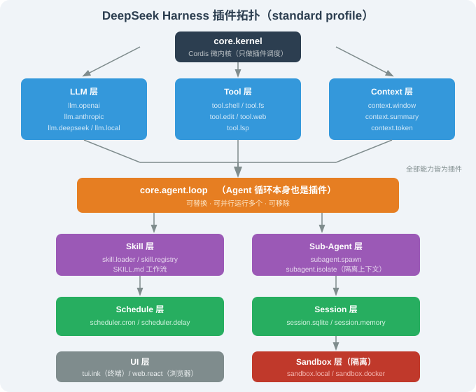

# 17.3 架构：Cordis 微内核与插件拓扑

> 🐋 *"没有特权组件——这是 DeepSeek Harness 与所有其他 Agent 框架的根本差别。"*

---

## 一、Cordis 是什么

在解释 DeepSeek Harness 之前，必须先理解 **Cordis**——因为它是 Harness 的整个世界观。

### 1.1 Cordis 出处

Cordis 是 **Koishi Team**（koishi.js 机器人框架团队）开发的**插件元框架**——它只做一件事：

> **让插件可加载、可卸载、可被依赖、可与彼此通讯。**

它**不**关心业务逻辑、不规定使用方式、不内嵌任何能力。

### 1.2 Cordis 的最小 API

```typescript
// 最小 Cordis 插件
import { Context } from 'cordis';

interface Config {
  greeting: string;
}

// 1) 定义插件
function greetPlugin(ctx: Context, config: Config) {
  ctx.on('ready', () => {
    console.log(config.greeting);
  });
}

// 2) 注册插件（带 schema 校验 + 默认值）
ctx.plugin(greetPlugin, {
  greeting: 'Hello, DeepSeek Harness',
});
```

这就是 Cordis 的**全部表面**——其他所有能力都是"插件"。

### 1.3 关键抽象

| 抽象 | 作用 |
|------|------|
| **Context (ctx)** | 插件运行时上下文；提供 `ctx.plugin` / `ctx.on` / `ctx.once` 等 API |
| **Service（服务）** | 插件暴露给其他插件的可调用接口 |
| **Event（事件）** | 异步消息总线，插件可以发 / 听 |
| **Effect（副作用）** | 插件加载时执行的一次性动作（如连接数据库） |
| **Schema** | 插件配置的强类型 schema + 默认值 |

一个插件函数 `pluginFn(ctx, config)` 拿到 ctx 后，可以做四类事：

| 调用 | 作用 |
|------|------|
| `ctx.plugin(otherPlugin, ...)` | 装载子插件 |
| `ctx.service('foo', { ... })` | 暴露一个服务（供其他插件调用） |
| `ctx.on('bar', handler)` | 监听一个事件 |
| `ctx.effect(() => ...)` | 注册副作用（插件加载时执行一次，如连数据库） |

Cordis 的依赖图是**显式**的：一个插件可以声明它依赖另一个插件要先装载。这种"显式 DAG"让插件间的拓扑一目了然——DeepSeek Harness 把这一点用作**"插件拓扑可视化"**的工具（详见 17.4）。

---

## 二、DeepSeek Harness 的插件拓扑

### 2.1 默认 standard profile 的插件拓扑（简化）



值得注意：**`core.agent.loop` 是插件**——这意味着你可以：

- 换一个 `core.agent.loop` 实现（比如换成"基于状态机的循环"）；
- 同时跑多个不同的循环（比如主 Agent 用一个循环、Sub-Agent 用另一个）；
- 完全去掉 `core.agent.loop`，把 Harness 当成"工具集合 + UI + LLM"用。

这是**其他 Harness 框架做不到的事**——Claude Code / OpenClaw / Hermes 都把 Agent Loop 写在"特权核心"里。

---

## 三、插件之间的通信：服务与事件

### 3.1 服务（Service）示例

```typescript
// core.tool.shell 插件暴露一个 service
ctx.service('shell', {
  async run(command: string, opts: { cwd?: string } = {}) {
    // 实际实现：spawn child process
    const { exec } = await import('node:child_process');
    return new Promise((resolve) => {
      exec(command, { cwd: opts.cwd }, (err, stdout, stderr) => {
        resolve({ ok: !err, output: stdout, error: stderr });
      });
    });
  },
});

// core.skill 里调用这个服务
ctx.on('skill.execute.shell', async (event) => {
  const shell = ctx.service('shell');
  const result = await shell.run(event.command);
  // ...
});
```

### 3.2 事件（Event）示例

```typescript
// 插件 A 发布事件
ctx.emit('tool.after', { name: 'shell', result });

// 插件 B 监听
ctx.on('tool.after', (event) => {
  logger.log(`tool ${event.name} returned ${event.result.ok}`);
});
```

事件总线让插件之间**松耦合**：插件 A 不需要知道谁在监听，插件 B 不需要知道谁发布的。

### 3.3 上下文中稳定的键

每个插件能力都挂到 `ctx.<key>` 上：

```typescript
// 在插件里访问其他插件暴露的能力
const llm = ctx.llm;                  // ctx 上的 llm 命名空间
const tools = ctx.tools;              // 工具集合
const session = ctx.session;          // 会话管理
const agentLoop = ctx.agentLoop;      // Agent 循环
const skillRegistry = ctx.skillRegistry;  // Skill 注册中心

// 调用
const response = await ctx.llm.stream(messages);
const result = await ctx.tools.shell.run(command);
```

> 📌 **核心稳定点**：Harness 保证 `ctx.<key>` 的命名是稳定的——第三方插件可以稳定调用。这与 OpenClaw / Hermes 的"插件可以暴露任意 API"形成对比。

---

## 四、Trajectory（轨迹回放）——Cordis 给的免费能力

### 4.1 什么是 Trajectory

Trajectory 是 Cordis 提供的事件流的"git 风格"视图——DeepSeek Harness 在它的基础上构建了"Agent 运行轨迹回放"：

```typescript
ctx.on('agent.step', (event) => {
  ctx.emit('trajectory.append', {
    sessionId: event.session,
    step: event.step,
    input: event.input,
    output: event.output,
    toolCalls: event.toolCalls,
  });
});
```

### 4.2 它能做什么

| 能力 | 含义 |
|------|------|
| **回放**（Replay） | 重跑某次 session 的全部轨迹，像 git 回滚 |
| **分叉**（Fork） | 在某 step 处克隆轨迹，从那里走另一个分支 |
| **审计** | 完整记录：模型看到什么、做了什么、有没有失败 |
| **调优** | 用真实轨迹训练下一代 Agent |

### 4.3 实际价值

**回放**让你能把"今天下午 3 点那次莫名其妙失败的 session"重新跑一遍看错误在哪；**分叉**让你能从"Agent 走到第 4 步突然想换工具"那一刻重新开始；**审计**让你能回答"这个 Agent 在生产里到底做了什么"。

这一点 Hugging Face 的 smolagents（第 12 章讨论）也强调过，但 Cordis 把这件事做成**框架级抽象**——比手工记录日志要稳得多。

---

## 五、与"事件流 + 沙箱 + 状态图"的范式对照

第 14–16 章我们已经看过 OpenClaw / Hermes / Claude Code 都用"事件流 + 沙箱 + 状态图 + 工具"作为骨架。DeepSeek Harness 同样使用这些范式，但**全部放进插件**：

| 范式 | OpenClaw | Hermes | Claude Code | DeepSeek Harness |
|------|----------|--------|-------------|------------------|
| **事件流** | 内部模块 | 内部模块 + Hooks | 内部模块 | **插件**（`trajectory`） |
| **沙箱** | 内置 + Docker | 6 种实现（plugin 级） | 6 阶段权限 | **插件**（`sandbox.*`） |
| **状态图** | 隐式 | 隐式（context manager） | 显式（state schema） | **插件**（`context.*`） |
| **工具** | 内部模块 | 内部模块 | 内部模块 | **插件**（`tool.*`） |
| **Agent 循环** | 内部模块 | 内部模块 | 内部模块 | **插件**（`agent.loop`） |

DeepSeek Harness 是**唯一一个把所有这些范式都"插件化"的工业级 Harness**。

---

## 六、加载生命周期

### 6.1 插件装载顺序

插件按依赖关系装载，顺序是确定的（微内核 → 抽象层 → 实现层 → 上层能力）：

| 顺序 | 插件 | 说明 |
|------|------|------|
| 1 | `core.kernel` | 微内核先起 |
| 2 | `core.llm` | LLM 抽象层 |
| 3 | `core.llm.openai` / `anthropic` / `deepseek` | 具体 LLM 实现 |
| 4 | `core.context` | 上下文管理 |
| 5 | `core.tools` | 工具（shell / fs / edit / ...） |
| 6 | `core.skill` | Skill 加载 |
| 7 | `core.session` | 会话管理 |
| 8 | `core.agent` | Agent 循环 |
| 9 | `core.ui` | UI |

### 6.2 启动时间观察

在不同 profile 下，启动时间差异巨大：

| Profile | 装载插件数 | 启动时间（参考） |
|---------|----------|------------------|
| minimal | ~5 | < 1s |
| ptc | ~25 | ~2s |
| standard | ~70 | ~3s |
| create | ~120 | ~5s |

（具体启动时间会受机器、模块数影响；以你本地 `dsh --profile X stat` 输出为准）

---

## 七、本节小结

| 主题 | 关键要点 |
|------|---------|
| Cordis 角色 | 微内核，只管插件加载/卸载/通讯 |
| 关键抽象 | Service / Event / Effect / Schema |
| 插件拓扑 | LLM / Tool / Context / Skill / Sub-Agent / Session / Sandbox / UI 全部插件 |
| 上下文键 | `ctx.llm` / `ctx.tools` / `ctx.session` 稳定可调用 |
| Trajectory | 事件流 + git 风格回放 / 分叉 |
| 范式差异 | DeepSeek Harness 是唯一把"事件流 / 沙箱 / 状态图"全部插件化的 Harness |

---

*下一节：[17.4 插件开发：tool / llm / skill / subagent 的插件接口](./04_plugin_development.md)*
