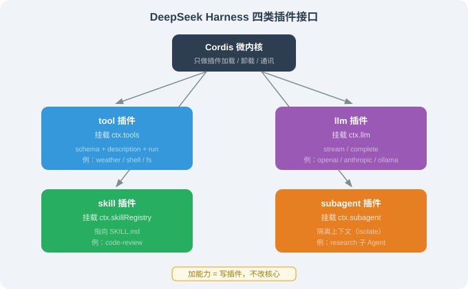

# 17.4 插件开发：tool / llm / skill / subagent 的插件接口

> 🐋 *"加能力 = 写一个插件，不改核心。"*

---

## 一、四类插件接口总览

DeepSeek Harness 里，所有"能力"都是插件。最常见的四类是：

| 插件类型 | 挂载点 | 作用 | 什么时候用 |
|---------|--------|------|-----------|
| **tool** | `ctx.tools` | 给 Agent 加一个工具 | Agent 需要新的"手"（查天气、发邮件、查数据库） |
| **llm** | `ctx.llm` | 接入一个新模型 | 你想用 DeepSeek Harness 但不想用官方模型 |
| **skill** | `ctx.skillRegistry` | 加一个 SKILL.md 工作流 | 复用一个多步骤的固定流程 |
| **subagent** | `ctx.subagent` | 加一个子 Agent 类型 | 需要隔离上下文跑并行子任务 |



**核心思想一句话**：这四类插件的接口都遵循同一个模式——**`register(name, { description, schema?, run })`**。你只需要告诉 Harness"这个能力叫什么、给 LLM 读的描述是什么、怎么执行"，剩下的（权限检查、错误处理、日志）框架都替你做了。

---

## 二、写一个 tool 插件（最常用）

### 2.1 完整实现

```typescript
// plugins/weather.ts
import { Context } from 'cordis';
import { z } from 'zod';

export interface WeatherConfig {
  apiKey: string;
}

export function weatherPlugin(ctx: Context, config: WeatherConfig) {
  ctx.tools.register('weather', {
    // ① name：工具唯一标识，Agent 调用时用这个名字
    name: 'weather',

    // ② description：给 LLM 读的"使用说明书"
    //    决定 LLM 什么时候该调这个工具、怎么调
    description: '查询指定城市的当前天气。当用户问天气、气温、下雨时使用。',

    // ③ schema：参数 schema（zod 强类型）
    //    框架会用它做参数校验 + 生成 JSON Schema 给 LLM
    schema: z.object({
      city: z.string().describe('城市名，如 "上海"'),
    }),

    // ④ run：实际执行函数
    //    返回值会被回写给 LLM（就像 14.3 节 Agent Loop 的"工具结果回写"）
    async run(args: { city: string }) {
      const res = await fetch(
        `https://api.openweathermap.org/data/2.5/weather?q=${args.city}&appid=${config.apiKey}`,
      );
      const data = await res.json();
      // 错误处理：API 失败时返回 { cod: "404", message: "city not found" } 等，
      // 此时没有 weather 字段，必须容错，否则 data.weather[0] 会抛 TypeError
      if (!data.weather) {
        return `查询失败：${data.message ?? '未知错误'}`;
      }
      // 开尔文转摄氏度（OpenWeatherMap 默认返回开尔文）
      return `城市 ${data.name}：${data.weather[0].description}，${Math.round(data.main.temp - 273.15)}°C`;
    },
  });
}
```

**四个字段的职责边界**（这是理解"插件接口"的关键）：

| 字段 | 谁用 | 作用 |
|------|------|------|
| `name` | Agent（工具调用）+ 框架（注册表） | 唯一标识 |
| `description` | **LLM** | 决定 LLM 何时、如何调用这个工具 |
| `schema` | 框架（参数校验）+ LLM（生成 JSON Schema） | 强类型参数约束 |
| `run` | 框架（执行） | 实际干活 |

**为什么 `description` 和 `schema` 都要给 LLM？** 因为 LLM 要做两件事：① **决定**用不用这个工具（靠 `description`）；② 如果要用，**生成正确的参数**（靠 `schema`）。缺了 `description`，LLM 想不起来有这个工具；缺了 `schema`，LLM 可能生成错误格式的参数。

### 2.2 运行示例：注册 → 调用 → 输出

假设你在配置里注册了 weather 插件（`config.yaml` 里 `plugins: { weather: { apiKey: 'xxx' } }`），然后问 Agent：

```
用户: 上海现在几度？
```

Agent 内部的过程：

```
[agent] 收到 "上海现在几度？"
[agent] 判断：问天气 → 命中 weather 工具的 description → 决定调用
[agent] 根据 schema 生成参数：{ city: "上海" }
[tool]  weather.run({ city: "上海" }) → fetch OpenWeatherMap API
[tool]  返回 "城市 Shanghai：clear sky，25°C"
[agent] 把工具结果回写，生成回复
[agent] 回复：上海现在晴，25°C。
```

**解读**：注意第 2 步——LLM 是从 `description` 里判断"该调 weather"的，从 `schema` 里知道"要传一个 `city` 参数"。**如果你的 `description` 写的是"查询天气"而没有触发词（"问天气/气温/下雨"），LLM 可能想不到去调它**——这就是 description 要写具体触发词的原因。

---

## 三、写一个 llm 插件（接入自定义模型）

```typescript
// plugins/my-llm.ts
import { Context } from 'cordis';

export function myLlmPlugin(ctx: Context, config: { endpoint: string; apiKey: string }) {
  ctx.llm.register('my-llm', {
    // 流式接口：返回 async generator（边生成边返回）
    async stream(messages, opts) {
      const res = await fetch(config.endpoint, {
        method: 'POST',
        headers: { Authorization: `Bearer ${config.apiKey}` },
        body: JSON.stringify({ messages, stream: true, ...opts }),
      });
      return readSSE(res);   // 解析 SSE 流
    },

    // 非流式接口：一次性返回完整结果
    async complete(messages, opts) {
      const res = await fetch(config.endpoint, {
        method: 'POST',
        headers: { Authorization: `Bearer ${config.apiKey}` },
        body: JSON.stringify({ messages, ...opts }),
      });
      return res.json();
    },
  });
}
```

注册后，配置里 `llm.provider: "my-llm"` 即可切换到你的模型——**Agent 循环代码零改动**。

**为什么"零改动"这么重要？** 因为"换模型"在传统 Agent 框架里往往要改一大堆代码（模型调用逻辑散落在各处）。而 DSH 把"模型调用"抽象成 `stream` / `complete` 两个接口，Agent Loop 只依赖这两个接口，不依赖具体模型。**这就是"一切皆插件"的威力：换模型 = 换一个插件，而不是改核心**。

> 对比第 15 章 Hermes 的"6 种执行后端"——思想同源（能力可换），但 DSH 把它抽象得更彻底：连"模型"本身都是插件，而不是"内置模型 + 可替换"。

---

## 四、写一个 skill 插件（SKILL.md 工作流）

```typescript
// plugins/my-skill.ts
import { Context } from 'cordis';

export function mySkillPlugin(ctx: Context) {
  ctx.skillRegistry.register({
    name: 'code-review',
    description: '对代码变更进行多维度审查',
    // 指向 SKILL.md 文件（工作流的"说明书"）
    skillFile: './skills/code-review/SKILL.md',
  });
}
```

配套 `SKILL.md`（与 Anthropic 格式兼容）：

```markdown
# Skill: Code Review
对代码变更进行系统化审查。

## 触发条件
用户要求 code review / review PR 时触发。

## 执行流程
1. git diff 获取变更
2. 按 安全/性能/可维护性 三维度审查
3. 输出 🔴 严重 / 🟡 建议 / 🟢 优点
```

> 📌 因为兼容 Anthropic `SKILL.md`，这个 Skill 可以直接复用 Claude Code / OpenClaw 的社区技能。

**`skill` 插件和 `tool` 插件的区别**：tool 是"单步能力"（查天气、读文件），skill 是"多步工作流"（code review = git diff + 三维度审查 + 输出报告，是一个流程）。skill 内部可能调用多个 tool，但对外暴露为一个"可复用的流程"。

---

## 五、写一个 subagent 插件

```typescript
// plugins/research-subagent.ts
import { Context } from 'cordis';

export function researchSubagentPlugin(ctx: Context) {
  ctx.subagent.register('research', {
    description: '独立研究一个主题，返回结构化摘要。用于需要大量检索的并行子任务。',
    async run(prompt: string) {
      // 关键：spawn({ isolate: true }) 创建"隔离上下文"的子 Agent
      // isolate = 子 Agent 看不到主 Agent 的对话历史，只拿到 prompt
      const sub = ctx.spawn({ isolate: true });
      return await sub.run(prompt);
    },
  });
}
```

主 Agent 通过 `Task` 工具派遣它，子 Agent 在隔离上下文里完成研究后返回。

**为什么 `isolate: true` 是关键？** 因为子 Agent 如果能看到主 Agent 的全部上下文，就会"受干扰"——它可能被主 Agent 的历史对话带偏，或者把不该看的敏感信息（其他任务的内容）带进自己的推理。**隔离上下文让子 Agent 只专注它被分配的那一个任务**，这是"子 Agent 能并行、能独立"的前提。

---

## 六、插件依赖声明

Cordis 允许插件声明依赖，保证装载顺序：

```typescript
ctx.plugin(weatherPlugin, {
  apiKey: 'xxx',
  before: ['core.llm'],    // 必须在 core.llm 之前装载
  after: ['core.kernel'],  // 必须在 core.kernel 之后装载
});
```

**为什么要显式声明依赖？** 两个好处：① 装载顺序正确（weather 插件如果依赖 llm，就必须在 llm 之后装）；② 缺失依赖提前报错（如果 `core.llm` 没装，框架启动时就会报错，而不是运行到一半才崩）。**这比"隐式依赖"（靠约定俗成）可靠得多**——详见 17.3 的"显式 DAG"。

---

## 七、create profile：秒级开发循环

写插件最爽的是 `create` 模式的热重载（见 17.2）：

```bash
$ dsh --profile create dev
   → watches ./plugins/**/*.ts   # 监听 plugins 目录
   → on save: auto-reload in 200ms  # 保存即热重载
```

改插件 → 保存 → 立即生效，无需重启 Harness。

**热重载为什么能"秒级"？** 因为 Cordis 的插件模型天然支持"卸载 + 重新装载"——一个插件被卸载时，它的 `ctx.effect` 里注册的副作用（如断开数据库连接）会被清理，然后重新装载时再执行。**这是"插件化架构"的免费红利：热重载不是额外功能，而是插件模型的自然结果**。

---

## 八、本节小结

| 主题 | 关键要点 |
|------|---------|
| 四类插件 | tool / llm / skill / subagent，接口统一为 `register(name, {description, schema?, run})` |
| tool 四字段 | name（标识）+ description（LLM 读）+ schema（强类型）+ run（执行） |
| llm 插件 | 注册后 `llm.provider` 切换，Agent 循环零改动 |
| skill vs tool | tool 是单步能力，skill 是多步工作流 |
| subagent | `isolate: true` 隔离上下文，保证独立并行 |
| 依赖声明 | before / after 显式装载顺序 + 缺失提前报错 |
| 热重载 | 插件模型的红利，卸载+重装即可 |

---

*下一节：[17.5 横向对比：DeepSeek Harness vs Claude Code / OpenClaw / Hermes](./05_comparison.md)*
