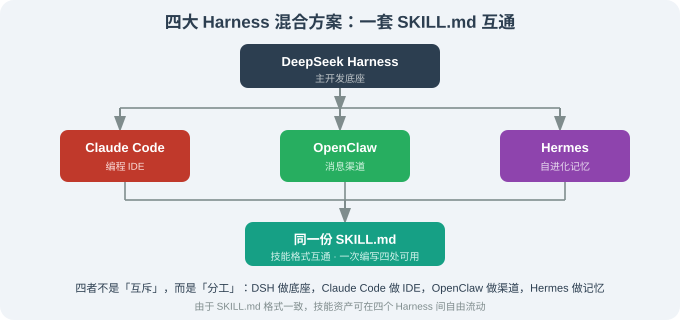

# 17.5 横向对比：DeepSeek Harness vs Claude Code / OpenClaw / Hermes

> 🐋 *"同一件事，4 种路线。"*

---

## 一、为什么必须做这个对比

读完 14-17 章你已经见过 4 种开源 Harness / 框架（外加 LangChain / LangGraph 在前两章）——它们都做"让 Agent 能跑 + 能干活"，但**路线截然不同**。这一节把 4 个项目按 12 个维度摆开，让你一眼看清差异。

> ⚠️ **会变化的数字不引用**——对比维度的"成熟度 / 文档完整度"等是定性判断，会随版本变化。具体能力清单以各自 `main` 分支 README 与文档为准。

---

## 二、12 维对比表

| 维度 | OpenClaw（14 章） | Hermes Agent（15 章） | Claude Code（16 章） | DeepSeek Harness（17 章） |
|------|-------------------|----------------------|---------------------|---------------------------|
| **许可** | MIT | MIT | source-available（未开源） | MIT |
| **作者** | Peter Steinberger 等社区 | Nous Research | Anthropic | DeepSeek AI + 社区 |
| **主语言** | TypeScript | Python + TypeScript | TypeScript | TypeScript + Python |
| **核心范式** | Skill 生态 + 多渠道 | 自进化 Skill + 主动反思 | 工业 IDE + 完整工程栈 | 一切皆插件 + 模型无关 |
| **能力归属** | 用户/社区写 Skill | Agent 自动 + 用户 | 厂商封闭 | **社区写插件** |
| **Agent 循环可换** | ❌ | ❌ | ❌ | ✅（连循环都是插件） |
| **模型无关** | ✅ | ✅ | ❌（绑 Claude） | ✅ |
| **核心开源深度** | 中 | 中 | ❌ 闭源 | **极深**（连 Cordis 上游都开源） |
| **Skill 格式** | SKILL.md | SKILL.md | SKILL.md | SKILL.md（**完全兼容**） |
| **协议接入** | 自有 | 自有 | MCP（Anthropic 推） | **MCP + SKILL.md** |
| **典型用户** | 多渠道个人助理使用者 | 自进化需求者 | 软件工程师 + IDE 用户 | 长期可控 Agent 平台搭建者 |
| **上手难度** | 极低（npx） | 极低（curl\|bash） | 中（CLI 概念） | 中（理解 profile + Cordis） |

---

## 三、6 个关键差异点详解

### 3.1 能力可换到哪一层？

```
Claude Code    [████████████████░░░░░░░░]   60%  ← UI / Skill / Hooks / MCP
OpenClaw       [████████████░░░░░░░░░░░░]   60%  ← Skill / Plugin
Hermes         [██████████████░░░░░░░░░░]   70%  ← Skill / Backend / Honcho
DeepSeek       [████████████████████░░░░]  100%  ← 包括 Agent Loop / 上下文 / 沙箱
```

> 这意味着：**DeepSeek Harness 的"插件化深度"是 4 者中最深的**。如果你要"换骨架"，只能选它。

### 3.2 模型绑定程度

| 项目 | 模型绑定 | 影响 |
|------|---------|------|
| Claude Code | 强（绑 Claude） | 不能用 OpenAI / DeepSeek，体验最优但锁死 |
| OpenClaw | 无（任意 LLM） | 完全灵活，需要自己调优 prompt |
| Hermes | 无（多模型后端） | 完全灵活 |
| DeepSeek Harness | 无（任意 OpenAI 兼容 + 自定义） | 完全灵活 + 内置 fallback |

### 3.3 用户修改权限

谁能改哪个层？

```
                Kernel   AgentLoop   Tools   Skills   Plugins   UI
Claude Code     ✗         ✗          ✗       △(MCP)   ✗        △
OpenClaw        ✗         ✗          △       ✓        △        ✓
Hermes          ✗         ✗          △       ✓        △        ✓
DeepSeek        ✓         ✓          ✓       ✓        ✓        ✓
```

### 3.4 自进化能力

仅 Hermes 提供"Agent 自动写 Skill + 自迭代"。其他三个：

- **OpenClaw**——Skill 由人写，**没有自进化**；
- **Claude Code**——Skill 由人写，**没有自进化**；
- **DeepSeek Harness**——Skill 由人写，但通过 plugin protocol 可以接入**外置的自动化**（需要第三方实现 self-evolving 插件）。

### 3.5 长期可控性

| 项目 | 长期可控措施 |
|------|-------------|
| **OpenClaw** | 多渠道 + Skill 生态 + npm 长期更新（由 Peter 与社区驱动） |
| **Hermes** | 自进化 + 长期记忆（学习越久越准） |
| **Claude Code** | 厂商驱动（Anthropic 路线决定一切，长期路线依赖公司） |
| **DeepSeek Harness** | 一切插件化，长期路线可由社区与 DeepSeek 共同驱动 |

### 3.6 文档与教学

| 项目 | 文档完整度 | 教学价值 |
|------|-----------|---------|
| OpenClaw | 中（README 详细但生态文档散落） | 高（multi-channel 是稀有主题） |
| Hermes | 中（self-evolving 概念文档较好） | 高（自进化是独家） |
| Claude Code | 高（官方 docs + 16.4 事件后社区解剖） | **极高**（可逐行阅读） |
| DeepSeek Harness | 中（v0.1 文档在快速完善） | 中（需要 Cordis 知识基础） |

---

## 四、按需求场景选

下面给一个"我想做 X，用谁"的快速判定表：

### 4.1 想做"多渠道个人助理"？

**首选 OpenClaw**（14 章）——渠道覆盖最广、生态成熟、上手最快。

### 4.2 想做"自进化 Agent"？

**首选 Hermes**（15 章）——目前唯一开源实现持续自进化的框架。

### 4.3 想做"软件工程 IDE Agent"？

**首选 Claude Code**（16 章）——行业范本，前提是你接受闭源 + Anthropic 模型绑定。

### 4.4 想做"自定义 Agent 平台"？

**首选 DeepSeek Harness**（本章）——可换内核、可换模型、可换插件，是搭建"长期可控平台"的最佳起点。

### 4.5 想做"教学示例"？

**首选 Claude Code + OpenClaw**——前者有源码级解剖，后者有清晰的渠道适配器代码。

### 4.6 想做"完全避开商业产品"？

**首选 DeepSeek Harness + OpenClaw + Hermes 三件套**——三者都 MIT，覆盖了大部分常见 Agent 场景。

---

## 五、它们可以并存吗？

**能并存**，甚至鼓励。下面是一个**混合方案**示例：



实际用法：

- **DeepSeek Harness** 作为"日常开发底座"，跑你的核心 Agent；
- **Claude Code** 装在你的 IDE 里跑"软件工程任务"（写代码、Review）；
- **OpenClaw** 接管你所有聊天 App，跑"个人助理任务"；
- **Hermes** 跑在你 VPS 上，跑"长期学习 + 跨渠道记忆"任务；
- 所有的 Skill 文件**统一**用 `SKILL.md` 格式（DeepSeek Harness / OpenClaw / Hermes / Claude Code 全都兼容），可互相迁移。

这一套"4 项目并用"是当下最完整的"行动型 Agent 工具栈"。

---

## 六、给"未来 1~2 年"的预期

行业有几个**几乎必然**的发展方向：

| 方向 | 谁会做 | 何时 |
|------|--------|------|
| **MCP 成为标准协议** | Anthropic 推 + OpenClaw/Hermes/DeepSeek 都接受 | **现在** ✓ |
| **SKILL.md 跨 Harness 互通** | 已实现 | **现在** ✓ |
| **"一切皆插件"成为主流** | DeepSeek Harness 引领 | 1 年内 |
| **自进化能力扩散** | Hermes 概念 → OpenClaw / Claude Code 学习 | 1 年内 |
| **捆绑模型变成历史** | 模型无关成为默认 | 2 年内 |
| **商业 Harness 与开源 Harness 融合** | 商业 Harness（如 Claude Code）开始开源核心 | 2 年内 |

读者读到这一章时，前面几条中至少前三条**已经是事实**；如果你看到别的更新，以仓库 README 为准。

---

## 七、本节小结

| 主题 | 关键要点 |
|------|---------|
| 12 维对比 | 许可 / 语言 / 范式 / 能力归属 / 模型无关 / Skill 协议等都不同 |
| 核心差异 | 插件化深度 + 模型绑定程度 + 可换层数 |
| 选型 | 多渠道 → OpenClaw；自进化 → Hermes；IDE → Claude Code；自建平台 → DeepSeek Harness |
| 可并存 | 4 项目并用、SKILL.md 互通，是当下最完整的 Agent 工具栈 |
| 预期 | MCP / SKILL.md / "一切插件化" / 模型无关都已成事实 |

---

*下一节：[17.6 借鉴：可换内核 / 模型无关的工程哲学](./06_lessons_philosophy.md)*
