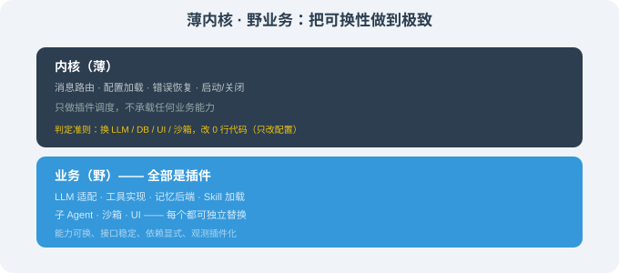

# 17.6 借鉴：可换内核 / 模型无关的工程哲学

> 🐋 *"把'换能力'的成本从'改源码'降到'改配置'。"*

---

## 一、本节核心问题

DeepSeek Harness 给全行业留下的最关键遗产不是"插件数量多"——

而是这个工程哲学：

> **任何一种 Agent 能力（模型 / 工具 / Skill / 子 Agent / 沙箱 / UI），都不应该被绑死。**

当你把"可换性"做到这一层，你就再也不会被"某个商业产品停更 / 某个开源项目失去维护 / 某个模型被淘汰"卡脖子。

本节把这件事拆成 5 条**可迁移**的工程原则，让你带回自己的 Agent 系统。

---

## 二、原则 1：内核"薄"，业务"野"

### 2.1 设计目标

DeepSeek Harness 的内核（Cordis）**几乎不**承载任何业务能力——它只做插件调度。所有的"功能"都是"插件"。

把这件事转成自己系统的语言是：



### 2.2 借到自己的系统

```python
# 反例：业务逻辑写在核心
class AgentLoop:
    def __init__(self):
        self.llm = OpenAIClient()      # 写死！换模型要改源码
        self.db = SQLiteStore()       # 写死！换 DB 要改源码

# 正例：业务逻辑通过接口注入
class AgentLoop:
    def __init__(self, llm, store, tools):
        self.llm = llm                 # 任意 LLM
        self.store = store             # 任意 Store
        self.tools = tools             # 任意 Tool

agent = AgentLoop(
    llm=AnthropicClient(...),
    store=RedisStore(...),
    tools=load_tools_from_plugins(),
)
```

**判定准则**：问自己"换 LLM / 换数据库 / 换 UI / 换沙箱，要改几行代码？"——答案是"改 0 行，只改配置"，你就做对了。

---

## 三、原则 2：可降级 + 可降级链

### 3.1 DeepSeek Harness 的 fallback 链

```json
{
  "llm": {
    "providers": ["deepseek-v4-pro", "anthropic-claude-4-7", "openai-gpt-4.1", "ollama-qwen3"],
    "routing": {
      "deepseek-v4-pro": {
        "primary": "deepseek-v4-pro",
        "fallback": ["anthropic-claude-4-7", "ollama-qwen3"]
      }
    }
  }
}
```

当 DeepSeek 端挂 → 自动切 Anthropic → 也挂 → 切本地 Ollama。任何一档挂了都不影响业务。

### 3.2 借到自己的系统

任何"外部依赖"都应该有 fallback：

| 外部依赖 | fallback |
|---------|---------|
| 主力 LLM | 二线 LLM → 本地 LLM |
| 主数据库 | 备用 DB → SQLite |
| 主邮件服务 | 备用 SMTP → 队列重试 |
| 主支付渠道 | 备用渠道 |

实现方式：

```python
class FallbackChain:
    def __init__(self, *providers):
        self.providers = providers

    async def call(self, request):
        last_error = None
        for p in self.providers:
            try:
                return await p.call(request)
            except Exception as e:
                last_error = e
                continue
        raise AllFailedError(last_error)
```

---

## 四、原则 3：能力可换 + 接口稳定

### 4.1 DeepSeek Harness 的"接口稳定"做法

每个插件的能力挂到 `ctx.<key>` 上——这是**约定**而不是**实现**：

```typescript
ctx.llm.stream(...)          // 不管 LLM 是 deepseek 还是 anthropic
ctx.tools.shell.run(...)     // 不管 shell 是 local 还是 docker
ctx.session.commit(...)      // 不管 session 是 sqlite 还是 redis
```

第三方插件可以稳定地写 `ctx.llm.stream(...)`——而具体实现可以随时换。

### 4.2 借到自己的系统

给你的 Agent 设计一组**稳定的接口**：

```python
class AgentContext:
    llm: LLMProtocol           # .stream() / .complete()
    store: StoreProtocol       # .get() / .set() / .search()
    tools: ToolsProtocol       # .register() / .invoke()
    session: SessionProtocol   # .get() / .commit()
```

每个 Protocol 的具体实现可以是不同的类，但**只要这些接口稳定**，插件就能正常协作。

### 4.3 文档化你的 Protocol

建立**接口文档页**，每个 Protocol 都要有：

- 方法签名（按 RFC 风格或 TypeScript-style）；
- 错误约定（什么算"可恢复"）；
- 性能约束（调用频率、批量大小）。

把这份文档版本化、commit 进 repo——这是给未来"换实现"的自己留的路。

---

## 五、原则 4：插件必须有显式的"依赖图"

### 5.1 Cordis 的依赖声明

```typescript
ctx.plugin(SubAgentPlugin, {
  dependencies: ['agent.loop', 'llm.openai', 'session.sqlite'],
});
```

依赖图让：
- **装载顺序正确**（subagent 在 loop 后装载）；
- **缺失依赖时报错**（而不是运行时崩溃）；
- **可视化插件拓扑**（17.3 那张图就是依赖图的可视化）。

### 5.2 借到自己的系统

任何"插件化"系统都应该有显式依赖图。Python 可以用 `entry_points` + 排序；TS 可以用 `peerDependencies`：

```json
// package.json
{
  "dsh": {
    "kind": "subagent",
    "dependencies": ["agent.loop", "llm.openai", "session.sqlite"]
  }
}
```

或者用更显式的 `manifest.json`：

```json
{
  "plugin": "code-review",
  "needs": ["fs", "shell", "diff"],
  "conflicts": ["lockfile.write"]
}
```

> 核心是：**写下来**，不要靠"运行时报错"。

---

## 六、原则 5：可观测性要"插件级"

### 6.1 DeepSeek Harness 的事件流

```typescript
ctx.on('tool.before', e => metrics.increment(`tool.${e.name}.calls`));
ctx.on('tool.after', e => metrics.histogram(`tool.${e.name}.latency`, e.duration));
ctx.on('agent.step', e => logger.debug({ step: e.step, tokens: e.tokens }));
ctx.on('plugin.error', e => sentry.report(e.error));
```

每个插件都能被独立观察——这意味着：

- 当 "my-tool" 频繁超时时，你会立刻知道；
- 当 anthropic 端调用变慢时，你会立刻知道；
- 当 subagent isolation 失败时，你会立刻知道。

### 6.2 借到自己的系统

不要把可观测性作为"额外"层——把它做成**插件**：

```python
# 可观测性 = 一个插件
class ObservabilityPlugin(Plugin):
    def on_load(self):
        self.ctx.on('llm.before', self._start_timer)
        self.ctx.on('llm.after', self._record_latency)
        self.ctx.on('tool.error', self._record_error)
        self.ctx.on('session.commit', self._snapshot)
```

这样**不管**哪个层挂了你都能看见，且不需要修改任何其他插件。

---

## 七、把 5 条原则压成一句

```
把"内核"做薄、"业务"做广、"接口"做稳、"依赖"做显、"观测"做插件。
```

如果你只能做一条，做**原则 1（内核薄）**——这是所有后续可换性的前提。

---

## 八、对比一段"未分层" vs "分层"代码

```python
# ❌ 未分层：全在一处
class MyAgent:
    def run(self, task):
        # LLM 写死
        response = openai.ChatCompletion.create(model='gpt-4.1', ...)
        # DB 写死
        db = sqlite3.connect('local.db')
        # Tool 写死
        result = subprocess.run(['ls'], capture_output=True)
        # UI 写死
        print(response.choices[0].message.content)
        return result

# ✅ 分层：接口稳定 + 实现可换
class MyAgent:
    def __init__(self, ctx: AgentContext):
        self.llm = ctx.llm            # 任意
        self.store = ctx.store        # 任意
        self.tools = ctx.tools        # 任意
        self.ui = ctx.ui              # 任意

    def run(self, task):
        response = self.llm.complete(...)   # 走 Protocol
        self.store.set('last_response', response)
        result = self.tools.invoke(...)
        self.ui.show(response)
        return result

# 用法：不同场景用不同组合
agent_dev = MyAgent(DevContext())    # 本地 LLM + 文件 store
agent_prod = MyAgent(ProdContext())  # DeepSeek + Redis + 多种 UI
```

分层后：**代码 0 改动**，场景就能变。

---

## 九、本节小结

| 原则 | 关键要点 |
|------|---------|
| 内核薄 | 业务逻辑不写在核心，全部插件化 |
| 可降级链 | 主依赖 + 多级 fallback |
| 接口稳 | Protocol / interface 稳定，实现可换 |
| 依赖图 | 显式声明插件依赖，运行时报错前就能查 |
| 观测插件化 | 不修业务代码也能加观测 |

---

*下一节：[17.7 总结：六大 Harness 框架选型矩阵](./07_summary_and_decision_matrix.md)*
