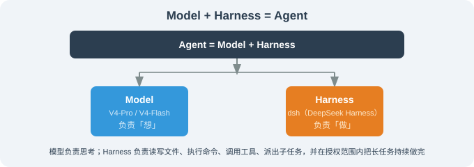

# 第17章 DeepSeek Harness：一切皆插件的开源底座

> 🐋 *"模型负责想，Harness 负责做。闭源为用户提供现在，开源让用户自己掌握未来。"*
> ——DeepSeek 团队，DeepSeek Harness 发布时语

---

## 本章导读

2026 年 8 月 13 日晚间，DeepSeek 团队以 MIT 协议开源了 **DeepSeek Harness（dsh / DSH）**——这是一款"所有 Agent 能力皆为插件"的 Agent 运行框架，配套发布四种运行模式与完整的 Python SDK、CLI、MCP 服务器。它是同月开源的 DeepSeek **V4-Pro / V4-Flash** 模型的"配套运行环境"，正面对标 **Claude Code** 与 **OpenAI Codex**。

为什么 DeepSeek 要专门做一个开源 Harness？答案藏在它们的标语里——**"Model + Harness = Agent"**。模型负责"想"，Harness 负责"做"：读写文件、执行命令、调用工具、派出子任务，并把长任务在授权范围内持续做完。这是一个"AI 操作系统外壳"的形态。下面这张图说明了它的位置：

DeepSeek Harness 的设计哲学有三件显著的事，与本书前面所有框架都不同：

1. **"一切皆插件"** —— 用 Koishi 团队打造的 Cordis 微内核做插件总线，模型、工具、技能、会话、沙箱、调度、UI 都是插件；任何能力都能在不改源码的情况下被替换；
2. **"模型无关"** —— 不绑定 DeepSeek 自家模型，能换 OpenAI、Anthropic、本地 Ollama 或任意 OpenAI 兼容端点；
3. **"四种模式"** —— 标准 / 极简 / PTC（程序化工具调用）/ 创造，分别对应日常开发、基准测试、链式工具调用、内存实验四种场景。

本章的目标：

1. **拆解"一切皆插件"的工程骨架**——理解 Cordis 微内核如何在插件之间建立事件、服务、上下文键的协作网络；
2. **演示 4 种运行模式与安装方式**——`npx`、`pnpm dsh web` 启动 Web UI、Python SDK、源码构建；
3. **与 Claude Code / OpenClaw / Hermes 对照**——把这 4 个开源（去闭源）Harness 并排比较，建立选型直觉。

通过本章你将获得：**理论层面**——理解"插件化元框架"作为新一代 Agent 基础设施的工程价值；**实战层面**——你能在自己机器上启动 DeepSeek Harness、装第一个插件、写第一个自定义工具。

---

## 本章内容概览

| 小节 | 内容 | 你将学到 |
|------|------|---------|
| 17.1 DeepSeek Harness 是什么 | "一切皆插件"理念、Cordis 微内核、与 Claude Code 的根本差异 | 建立 DeepSeek Harness 在 Harness 谱系中的坐标 |
| 17.2 安装与四种运行模式 | `npx` 一键启动 Web UI、源码构建、standard/minimal/PTC/create 四种模式 | 在 macOS / Linux 上跑起来 |
| 17.3 架构：Cordis 微内核与插件拓扑 | 插件加载、服务注册、事件总线、上下文键 | 读懂 DeepSeek Harness 的工程骨架 |
| 17.4 插件开发：tool / llm / skill / subagent 的插件接口 | 写一个自定义工具插件、写一个自定义 LLM 适配器、写一个 skill | 让 Harness 长出你自己需要的能力 |
| 17.5 横向对比：DeepSeek Harness vs Claude Code / OpenClaw / Hermes | 四个开源 Harness 的特性矩阵 + 选型决策 | 帮你做出"用谁"的选择 |
| 17.6 借鉴：可换内核 / 模型无关的工程哲学 | 把"换能力"成本从"改源码"降到"改配置"的工程意义 | 把这种设计哲学带回自己的系统 |
| 17.7 总结：六大 Harness 框架选型矩阵 | 把前面 4 章 + 本章的 6 个框架汇总成一张决策表 | 一张图完成"我该选谁"的判断 |

---

## 阅读建议

本章适合以下读者：

- ✅ **想做"长期可控 Agent 平台"的工程师**：希望不被任何闭源系统锁定——从 17.1 顺序读起
- ✅ **已经在用 Claude Code 想"换开源"的用户**：对比从商业 Harness 迁到开源 Harness 的成本与收益——重点读 17.5
- ✅ **想给 Agent 加自定义能力的开发者**：写自定义插件、技能、工具——重点读 17.4
- ✅ **关心 AI 基础设施的研究者**：跟踪 Cordis 这种"插件元框架"在 Agent 时代的复用——重点读 17.3

**前置知识建议**：建议先阅读第 8 章 Harness Engineering、第 16 章 Claude Code（理解"Harness 是什么"再来看"开源 Harness 长什么样"会更顺）。本章与第 14、15、16 章构成"行动型 Agent 四联篇"——OpenClaw 多渠道、Hermes 自进化、Claude Code 工业 IDE、DeepSeek Harness 插件化工坊。

> ⚠️ **特别说明**：DeepSeek Harness 当前为 **v0.1 开发者预览版**（公开于 2026-08-13），DeepSeek 官方明确提示未来将出现**破坏兼容性**的变更。本章内容以 **v0.1 + 截至 2026-08-15 提交**为基础；版本相关的细节（CLI 命令名、配置文件路径）以 `main` 分支为准。功能可用（Web UI / CLI / 插件开发 / Python SDK 均已发布），追求生产稳定的部署者建议等版本收敛。

---

## 引用约定

本章所有可核验事实（协议、命令名、CLI flag、Cordis 来源）以 `deepseek-ai/deepseek-harness` `main` 分支 README 与官方文档站 `deepseek-harness.github.io/deepseek-harness/` 为准。

> 💡 **核心洞察**：DeepSeek Harness 真正改变的不是"Agent 能做什么"，而是"Agent 能力的归属"——当你不再为"换个 LLM"或"换个工具"等官方发版，Agent 平台就变成了 **用户可拥有** 的东西。

---

*下一节：[17.1 DeepSeek Harness 是什么：Cordis 内核与"一切皆插件"](./01_what_is_dsh.md)*
