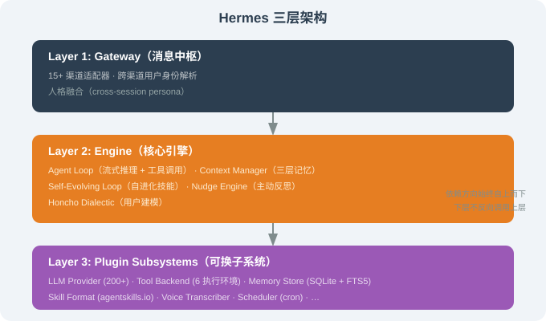
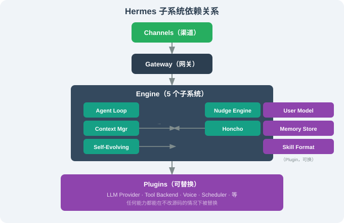

# 15.3 三层架构：Gateway / Engine / Plugin

> ☤ *"三层不是分类，是看问题的不同角度。"*

---

## 一、为什么"Hermes 的架构值得拆"？

第 14 章我们看到 OpenClaw 是"渠道 + Agent Loop + Tools"的传统 4 层结构。Hermes 在这之上又叠了一层：**Plugin 子系统**——它把"Agent 核心能力"全部插件化。

这意味着：

- **Memory** 是插件（不是写死在框架里）；
- **Tool execution backend** 是插件（local / Docker / SSH / Singularity / Modal / Daytona 都是不同插件）；
- **Self-evolving loop** 是插件（可以"关闭"或"换实现"）；
- **Voice transcriber** 是插件（whisper.cpp、Paraformer、OpenAI Whisper 都可换）。

这一层抽象给 Hermes 带来了与 DeepSeek Harness（第 17 章）同源的"可换内核"灵活性——只是更早期、更 Python 风格。

我们用三层视图来拆：Gateway / Engine / Plugin。



下面逐层展开。

---

## 二、Layer 1：Gateway（消息中枢）

Hermes 的 Gateway 与 OpenClaw 几乎同构，但 **Python 实现** 且集成更多渠道（15+）：

```python
# hermes/gateway/channels/telegram.py —— 简化
from telegram.ext import Application, MessageHandler, filters

class TelegramChannel:
    def __init__(self, config):
        self.config = config
        self.app = Application.builder().token(config.bot_token).build()

    async def start(self):
        self.app.add_handler(MessageHandler(
            filters.TEXT & ~filters.COMMAND,
            self._on_message,
        ))
        await self.app.initialize()
        await self.app.start()

    async def _on_message(self, update, context):
        msg = IncomingMessage(
            channel="telegram",
            from_=str(update.effective_user.id),
            text=update.message.text,
            thread_id=str(update.message.message_thread_id or ""),
            is_group=update.effective_chat.type != "private",
            mentions=extract_mentions(update.message),
        )
        await self.bus.publish(msg)   # 送入 Engine
```

**关键 API：**

- `hermes gateway` —— 启动 15 个渠道适配器；
- `hermes channel list` —— 列出活跃渠道；
- `hermes channel add <name>` —— 加一个新渠道；
- `hermes channel test <name>` —— 发送测试消息。

### 2.1 跨渠道人格融合

与 OpenClaw 类似，Hermes 也支持跨渠道身份合并，但它**更激进**——把"用户建模（Honcho Dialectic）"显式作为一个子系统：

```
真实用户（手机号 +1-555-0123）
    ├── Telegram (chat_id=1234567) ──┐
    ├── WhatsApp (+1-555-0123)      ├── 同一个 hermes session
    └── Signal (+1-555-0123)      ──┘

    Honcho 用户建模:
    "张三偏好中文回复、简洁风格、技术深度高、
    已养成每周三下午做 deep work 的习惯"
```

这个用户建模会被 Engine 在每次决策时显式注入上下文，**不是隐式**——你可以在调试时看到。

---

## 三、Layer 2：Engine（核心引擎）

Engine 是 Hermes 区别于 OpenClaw 的核心——它有 5 个子系统：

### 3.1 Agent Loop（流式推理 + 工具调用）

与传统 ReAct 类似，但加了三个 Hermes 特有的环节：

```python
# hermes/engine/loop.py —— 简化
async def agent_loop(session, user_message):
    # 1. 上下文组装（注入三层记忆 + 用户建模）
    context = await context_manager.assemble(session, user_message)

    for step in range(MAX_STEPS):
        # 2. 流式推理
        llm_output = await llm.stream(context)

        # 3. 解析（text / tool_call / final_answer）
        parsed = parse(llm_output)

        if parsed.kind == "final_answer":
            await memory.write_session_entry(session, parsed.text)
            return parsed.text

        if parsed.kind == "tool_call":
            # 4. 工具执行（在当前 backend 中跑）
            decision = await permissions.check(parsed.tool_call, session)
            if not decision.allowed:
                context.append_tool_error(parsed.tool_call.id, decision.reason)
                continue

            result = await tools.run(parsed.tool_call)
            context.append_tool_result(parsed.tool_call.id, result)

            # 5. ⭐ 自进化钩子：触发 Skill 提炼评估
            await self_evolving.on_tool_use(
                session=session,
                tool_call=parsed.tool_call,
                result=result,
                context=context,
            )
```

> 第 5 步（`self_evolving.on_tool_use`）是 Hermes **独有的钩子**——它让"每完成一次任务"都可能变成"创建/更新 Skill"的契机。

### 3.1.1 一次循环的运行示例

用户发"帮我查下明天的天气，然后提醒我带伞"，Agent Loop 内部发生了什么：

```
[step 1] 组装上下文：注入 USER.md（用户偏好"简洁回复"）+ 最近 5 条情景 + 长期记忆
[step 1] 调 LLM → 输出 tool_call: get_weather(city="上海", date="明天")
[step 1] 权限检查 → 放行 → 执行 get_weather → 返回"明天有雨"
[step 1] ⭐ 触发 self_evolving.on_tool_use（记录这次工具调用，供后续提炼评估）
[step 1] 工具结果回写上下文
[step 2] 调 LLM → 输出 tool_call: set_reminder("带伞", time="明早8点")
[step 2] 权限检查 → 放行 → 执行 set_reminder → 成功
[step 2] ⭐ 再次触发 self_evolving.on_tool_use
[step 3] 调 LLM → 输出 final_answer: "明天上海有雨，已帮你设了明早 8 点的带伞提醒"
[step 3] 写会话记忆 → 返回给用户
```

**和普通 ReAct 循环的唯一区别，就是第 5 步的 `self_evolving.on_tool_use` 钩子**。它不改变循环的控制流（工具照跑、结果照回写），只是在每次工具调用后**顺手记一笔**——这笔记录攒起来，就是 15.4 节"自进化"的原料。**这就是"自进化"被集成进主循环而不破坏主循环的方式：用钩子，而不是改流程。**

### 3.2 Context Manager（三层记忆）

Engine 的 Context Manager 不直接存数据——它从 Plugin 子系统的 `Memory Store` 拉数据：

```python
# hermes/engine/context.py —— 简化
async def assemble(session, user_message):
    long_term = await memory_store.recall_relevant(  # 长期语义
        query=user_message.text,
        top_k=10,
    )
    working = await memory_store.get_session(session.id)  # 工作记忆
    episodic = await memory_store.get_recent_episodes(session.id, k=5)  # 情景
    persona = await honcho.user_model(user_message.from_)  # 用户建模

    return build_prompt(
        system_prompt=system_prompt_template,
        long_term=long_term,
        working=working,
        episodic=episodic,
        persona=persona,
        new_message=user_message,
    )
```

> Memory Store 本身是 Plugin——这意味着**同一个 Engine 可以跑在不同存储后端上**（SQLite 是默认，但你可以加 Redis / Postgres / MongoDB 等 Plugin）。

### 3.3 Self-Evolving Loop

这是 Hermes 的核心差异化（详见 15.4）。它在 Engine 主循环之外另起一个**离线进程**，流程是：任务完成 → 评估"是否值得提炼为 Skill" → 若值得，把执行轨迹喂给 LLM 生成 SKILL.md → 落盘为草稿 → 空闲时离线调优。**关键点：它不阻塞主循环**——提炼/迭代都在离线进行，用户感知不到延迟。

### 3.4 Nudge Engine（主动反思）

Engine 还有一个"周期性触发"的子系统——不是每条消息都触发，而是按时间 / 事件触发（每 30 分钟反思"最近有什么经验值得沉淀"，有就触发 Skill 提炼）。详见 15.6。

### 3.5 Honcho Dialectic（用户建模）

Hermes 集成的是 Honcho——一个"持续观察用户 + 主动问自己"的子系统。它观察用户的偏好 / 工作模式 / 决策风格，写成 `USER.md`（人话描述），下次对话时注入 system prompt。详见 15.5。

---

## 四、Layer 3：Plugin Subsystems（可换子系统）

Hermes 的 Plugin 协议和 DeepSeek Harness 的 Cordis Plugin（17 章）有大量相似思想——核心都是"能力可换"。但 Hermes 实现更轻、更 Pythonic。

### 4.1 一个 Plugin 的骨架

```python
# ~/.hermes/plugins/my-llm.py
from hermes.plugins import LLMPlugin

class MyLLMPlugin(LLMPlugin):
    name = "my-llm"
    version = "0.1.0"
    supported_models = ["my-model-1", "my-model-2"]

    async def stream(self, messages, **opts):
        # 调用你的 LLM 端点
        async for chunk in your_api.stream(messages, opts):
            yield chunk

    async def complete(self, messages, **opts):
        return await your_api.complete(messages, opts)
```

注册到 `~/.hermes/config.yaml`：

```yaml
plugins:
  llm:
    - name: my-llm
      enabled: true
      api_endpoint: https://api.example.com/v1
      api_key: "${MY_LLM_KEY}"
```

### 4.2 6 种执行后端

| 插件 | 适用 |
|------|------|
| **local** | 直接跑在 Hermes 主机上（默认） |
| **Docker** | 工具执行隔离在容器里 |
| **SSH** | 远程执行（适合长任务在别处跑） |
| **Singularity** | HPC / 科研环境的标准容器 |
| **Modal** | Serverless Python 平台（休眠付费） |
| **Daytona** | 开发沙箱式休眠容器 |

切换执行后端：

```bash
$ hermes runtime set modal
$ hermes runtime set local
```

每种后端实现同一个 `ToolBackend` 接口：

```python
class ToolBackend(Protocol):
    async def execute(self, command: str) -> ToolResult: ...
    async def read_file(self, path: str) -> bytes: ...
    async def write_file(self, path: str, content: bytes) -> None: ...
```

### 4.3 全文检索与摘要

Hermes 用 SQLite 的 **FTS5**（Full-Text Search 5）做全文检索——这是一个成熟、轻量、零依赖的实现。LLM 摘要则在每次"压缩远端上下文"时按需调用。

```sql
-- ~/.hermes/memory/main.sqlite —— FTS5 索引
CREATE VIRTUAL TABLE memory USING fts5(
  content,
  created_at UNINDEXED,
  source UNINDEXED,
  tags,
  tokenize = 'unicode61 remove_diacritics 2'
);
```

`memory_store.recall_relevant(query, top_k)` 的实现大致是：

```python
async def recall_relevant(query: str, top_k: int = 10):
    sql = """
        SELECT content, created_at, bm25(memory) AS score
        FROM memory
        WHERE memory MATCH ?
        ORDER BY score ASC
        LIMIT ?
    """
    async with aiosqlite.connect(DB_PATH) as db:
        rows = await db.execute(sql, (query, top_k))
        return await rows.fetchall()
```

> **BM25** 是经典的全文检索打分算法。对"最近讨论过 X 主题"这种查询非常有效——远端话题也能从大量历史里被精确召回。

---

## 五、与第 8 章 Harness 的对照

| Harness 六大工程支柱 | Hermes 中的对应 |
|-------------------|-----------------|
| **Agent 循环** | `hermes/engine/loop.py` |
| **工具系统** | `ToolBackend` 抽象 + 6 种实现 |
| **技能系统** | `Self-Evolving Loop`（自动）+ ClawHub 兼容市场 |
| **记忆系统** | `Memory Store` + FTS5 + LLM 摘要 |
| **沙箱隔离** | Docker / SSH / Singularity / Modal / Daytona 等 6 种 |
| **权限治理** | `permissions/` + Hooks + Persona-aware 决策 |
| **额外（Hermes）** | **Self-Evolution + Honcho User Modeling** |

> 这个对照让我们看清一件事：**Hermes 把"六大支柱"做了全部实现，且额外加了"自进化 + 用户建模"两条新支柱**。

---

## 六、子系统依赖关系



依赖方向**始终**自上而下，下层从不直接调用上层——这让"换 Plugin 不动 Engine、换 Engine 不动 Gateway"成为可能。

---

## 七、本节小结

| 主题 | 关键要点 |
|------|---------|
| 三层架构 | Gateway / Engine / Plugin（可换子系统） |
| Engine 子系统 | Agent Loop + Context Manager + Self-Evolving + Nudge + Honcho |
| Plugin 协议 | LLM Provider / Tool Backend / Memory / Skill Format 等都可换 |
| 6 种执行后端 | local / Docker / SSH / Singularity / Modal / Daytona |
| 全文检索 | SQLite FTS5 + BM25 |
| 与第 8 章对照 | 完全覆盖六大支柱 + 自进化 + 用户建模 |

---

*下一节：[15.4 核心：Self-Evolving Skills 闭环](./04_self_evolving_skills.md)*
