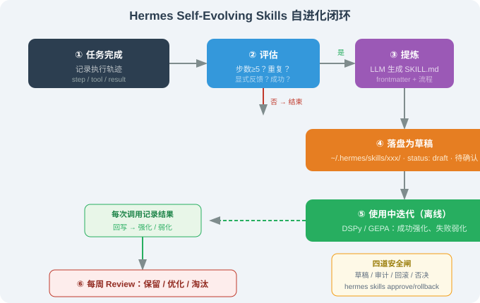

# 15.4 核心：Self-Evolving Skills 闭环

> ☤ *"Hermes 最锋利的一刀：让 Agent 自己写技能、自己迭代技能。"*

---

## 一、问题：为什么"技能"需要自进化

传统 Agent 的技能是**人写死的**（OpenClaw / Claude Code 的 SKILL.md 都由人维护）。这有两个天花板：

1. **覆盖不全**：人不可能预写所有任务——你能想到"邮件摘要""日程提醒"，但想不到三个月后你才会遇到的"每周五把某个表格导出成 PDF 发给老板"。
2. **不随人变**：同一个用户换了工作流，技能不会自动跟着变——你从"用 Notion 记笔记"换成"用 Obsidian"，旧的 Notion 技能就废了，得人手动改。

Hermes 的解法是 **Self-Evolving Skills**——任务完成后，Agent **自己**把执行轨迹提炼成技能；技能在使用中**自己**改进。这是"自进化"最锐利的部分，也是 Hermes 和"OpenClaw 式人工技能库"的分水岭。



---

## 二、闭环总览：五个阶段

整个闭环是一条流水线，**任务完成是起点，技能淘汰/强化是终点**：

| 阶段 | 名字 | 核心问题 | 谁来做 |
|------|------|---------|--------|
| ① | 评估 | 这个任务**值不值得**提炼成技能？ | 规则 + 信号判断 |
| ② | 提炼 | 从执行轨迹**生成** SKILL.md | LLM |
| ③ | 落盘 | 新技能**先存草稿**，不上生产 | 代码 |
| ④ | 迭代 | 技能用得好不好？**离线调优** | LLM + 记录 |
| ⑤ | 淘汰/强化 | 技能**去留**？ | 每周 Review + 用户 |

下面逐个阶段深入，每个阶段都给出**能跑的最小实现**，而不是"概念示意"。

---

## 三、阶段 ①：评估（Should I extract?）

不是每个任务都值得提炼成技能——如果 Agent 把"帮我查一下今天几号"也提炼成技能，技能库很快就会被垃圾淹没。所以第一步是**用一个判断函数挡住不值得的任务**。

```python
# hermes/self_evolving/should_extract.py
def should_extract(task, trajectory, user_signal):
    """
    判断一个刚完成的任务是否值得提炼成技能。

    返回值：
        True  → 值得提炼，进入阶段②
        False → 不值得，丢弃

    四个信号（满足任一强信号，或综合打分过阈值即通过）：
    """

    # 信号 1：任务够复杂（步数 ≥ 5）
    #   一步就能完成的简单任务（"查天气"）没有沉淀价值，
    #   只有多步任务（"整理收件箱→分类→摘要→写报告"）才值得。
    complex_enough = trajectory["steps"] >= 5

    # 信号 2：重复出现（相似任务出现 ≥ 2 次）
    #   一次性的任务不值得自动化，重复的才值得——
    #   "重复劳动 = 该自动化"是最朴素的判断标准。
    repeated = trajectory["similar_count"] >= 2

    # 信号 3：用户显式要求（"记住这个流程"）
    #   这是最强信号——用户明确说"记住"，直接通过。
    explicit = user_signal == "remember"

    # 信号 4：任务成功了
    #   失败的任务不提炼——先修 bug，别把错误流程固化成技能。
    succeeded = trajectory["status"] == "success"

    # 综合判断：至少"成功" +（复杂 或 重复 或 显式）
    return succeeded and (complex_enough or repeated or explicit)
```

**这个函数的本质是一个"过滤器"**。它回答的问题是：**什么样的经验值得固化成技能？** 答案是"成功的 + 复杂的/重复的/用户要求的"。反过来，失败的任务、简单的一次性任务，都不会进入技能库。

运行示例：

```python
trajectory = {"steps": 8, "similar_count": 1, "status": "success"}
print(should_extract(trajectory, trajectory, "none"))   # True（8步够复杂）

trajectory2 = {"steps": 1, "similar_count": 0, "status": "success"}
print(should_extract(trajectory2, trajectory2, "none")) # False（1步太简单）

trajectory3 = {"steps": 6, "similar_count": 0, "status": "failed"}
print(should_extract(trajectory3, trajectory3, "none")) # False（失败了不提炼）
```

输出：

```
True
False
False
```

**解读**：第一个任务 8 步、成功了 → 提炼；第二个 1 步 → 太简单不提炼；第三个失败了 → 不提炼。**这三条规则就是"自进化不会变成垃圾堆"的第一道防线**。

---

## 四、阶段 ②：提炼（Extract SKILL.md）

判定值得提炼后，把执行轨迹喂给 LLM，让它生成结构化的 SKILL.md。这是整个闭环里**唯一依赖 LLM 创造力的环节**。

### 4.1 完整实现

```python
# hermes/self_evolving/extract.py
import json
import re

# 提炼用的 prompt：把"执行轨迹"翻译成"技能说明书"
EXTRACT_PROMPT = """
你是一个技能提炼器。以下是一次成功任务的执行轨迹，请把它提炼成一个可复用的 Skill。

## 执行轨迹（用户消息 + 每一步的决策和工具调用）
{trajectory}

## 输出要求（严格的 JSON 格式）
{{
  "name": "技能名（kebab-case，如 summarize-inbox）",
  "description": "一句话描述，含触发词（用户怎么问会用到这个技能）",
  "trigger": "触发条件：什么情况下该用",
  "steps": ["步骤1", "步骤2", "..."],
  "tools": ["用到的工具名"],
  "permissions": ["需要的权限"],
  "constraints": ["明确不做的事"]
}}

注意：
- description 要包含触发词，否则 Agent 永远想不起来用它；
- steps 每步一句话，不要超过 10 步；
- constraints 写"不做"而非"要做"，更利于安全审查。
"""

def extract_skill(trajectory: dict, llm) -> dict:
    """把执行轨迹提炼成 SKILL.md 的 frontmatter + 内容"""

    # 1. 把轨迹序列化成文本，填进 prompt
    prompt = EXTRACT_PROMPT.format(trajectory=json.dumps(trajectory, ensure_ascii=False, indent=2))

    # 2. 调 LLM 生成（invoke 返回 AIMessage，取 .content 得到纯文本）
    raw = llm.invoke(prompt).content

    # 3. 解析 JSON（LLM 可能输出 ```json 包裹或前后有废话）
    #    用正则提取第一个 { 到最后一个 }，比手动 strip/replace 更稳——
    #    手动 replace("json","") 会误删内容里恰好出现的 "json" 字样。
    match = re.search(r'\{.*\}', raw, re.DOTALL)
    skill = json.loads(match.group(0) if match else raw)

    # 4. 附加元数据（来源轨迹、置信度、创建时间）—— 后面草稿审查要用
    skill["_meta"] = {
        "source_trajectory_id": trajectory["id"],
        "confidence": trajectory.get("confidence", 0.8),
        "created_at": trajectory["finished_at"],
    }
    return skill
```

### 4.2 运行示例：看一次真实的提炼

假设用户第一次让 Hermes"整理收件箱，按主题分类并摘要"，Agent 用 8 步完成了。它的执行轨迹（简化）是：

```json
{
  "id": "traj_20260817_001",
  "steps": 8,
  "status": "success",
  "messages": [
    {"role": "user", "content": "帮我整理收件箱，按主题分类并摘要"},
    {"role": "tool", "content": "list_today_emails() → 28 封未读"},
    {"role": "tool", "content": "classify_email() → 分成了 5 类"},
    {"role": "tool", "content": "summarize_email() → 生成摘要"},
    {"role": "tool", "content": "write_report() → 写入 ~/Reports/inbox-20260817.md"}
  ]
}
```

`extract_skill` 的输出（LLM 生成）：

```json
{
  "name": "summarize-inbox",
  "description": "整理收件箱并按主题分类摘要。当用户说\"整理邮件/收件箱/分类邮件\"时使用。",
  "trigger": "用户要求整理、分类、摘要收件箱时触发",
  "steps": [
    "调用 list_today_emails 获取未读邮件",
    "按主题对邮件分类（工作/个人/营销/账单）",
    "对每类生成一句话摘要",
    "把结果写入 ~/Reports/ 并回复用户"
  ],
  "tools": ["list_today_emails", "classify_email", "summarize_email", "write_report"],
  "permissions": ["gmail.read", "fs.write"],
  "constraints": ["不删除任何邮件", "不自动回复邮件", "摘要不超过 200 字"]
}
```

**逐项解读这个产物**：

| 字段 | 值 | 为什么重要 |
|------|-----|-----------|
| `description` | 含"整理邮件/收件箱/分类邮件"触发词 | 没有触发词，Agent 下次就"想不起来"有这个技能 |
| `steps` | 4 步（从 8 步轨迹压缩） | 把 8 步执行轨迹抽象成 4 步"范式"，去掉了一堆中间噪音 |
| `constraints` | "不删除/不回复邮件" | 这是**安全边界**——提炼时主动声明"不做的事"，比"做的事"更利于审查 |

---

## 五、阶段 ③：落盘（Save draft）

提炼结果**不直接上生产**，先存为草稿。这是防"失控"最关键的一步。

```python
# hermes/self_evolving/save_draft.py
import json
from pathlib import Path

SKILLS_DIR = Path.home() / ".hermes" / "skills"

def save_draft(skill: dict) -> Path:
    """把提炼出的技能存为草稿（status: draft），不激活"""

    # 1. 技能目录：~/.hermes/skills/<name>/
    skill_dir = SKILLS_DIR / skill["name"]
    skill_dir.mkdir(parents=True, exist_ok=True)

    # 2. SKILL.md 的 frontmatter 强制标记 status: draft
    frontmatter = {
        "name": skill["name"],
        "description": skill["description"],
        "tools": skill["tools"],
        "permissions": skill["permissions"],
        "version": "0.1.0",
        "status": "draft",        # ⚠️ 关键：草稿状态，Agent 默认不能调用
    }

    md = "---\n" + "\n".join(f"{k}: {json.dumps(v, ensure_ascii=False)}" for k, v in frontmatter.items()) + "\n---\n\n"
    md += f"# {skill['name']}\n\n"
    md += f"## 触发条件\n{skill['trigger']}\n\n"
    md += "## 执行流程\n" + "\n".join(f"{i+1}. {s}" for i, s in enumerate(skill["steps"])) + "\n\n"
    md += "## 约束\n" + "\n".join(f"- {c}" for c in skill["constraints"]) + "\n"

    # 3. 写 SKILL.md + meta.json（来源轨迹、置信度，供后续审查/回滚）
    (skill_dir / "SKILL.md").write_text(md)
    (skill_dir / "meta.json").write_text(json.dumps(skill["_meta"], ensure_ascii=False, indent=2))

    return skill_dir
```

**`status: draft` 是整个安全模型的核心**。它意味着：新技能落盘后，Agent **默认看不到它**——它躺在技能目录里，但不会被加载进 Agent 的可用工具列表。只有当用户（或审计流程）把它从 `draft` 改成 `active`，它才真正"上线"。

> 📌 这对应了 14.6 节 OpenClaw 的"权限"思路，但更进一步：OpenClaw 的技能是**人写的、默认信任**；Hermes 的技能是 **Agent 写的、默认不信任**——必须过一道"确认"才能激活。

---

## 六、阶段 ④：使用中迭代（Self-improve offline）

技能激活后，每次被调用都会**记录结果**；空闲时 Hermes 离线分析这些记录，优化技能本身。这就是"技能在使用中越用越好"的来源。

```python
# hermes/self_evolving/offline_improve.py
def record_usage(skill_name: str, result: dict):
    """技能每次被调用后，记录一次使用结果"""
    # 追加到该技能的 usage 日志（jsonl，一行一条）
    usage_log = SKILLS_DIR / skill_name / "usage.jsonl"
    with open(usage_log, "a") as f:
        f.write(json.dumps(result, ensure_ascii=False) + "\n")


def offline_improve(skill_name: str, llm):
    """空闲时（cron 触发）分析 usage 日志，离线优化技能"""

    # 1. 读该技能最近 N 次的使用记录
    #    文件可能还不存在（技能刚创建、还没被调用过），要容错
    usage_log = SKILLS_DIR / skill_name / "usage.jsonl"
    lines = usage_log.read_text().splitlines()[-20:] if usage_log.exists() else []
    records = [json.loads(l) for l in lines]

    # 2. 还没有使用记录：保留观察，不急着淘汰
    if not records:
        return "keep"

    # 3. 统计成功率
    successes = [r for r in records if r["ok"]]
    success_rate = len(successes) / len(records)

    # 4. 三种处置（对应"健康/需优化/濒死"）
    if success_rate > 0.9:
        return "keep"        # 健康：保留
    elif success_rate > 0.5:
        return "improve"     # 需优化：触发 self-improve（让 LLM 看失败案例改 steps）
    else:
        return "prune"       # 濒死：提示用户决定去留
```

**为什么"迭代"要放在空闲时（offline）做？** 因为迭代要调 LLM、要分析日志，**如果放在技能被调用的那一刻做，会拖慢用户的实际请求**。离线迭代把"优化"从"热路径"（用户等待的路径）挪到"冷路径"（cron 空闲时），用户在技能调用时感觉不到任何延迟。

---

## 七、阶段 ⑤：淘汰/强化（Prune / Reinforce）

每周 Review（见 15.6）根据 `offline_improve` 的结论决定技能去留：

| 结论 | 动作 | 对应命令 |
|------|------|---------|
| `keep`（成功率 > 90%） | 保留，权重提升 | 无 |
| `improve`（50%~90%） | 触发 self-improve，让 LLM 看失败案例改 steps | `hermes skills improve <name>` |
| `prune`（< 50%） | 提示用户决定去留 | `hermes skills disable <name>` |

---

## 八、一个完整的 trace：从任务到技能

把五个阶段串起来，看一次**完整**的自进化过程（这是理解 Hermes 的关键）：

```
[第 1 天]
用户: 帮我整理收件箱，按主题分类并摘要
Agent: 用 8 步完成（读邮件→分类→摘要→写报告）
阶段① 评估: steps=8 ≥ 5，success → 值得提炼 ✓
阶段② 提炼: LLM 生成 summarize-inbox 技能（4 步范式 + 触发词 + 约束）
阶段③ 落盘: 存为 draft，Agent 还看不到它
用户: hermes skills approve summarize-inbox → 激活

[第 2 天]
用户: 整理邮件
Agent: 命中 summarize-inbox 的触发词 → 直接调用技能（不再从零规划，8 步 → 4 步）
阶段④ 记录: 本次成功，写入 usage.jsonl

[第 7 天]
用户: 整理收件箱，把营销邮件也标出来
Agent: 调技能，但把营销邮件误归为"工作"类
阶段④ 记录: 本次部分失败（分类错误）

[第 8 天（空闲时）]
阶段④ 迭代: offline_improve 发现最近 20 次有 2 次分类错误 → 成功率 90%
阶段⑤ 强化: 触发 self-improve，LLM 看失败案例，把 steps 里的"分类"细化为"工作/个人/营销/账单"
```

**第 1 天 vs 第 8 天的本质区别**：

- **普通 Agent**（人工技能库）：第 8 天整理邮件和第 1 天一样，靠人写的固定规则，营销邮件照样分错——除非人手动改技能。
- **Hermes**：第 8 天的技能已经是"看过自己 20 次使用记录、修正过分类规则"的版本。**它从自己的失败中学习了，而没有人介入。**

---

## 九、与"人工技能库"的本质区别

| 维度 | 人工技能库（OpenClaw） | 自进化技能（Hermes） |
|------|----------------------|---------------------|
| 技能来源 | 人写 | 人 + Agent（从实际轨迹提炼） |
| 迭代 | 人发版 | Agent 离线自动 |
| 覆盖 | 人的想象力 | 实际任务轨迹（用户真遇到什么，就有什么技能） |
| 个性化 | 通用 | 专属该用户 |
| 审查 | 简单（人写人审） | 复杂（草稿 + 审计 + 版本回滚） |

**一句话总结差异**：OpenClaw 的 Skills 是"**给人用的扩展接口**"；Hermes 的 Self-Evolving Skills 是"**让 Agent 学会的肌肉记忆**"。前者解决"怎么扩展能力"，后者解决"怎么让能力随使用进化"。

---

## 十、安全边界（为什么不是"失控"）

自进化听起来危险——"Agent 自己写技能，会不会越写越危险？" Hermes 用 4 道闸防失控：

| 闸门 | 机制 | 挡住什么风险 |
|------|------|-------------|
| 1. 草稿机制 | 新技能 `status: draft`，Agent 默认不可用 | 挡住"坏技能一生成就上线" |
| 2. 权限审计 | 提炼的 `tools`/`permissions` 字段强制过权限系统 | 挡住"技能申请了不该有的权限" |
| 3. 版本回滚 | 技能每次迭代保留版本，可回退 | 挡住"迭代改坏了技能" |
| 4. 用户否决 | `hermes skills disable` 随时关掉 | 兜底：用户有最终否决权 |

```bash
$ hermes skills list
  summarize-inbox    active    v3   (自进化，最近迭代 2h 前)
  daily-report       draft     v1   (待确认)
  send-email         disabled  v2   (你已关闭)

$ hermes skills approve summarize-inbox      # 确认草稿 → 激活
$ hermes skills rollback summarize-inbox v2  # 回退到 v2
```

**核心设计哲学**：自进化的**速度**可以快（自动提炼、自动迭代），但**上线**必须慢（草稿、审计、确认）。**"进化快、上线慢"是让自进化安全可控的唯一解**——反过来"进化慢、上线快"（人写技能直接上）反而更容易出问题，因为人写技能时可能没意识到某个边界。

---

## 十一、本节小结

| 主题 | 关键要点 |
|------|---------|
| 闭环五阶段 | 评估 → 提炼 → 落盘 → 使用中迭代 → 淘汰/强化 |
| 评估信号 | 步数 ≥ 5 / 重复 ≥ 2 / 显式反馈 / 成功 |
| 提炼 | LLM 把轨迹翻译成 SKILL.md，description 必须含触发词 |
| 落盘 | `status: draft`，Agent 默认不可见，激活需人工确认 |
| 迭代 | 离线分析 usage.jsonl，成功/失败分治 |
| 安全闸 | 草稿 + 权限审计 + 版本回滚 + 用户否决 |
| 哲学 | 进化快、上线慢 |

---

*下一节：[15.5 三层记忆系统：MEMORY / USER / Session](./05_memory.md)*
