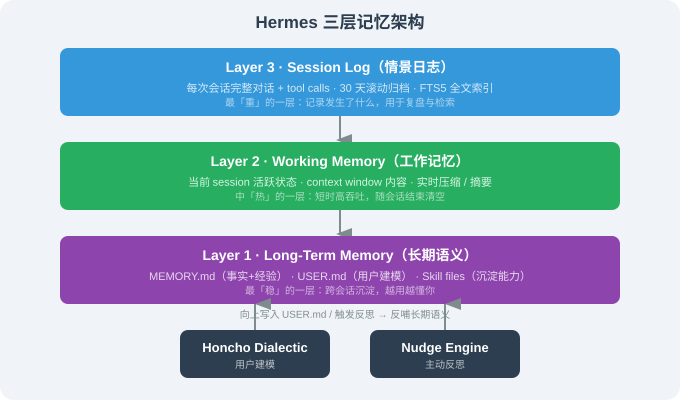
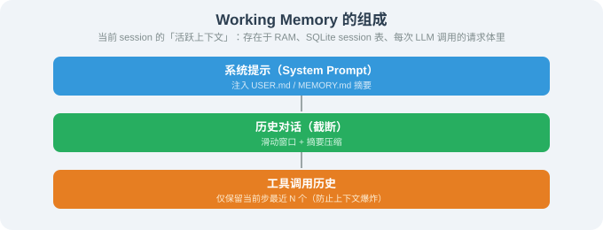

# 15.5 三层记忆系统：MEMORY / USER / Session

> ☤ *"长期语义是'知道什么'，工作记忆是'正在做什么'，情景日志是'做过什么'。"*

---

## 一、为什么"记忆"是 Hermes 的关键差异化

OpenClaw 也有"长期记忆"——但只是单层 SQLite；Hermes 把记忆拆成**三层**，每层有明确的语义角色与存储后端。这种分层让 Agent 真正具备**跨会话**、**跨渠道**、**持续学习**的能力。

本节把三层记忆展开讲。

---

## 二、三层架构总览



下面逐层拆。

---

## 三、Layer 1：Long-Term Memory（长期语义）

### 3.1 三种文件形态

```
~/.hermes/
├── MEMORY.md     # 长期事实 + 经验
├── USER.md       # 用户建模
└── skills/       # 沉淀能力
```

### 3.2 `MEMORY.md` 的语义

`MEMORY.md` 是 Hermes 的"长期陈述记忆"——用**自然语言**记录长期事实与经验，由 Hermes 自己维护：

```markdown
# MEMORY.md —— Hermes 的长期记忆

## 长期事实

- 用户公司位于北京海淀区，工作语言以中英文混用为主
- 用户的核心项目是一个叫 "agent_learning" 的 mdBook 项目
- 用户的常用工具栈：Python（PyTorch / LangChain / OpenClaw / Hermes）、Node（Vite / React）
- 用户的偏好：偏好简短精炼回复；不喜欢废话；不需要 emoji；技术深度要够

## 累积经验

- 2026-06：用户偏好"每周复盘"——发现每个周日晚上 21:00 做这件事效果最好
- 2026-07：用户的日历常常提前一天被改动——日程提醒要带"前一天提醒"
- 2026-08：用户对一切"非事实即可核验"的数据有警觉——不引用 Star 数等动态数字
```

`MEMORY.md` 的几点设计哲学：

1. **自然语言** —— 而不是 JSON 表或向量 —— 因为它**可以被 LLM 完美理解**；
2. **人话描述** —— 而不是 embeddings —— 因为你可以直接打开文件看、改、合并；
3. **显式日期** —— 每条信息都带时间，方便 Agent 判断"这条信息是否过期"。

### 3.3 `USER.md` 的语义

`USER.md` 是 Hermes 的"用户建模"——比 MEMORY.md 更聚焦于"人"：

```markdown
# USER.md —— 用户建模

## 基本画像

- 名：Haozhe
- 工作：腾讯青云算法工程师 + mdBook 作者
- 关注领域：AI Agent / 自演化 Agent / USACO

## 工作模式

- 上午：脑力活、深度工作
- 下午：会议、协作
- 晚上：写作、复盘
- 周日：复盘 + 学习

## 偏好

- 中文为主，工作术语保持英文
- 简洁直接，结构化输出
- 提交前要确认所有破坏性动作
- 引用事实要可核验

## 与 Hermes 的协作方式

- 使用 AskUserQuestion 询问关键决策
- 用 TaskCreate / TaskUpdate 跟踪进度
- 关键决策后记得更新 memory
- 不要做没必要的视觉化（除非真的有用）
```

USER.md 是 **Honcho dialectic**（15.6）维护的——Hermes 自己每过一段时间会问自己："我从最近的对话里看出了什么用户偏好？" 然后更新这个文件。

### 3.4 Skill files 作为"能力记忆"

`~/.hermes/skills/` 下的每个 Skill 也是 Hermes 的"长期能力记忆"——它们不是数据，是"沉淀的可执行能力"：

```
~/.hermes/skills/
├── book-flight/
├── draft-reply/
├── meeting-summary/
├── …
```

每个 Skill 都是 self-evolving 的产物（15.4）。

### 3.5 长期记忆的写入路径

写入路径有 3 个：

| 触发 | 写入位置 |
|------|---------|
| **用户主动告知**（"记住 XXX"） | MEMORY.md |
| **Nudge Engine 主动反思** | MEMORY.md / USER.md |
| **任务自动完成且成功** | Skill files |

写入是**显式的**——Hermes 不会偷偷往 MEMORY.md 里塞东西，所有写入都会在 `hermes memory log` 里留下痕迹。

---

## 四、Layer 2：Working Memory（工作记忆）

### 4.1 概念

**Working memory** 就是当前 session 的"活跃上下文"——它存在于 RAM、SQLite 的 session 表、和每次 LLM 调用的请求体里。



### 4.2 压缩策略

当 context window 接近上限，Hermes 触发**三级压缩**（与 Claude Code 同思路，但更精细）：

| 触发条件 | 压缩策略 |
|---------|---------|
| 上下文 < 60% | 不压缩 |
| 60~80% | **滑动**：保留最近 K 轮，远端摘要丢弃 |
| 80~95% | **LLM 摘要**：把远端整段压成一段 Markdown |
| > 95% | **激进**：删工具调用历史，只保留 final answer |

压缩是**主动的、可观测的**——`hermes session debug` 会显示每次压缩的时间、压缩比、保留了什么。

### 4.3 与 LangChain 上下文工程的差异

| 维度 | LangChain 通用做法 | Hermes Working Memory |
|------|---------------------|----------------------|
| **压缩触发** | 开发者写代码触发 | **自动**（按比例触发） |
| **压缩方法** | ConversationSummaryMemory 等几个 class | 三级压级 + LLM 摘要 |
| **可观测性** | 通过 LangSmith | `hermes session debug` |
| **跨 session 复用** | 几乎无 | **回写 MEMORY.md / Skill** |

---

## 五、Layer 3：Session Log（情景日志）

### 5.1 概念

Session Log 是 Hermes 的"情景记忆"——**每次会话的完整记录**，包括：

```
~/.hermes/sessions/
├── 2026-08-17/
│   ├── session-001/
│   │   ├── messages.jsonl           # 每条对话
│   │   ├── tool_calls.jsonl         # 每个 tool call + result
│   │   ├── diffs/                   # 文件编辑 diff
│   │   └── skills_used.jsonl        # 哪些 skill 被调用
│   ├── session-002/
│   │   └── …
│   └── …
├── 2026-08-16/
│   └── …
└── …
```

### 5.2 FTS5 全文索引

每次会话被写入后，会被自动加入 FTS5 索引。这意味着：

```bash
$ hermes memory search "Q3 plan review"
2 个相关结果：
  • 2026-08-10 session-007 · "Q3 plan review" 标题匹配
  • 2026-07-28 session-042 · 包含 "review plan" 上下文
```

`hermes memory search` 用 BM25 打分——比纯语义检索更**精确**（短关键字也能命中）。

### 5.3 30 天滚动

会话日志默认保留 30 天，超期后归档为 zip（仍可搜索但不再被常驻加载）。这避免了"长期占用磁盘"。

### 5.4 用于 Self-Evolving

Session Log 是 Self-Evolving 的"燃料"——Self-Evolving Loop 通过 `memory.recall_relevant(query, top_k=10)` 召回相似任务的轨迹，再交给 LLM 提炼 Skill（详见 15.4）。

---

## 六、跨层访问的统一接口

Hermes 暴露一个统一的 `memory` 接口，让所有层调用者（Agent Loop / Nudge Engine / Self-Evolving 等）都能用同样的 API：

```python
# hermes/memory/store.py —— 简化接口
class MemoryStore:
    # 写入
    async def write_long_term(self, content: str, tags: List[str]): ...
    async def write_user_model(self, content: str): ...
    async def write_session_entry(self, session_id: str, entry: dict): ...

    # 召回
    async def recall_relevant(self, query: str, top_k: int = 10) -> List[MemoryHit]: ...
    async def get_session(self, session_id: str) -> Session: ...
    async def get_user_model(self) -> str: ...
    async def get_recent_episodes(self, session_id: str, k: int) -> List[dict]: ...

    # 维护
    async def rollback(self, hit_id: str): ...
    async def archive_sessions_older_than(self, days: int): ...
```

调用方**不需要**关心底层是 SQLite 还是其它——这是 Memory Store Plugin 起的作用（15.3 的 Layer 3）。

---

## 七、跨渠道记忆一致性

Hermes 在多渠道下的记忆合并策略与 OpenClaw 类似（手机号关联），但**更激进**——它显式维护一个"用户档案"：

```
User: 张三
├── user_id: hermes:user:phone-555-0123
├── USER.md
├── memory/*.md
├── skills/* (个人专属)
└── channels:
    ├── telegram: 1234567 (active 30ms ago)
    ├── whatsapp: +1-555-0123 (last: 4h ago)
    └── signal: +1-555-0123 (last: 1w ago)
```

这意味着 Hermes 在你切换渠道时：

- 同一个真人的所有历史被同一份 MEMORY.md 引用；
- 同一个真人的所有用户偏好被同一份 USER.md 引用；
- 同一个人在不同渠道看到的 Agent 人格**完全一致**。

这是 OpenClaw 默认不合并、Hermes 默认合并的根本差异——这个选择**深刻**影响 Agent 给人的"连贯感"。

---

## 八、本节小结

| 主题 | 关键要点 |
|------|---------|
| 三层记忆 | 长期语义（MEMORY/USER/Skills）/ 工作记忆 / 情景日志 |
| MEMORY.md | 自然语言、显式日期、人可读 + 机可读 |
| USER.md | Honcho 用户建模产物，描述用户偏好 |
| Working Memory | 三级压缩、自动触发、可观测 |
| Session Log | FTS5 全文索引，30 天滚动归档 |
| 跨渠道记忆 | 默认按手机号合并，所有渠道共享 USER.md / MEMORY.md |
| 跨层接口 | `MemoryStore` 抽象，对调用方统一 |

---

*下一节：[15.6 Nudge Engine 与跨会话学习](./06_nudge_engine.md)*
