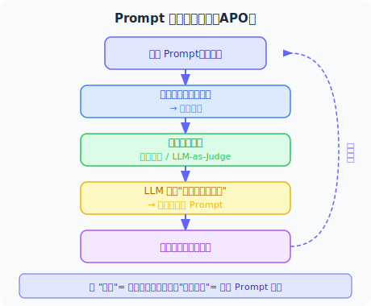

# 2.3 Few-shot / Zero-shot / Chain-of-Thought 提示策略

掌握了基础的 Prompt Engineering 之后，我们来学习几种经过研究验证的提示策略。这些策略在面对复杂任务时，能显著提升 LLM 的表现。

> 📄 **学术背景**：Few-shot 学习由 Brown 等人在 GPT-3 论文中系统化研究 [1]，证明了大模型仅通过几个示例就能适应新任务。Chain-of-Thought（思维链）由 Wei 等人提出 [2]，通过在 prompt 中加入"让我们一步步思考"就能大幅提升 LLM 的推理能力——在 GSM8K 数学推理基准上，CoT 将 PaLM 540B 的准确率从 17.9% 提升到 58.1%。

## Zero-shot：直接提问

**Zero-shot（零样本）** 是最简单的策略：直接告诉模型任务是什么，不提供任何示例。

```python
from openai import OpenAI

client = OpenAI()

def zero_shot_classify(text: str) -> str:
    """零样本情感分类"""
    response = client.chat.completions.create(
        model="gpt-4.1",
        messages=[
            {
                "role": "system",
                "content": "你是一个文本分类专家。"
            },
            {
                "role": "user",
                "content": f"""
对以下评论进行情感分类，只返回：正面、负面、中性 之一。

评论：{text}

分类结果："""
            }
        ]
    )
    return response.choices[0].message.content.strip()

# 测试
texts = [
    "这个产品太棒了，完全超出了我的预期！",
    "还可以吧，没什么特别的。",
    "质量很差，完全浪费钱，不推荐。"
]

for text in texts:
    result = zero_shot_classify(text)
    print(f"文本: {text[:20]}... → {result}")
```

**Zero-shot 适用场景：**
- 任务描述清晰、模型熟悉的常见任务
- 快速原型验证
- 对延迟和成本要求较高的场景

## Few-shot：示例引导学习

**Few-shot（少样本）** 通过提供几个示例，让模型理解期望的输入输出模式。

```python
def few_shot_classify(text: str) -> str:
    """少样本情感分类——通过示例引导"""
    
    # 精心挑选的示例（覆盖不同情况）
    examples = [
        ("这款手机拍照效果惊艳，续航也很棒！", "正面"),
        ("物流太慢了，等了两周才到，很失望。", "负面"),
        ("产品符合描述，包装完好。", "中性"),
        ("客服态度超好，问题解决得很及时，给好评！", "正面"),
        ("有点贵，但质量确实不错。", "中性"),
    ]
    
    # 构建 Few-shot Prompt
    few_shot_prompt = "对以下评论进行情感分类（正面/负面/中性）。\n\n"
    
    for example_text, label in examples:
        few_shot_prompt += f"评论：{example_text}\n情感：{label}\n\n"
    
    few_shot_prompt += f"评论：{text}\n情感："
    
    response = client.chat.completions.create(
        model="gpt-4.1",
        messages=[{"role": "user", "content": few_shot_prompt}]
    )
    return response.choices[0].message.content.strip()

# Few-shot 在复杂分类任务上通常更稳定
result = few_shot_classify("不得不说，价格有些偏高，不过产品本身没什么大问题。")
print(f"分类结果：{result}")
```

**Few-shot 的关键技巧：**

```python
def create_few_shot_prompt(task_description: str, 
                            examples: list[tuple],
                            new_input: str) -> str:
    """
    通用 Few-shot Prompt 构建器
    
    Args:
        task_description: 任务描述
        examples: [(输入, 输出), ...] 示例列表
        new_input: 待处理的新输入
    """
    prompt = f"{task_description}\n\n"
    
    prompt += "## 示例\n\n"
    for i, (inp, out) in enumerate(examples, 1):
        prompt += f"示例 {i}：\n"
        prompt += f"输入：{inp}\n"
        prompt += f"输出：{out}\n\n"
    
    prompt += f"## 现在请处理\n"
    prompt += f"输入：{new_input}\n"
    prompt += "输出："
    
    return prompt

# 使用示例：代码注释生成
examples = [
    (
        "def add(a, b): return a + b",
        "# 将两个数相加并返回结果\ndef add(a, b): return a + b"
    ),
    (
        "def is_even(n): return n % 2 == 0",
        "# 判断数字是否为偶数，返回布尔值\ndef is_even(n): return n % 2 == 0"
    ),
]

new_code = "def factorial(n): return 1 if n <= 1 else n * factorial(n-1)"
prompt = create_few_shot_prompt(
    "为以下 Python 函数添加一行中文注释",
    examples,
    new_code
)
print(prompt)
```

**示例选择原则：**
1. **代表性**：覆盖任务的各种情况（边界case）
2. **多样性**：不要全是相似的例子
3. **质量**：示例本身必须正确
4. **顺序**：最后一个示例的风格影响最大

## Chain-of-Thought（CoT）：让模型"想出来"

**Chain-of-Thought（思维链）** 是一种革命性的提示策略：通过让模型展示推理过程，显著提升其在复杂问题上的准确率。

> 📄 **论文出处**：CoT 由 Google Brain 团队在论文 *"Chain-of-Thought Prompting Elicits Reasoning in Large Language Models"*（Wei et al., 2022）中首次提出。该论文发现，只要在 Few-shot 示例中加入推理步骤，模型在 GSM8K 数学推理数据集上的准确率就能从 17.7% 飙升到 58.1%——仅仅是改变了提示的格式，没有修改模型的任何参数。这个发现揭示了一个深刻的事实：**大型语言模型已经具备了推理能力，我们需要的只是用正确的方式"激发"它。**


```python
def solve_with_cot(problem: str) -> str:
    """使用思维链解决复杂问题"""
    
    response = client.chat.completions.create(
        model="gpt-4.1",
        messages=[
            {
                "role": "system",
                "content": """解题时，请严格按照以下步骤：
1. 理解问题（用1-2句话复述问题）
2. 分析已知条件
3. 制定解题思路
4. 逐步推导
5. 得出结论并验证

每一步都要明确标注。"""
            },
            {
                "role": "user",
                "content": problem
            }
        ]
    )
    return response.choices[0].message.content

# 数学推理问题
problem = """
小明有若干个苹果。他先给了小红苹果总数的一半多1个，又给了小李苹果总数的四分之一，
此时小明还剩9个苹果。请问小明最初有多少个苹果？
"""

result = solve_with_cot(problem)
print(result)
```

**Zero-shot CoT 魔法咒语：**

> 📄 **论文出处**：*"Large Language Models are Zero-Shot Reasoners"*（Kojima et al., 2022）发现了一个令人惊讶的事实——只需在 Prompt 末尾加上 *"Let's think step by step"*（"让我们一步步思考"）这句话，就能在不提供任何推理示例的情况下触发 CoT 推理。这意味着模型的推理能力是"内建"的，只需要一个简单的触发词就能激活。

```python
def zero_shot_cot(question: str) -> str:
    """零样本思维链：加上魔法咒语即可触发推理"""
    
    # 第一步：触发推理
    response1 = client.chat.completions.create(
        model="gpt-4.1",
        messages=[
            {
                "role": "user",
                "content": f"{question}\n\n让我们一步步思考（Let's think step by step）："
            }
        ]
    )
    
    reasoning = response1.choices[0].message.content
    
    # 第二步：基于推理给出最终答案
    response2 = client.chat.completions.create(
        model="gpt-4.1",
        messages=[
            {"role": "user", "content": f"{question}\n\n让我们一步步思考："},
            {"role": "assistant", "content": reasoning},
            {"role": "user", "content": "基于以上推理，请给出最终简洁的答案："}
        ]
    )
    
    return {
        "reasoning": reasoning,
        "answer": response2.choices[0].message.content
    }

result = zero_shot_cot("如果一列火车以120km/h的速度行驶，需要多少分钟才能走完180公里？")
print("推理过程：", result["reasoning"])
print("\n最终答案：", result["answer"])
```

## 高级策略：Tree-of-Thought（ToT）

**Tree-of-Thought** 是 CoT 的升级版：让模型探索多条推理路径，选择最优解。

> 📄 **论文出处**：*"Tree of Thoughts: Deliberate Problem Solving with Large Language Models"*（Yao et al., 2023）。与 CoT 的"一条路走到底"不同，ToT 让模型在每一步都生成多个候选想法（Thought），然后用评估函数判断哪些想法更有前景，最终像搜索树一样找到最优的推理路径。论文在 24 点游戏上的实验尤其惊艳——标准 CoT 仅解出 4% 的题目，ToT 达到了 74%。

```python
def tree_of_thought(problem: str, num_paths: int = 3) -> str:
    """
    思维树：生成多条推理路径，评估并选择最优解
    适用于复杂决策问题
    """
    
    # 步骤1：生成多条推理路径
    paths_prompt = f"""
问题：{problem}

请提供 {num_paths} 种不同的解决思路（每种思路用简短的标题开头，然后描述核心方法）：
"""
    
    paths_response = client.chat.completions.create(
        model="gpt-4.1",
        messages=[{"role": "user", "content": paths_prompt}]
    )
    
    paths = paths_response.choices[0].message.content
    
    # 步骤2：评估各路径
    eval_prompt = f"""
问题：{problem}

以下是几种解决思路：
{paths}

请评估每种思路的：
1. 可行性（1-10分）
2. 时间成本
3. 潜在风险

最终推荐哪种方案并说明原因。
"""
    
    eval_response = client.chat.completions.create(
        model="gpt-4.1",
        messages=[{"role": "user", "content": eval_prompt}]
    )
    
    return {
        "paths": paths,
        "evaluation": eval_response.choices[0].message.content
    }

# 示例：复杂决策问题
problem = """
我需要在3个月内学习 Python，用于数据分析工作。
我每天只有2小时学习时间，有一定的编程基础（学过简单的 HTML/CSS）。
应该如何规划学习路径？
"""

result = tree_of_thought(problem)
print("多路径探索：\n", result["paths"])
print("\n评估与推荐：\n", result["evaluation"])
```

## ReAct：推理与行动交织

**ReAct（Reasoning + Acting）** 是 Agent 开发中最重要的提示策略之一（第6章会深入讲解）。

> 📄 **论文出处**：*"ReAct: Synergizing Reasoning and Acting in Language Models"*（Yao et al., 2022）。ReAct 的核心洞察是：**纯推理（CoT）和纯行动（工具调用）都不够好，将两者交织在一起才能获得最佳效果。** 在 HotpotQA 多跳推理任务上，ReAct 比纯 CoT 提升了 6 个百分点；在 ALFWorld 交互式任务上，比纯行动模式提升了 34 个百分点。这篇论文直接奠定了现代 Agent 的基本架构。

```python
react_prompt = """
你是一个能够使用工具的 AI 助手。解决问题时，请严格按照以下格式：

思考（Thought）：分析当前情况，决定下一步
行动（Action）：选择并使用工具
观察（Observation）：记录工具返回的结果
... （重复直到问题解决）
答案（Answer）：最终答案

可用工具：
- search(query): 搜索互联网
- calculate(expression): 计算数学表达式
- get_weather(city): 获取天气信息

---
问题：北京今天的气温是多少摄氏度？折算成华氏度是多少？

思考：我需要先获取北京今天的气温，然后进行单位换算。
行动：get_weather("北京")
观察：北京今日气温：12°C
思考：已经获取了气温，现在需要将12°C换算成华氏度，公式是 F = C × 9/5 + 32
行动：calculate("12 * 9/5 + 32")
观察：53.6
答案：北京今天气温是 12°C，换算成华氏度是 53.6°F。
"""

# 这个模式将在第6章详细实现
```

## 提示策略选择指南


## 实战：综合策略对比

```python
import time

def benchmark_strategies(question: str) -> dict:
    """对比不同策略在同一问题上的效果"""
    
    strategies = {
        "zero_shot": {
            "messages": [{"role": "user", "content": question}]
        },
        "cot": {
            "messages": [{"role": "user", "content": f"{question}\n\n让我们一步步思考："}]
        },
        "few_shot_cot": {
            "messages": [
                {
                    "role": "system",
                    "content": "你是一个逻辑推理专家，解题时先分析条件，再逐步推导。"
                },
                {
                    "role": "user",
                    "content": """示例：
问题：5个人分12个苹果，平均每人得几个？
分析：总量12，人数5，做除法
计算：12 ÷ 5 = 2.4
答案：平均每人得 2.4 个苹果

现在解答：""" + question
                }
            ]
        }
    }
    
    results = {}
    for name, config in strategies.items():
        start = time.time()
        response = client.chat.completions.create(
            model="gpt-4.1-mini",
            **config
        )
        elapsed = time.time() - start
        
        results[name] = {
            "answer": response.choices[0].message.content,
            "tokens": response.usage.total_tokens,
            "time": f"{elapsed:.2f}s"
        }
    
    return results

# 测试复杂推理问题
question = "一个班级有40名学生，其中60%喜欢数学，75%喜欢语文。至少有多少名学生同时喜欢数学和语文？"
results = benchmark_strategies(question)

for strategy, data in results.items():
    print(f"\n策略：{strategy}")
    print(f"Token 消耗：{data['tokens']}")
    print(f"耗时：{data['time']}")
    print(f"回答：{data['answer'][:200]}...")
```

---

## 小结

| 策略 | 适用场景 | 优点 | 缺点 |
|------|---------|------|------|
| Zero-shot | 常见标准任务 | 简单、快速、省 Token | 复杂任务效果差 |
| Few-shot | 需要特定格式/风格 | 稳定可控 | 消耗更多 Token |
| CoT | 推理、计算、多步骤 | 准确率高 | 慢、Token 多 |
| ToT | 复杂决策问题 | 探索多方案 | 最慢、最贵 |
| ReAct | 需要工具调用的 Agent | 融合推理和行动 | 实现复杂 |

选择合适的策略是 Agent 开发的重要技能——不是"越复杂越好"，而是"恰到好处"。

### 📖 延伸阅读：核心论文

本节涉及的提示策略都有扎实的学术研究基础。以下是最重要的论文，按发表时间排序：

| 论文 | 作者 | 年份 | 核心贡献 |
|------|------|------|---------|
| *Chain-of-Thought Prompting Elicits Reasoning in Large Language Models* | Wei et al. (Google Brain) | 2022 | 首次提出 CoT，证明在示例中加入推理步骤可大幅提升数学和逻辑推理能力 |
| *Large Language Models are Zero-Shot Reasoners* | Kojima et al. | 2022 | 发现 "Let's think step by step" 一句话就能激活 Zero-shot CoT |
| *Self-Consistency Improves Chain of Thought Reasoning* | Wang et al. (Google Brain) | 2023 | 提出自我一致性（Self-Consistency）：多次采样 CoT 路径，取多数投票结果，进一步提升推理准确率 |
| *ReAct: Synergizing Reasoning and Acting in Language Models* | Yao et al. (Princeton) | 2022 | 将推理和行动交织，奠定了现代 Agent 的 ReAct 架构 |
| *Tree of Thoughts: Deliberate Problem Solving with LLMs* | Yao et al. (Princeton) | 2023 | CoT 的升级版，多路径探索 + 回溯搜索，在复杂推理任务上大幅超越 CoT |

> 💡 **前沿进展**：2024-2025 年以来，推理模型成为 LLM 发展的核心方向。OpenAI 的 o1/o3/o4-mini 系列模型、Anthropic 的 Claude 4 Extended Thinking、DeepSeek-R2 等模型将 CoT 推理"内化"到了模型本身（而非依赖提示词），在数学、编程竞赛和科学推理中展现了惊人的能力。Google 的 Gemini 2.5 Pro 也引入了"Thinking Mode"。这表明 CoT 已从一种"提示技巧"演变为模型训练的核心范式——未来的 LLM 将越来越"会想"。对于 Agent 开发者而言，推理模型让 Agent 在复杂多步任务中的规划能力大幅提升。

> 📖 **更多论文解读**：ReAct 的深度解读请见 [5.7 论文解读：规划与推理前沿研究](../chapter_planning/06_paper_readings.md)，Self-Consistency 在幻觉缓解中的应用请见 [18.6 论文解读：安全与可靠性前沿研究](../chapter_security/06_paper_readings.md)。

---

## 进阶：自动提示优化（APO）—— 让 LLM 自己写 Prompt

上面介绍的所有策略——Zero-shot、Few-shot、CoT、ToT、ReAct——都有一个共同点：**需要人来设计 prompt**。你需要反复试验、手动调整措辞、挑选示例、评估效果。这个过程费时费力，而且很难找到"最优解"。

一个自然的问题是：**能不能让 LLM 自己把 prompt 优化到最好？**

这正是 **自动提示优化（Automatic Prompt Optimization，APO）** 要解决的问题——把"写 prompt"从一门手艺变成一个**可以自动求解的优化问题**。

### 核心思路：把 Prompt 当作优化变量

APO 的基本循环如下：



与神经网络的梯度下降不同，APO 的"梯度"是**自然语言描述的改进建议**，"参数更新"是**重写 prompt 的文字内容**。整个过程不涉及任何模型权重的修改。

### 五种主流方法横向对比

| 方法 | 核心机制 | 最适合的场景 |
|------|---------|------------|
| **APE** | 大量采样候选 prompt，打分后取最优 | 快速验证、简单分类任务 |
| **OPRO** | 把历史"prompt → 得分"日志喂给 LLM，让它当优化器 | 中等复杂任务，无需训练集 |
| **DSPy** | 编译 pipeline，自动生成最优 few-shot 示例组合 | 工程化 Agent pipeline |
| **TextGrad** | 文本"反向传播"：LLM 计算 loss 和 gradient | 多模块端到端系统优化 |
| **EvoPrompting** | 进化算法：生成变体 → 交叉变异 → 选优 | 大搜索空间、黑盒场景 |

### OPRO：把 LLM 当优化器

> 📄 **论文出处**：*"Large Language Models as Optimizers"*（Yang et al., DeepMind, 2023）arXiv:2309.03409。论文用一个简洁的实验说明了这个想法的可行性：在 GSM8K 数学推理任务上，OPRO 找到的最优 prompt 把准确率从 50.6%（人工 prompt）提升到 80.3%——完全依靠自动迭代，无需任何模型微调。

OPRO 的关键创新是**把优化历史本身写进 prompt**，让 LLM 从历次失败中归纳规律：

```
你是一个提示词优化专家。下面是已经尝试过的提示词和对应的任务得分（满分 1.0）：

提示词 A："请解答以下数学题："          得分：0.51
提示词 B："请一步步分析这道题，然后给出答案："  得分：0.74
提示词 C："作为数学专家，请详细推导："       得分：0.68

请分析上面的规律，生成一个预计得分更高的新提示词：
```

LLM 读完这段"优化日志"，就能像人类调参工程师一样，从成功和失败的案例中总结出什么写法有效、什么无效，进而生成更好的候选。这个过程可以迭代 10~20 轮，通常能找到明显优于人工初稿的 prompt。

### DSPy 实战：声明逻辑，编译出最优 Prompt

> 📄 **论文出处**：*"DSPy: Compiling Declarative Language Model Calls into Self-Improving Pipelines"*（Khattab et al., Stanford NLP, 2023）arXiv:2310.03714。DSPy 的核心思想是：让开发者只声明 pipeline 的**逻辑结构**，由框架自动找到最优的 prompt 措辞和 few-shot 示例组合——就像编译器把高级语言编译成机器码一样。

```python
import dspy

# ① 定义模块：只描述逻辑，完全不写 prompt 措辞
class AgentQA(dspy.Module):
    def __init__(self):
        # "question -> answer" 是签名，DSPy 会自动生成最优 prompt
        self.qa = dspy.ChainOfThought("question -> answer")

    def forward(self, question: str):
        return self.qa(question=question)

# ② 配置语言模型
lm = dspy.LM("openai/gpt-4.1-mini", max_tokens=1000)
dspy.configure(lm=lm)

# ③ 准备少量标注训练集（十几条即可）
trainset = [
    dspy.Example(
        question="什么是 ReAct 框架？",
        answer="ReAct 将推理（Reasoning）和行动（Acting）交织在一起，让 Agent 在调用工具的同时进行思维链推理。"
    ).with_inputs("question"),
    dspy.Example(
        question="向量数据库的作用是什么？",
        answer="向量数据库将文本转化为高维向量并存储，支持基于语义相似度的快速检索，是 RAG 系统的核心组件。"
    ).with_inputs("question"),
    # ... 更多示例
]

# ④ 定义评估指标（这里用关键词覆盖率作为简单示例）
def keyword_coverage(example, pred, trace=None):
    """判断预测答案是否包含参考答案的关键词"""
    key_words = example.answer.split("，")[:3]  # 取前3个关键短语
    return sum(kw in pred.answer for kw in key_words) / len(key_words)

# ⑤ 自动编译：找出最优的 prompt + few-shot 示例组合
optimizer = dspy.MIPROv2(metric=keyword_coverage, auto="medium")
optimized_module = optimizer.compile(
    AgentQA(),
    trainset=trainset,
    num_trials=20  # 尝试 20 种 prompt 配置
)

# ⑥ 使用优化后的模块（内置了 DSPy 找到的最优 prompt）
result = optimized_module(question="Agent 的记忆系统有哪几种类型？")
print(result.answer)

# 查看 DSPy 生成的最终 prompt（可以学习它找到了什么）
print(dspy.inspect_history(n=1))
```

DSPy 的强大之处在于：你修改模块结构（比如从 `ChainOfThought` 改成 `ReAct`），只需重新编译，无需手动重写 prompt——**prompt 跟着逻辑自动更新**。

### TextGrad：文本空间的反向传播

> 📄 **论文出处**：*"TextGrad: Automatic 'Differentiation' via Text"*（Yuksekgonul et al., Stanford, 2024）arXiv:2406.07496。

TextGrad 把 PyTorch 的自动微分框架搬到了文本空间：

> **神经网络**：`loss = f(params)` → `gradient = ∂loss/∂params` → `params -= lr * gradient`
>
> **TextGrad**：`loss = "答案不够准确，缺少数学推导步骤"` → `gradient = LLM 分析"prompt 哪里导致了这个 loss"` → `new_prompt = 把 gradient 应用到旧 prompt 上`

整个过程**全部用自然语言**完成——loss 是文字描述，gradient 是文字建议，参数更新是文字改写。适合需要同时优化多个 prompt（多模块系统）的场景。

### 选型建议

> 💡 **核心建议**：先把 prompt 手动做到"还不错"再交给 APO——冷启动质量直接决定优化上限。

- **快速验证 / 一次性任务** → 手动 OPRO 思路：写个简单的迭代循环，10 轮内能得到有意义的改进
- **有少量标注数据、工程化 pipeline** → **DSPy MIPROv2**：目前生产可用性最好，社区活跃
- **多模块端到端系统** → **TextGrad**：适合把整条 Agent 链路的 prompt 一起优化

---

## 参考文献

[1] BROWN T B, MANN B, RYDER N, et al. Language models are few-shot learners[C]//NeurIPS. 2020.

[2] WEI J, WANG X, SCHUURMANS D, et al. Chain-of-thought prompting elicits reasoning in large language models[C]//NeurIPS. 2022.

[3] KOJIMA T, GU S, REID M, et al. Large language models are zero-shot reasoners[C]//NeurIPS. 2022.

[4] WANG X, WEI J, SCHUURMANS D, et al. Self-consistency improves chain of thought reasoning in language models[C]//ICLR. 2023.

[5] YAO S, YU D, ZHAO J, et al. Tree of thoughts: Deliberate problem solving with large language models[C]//NeurIPS. 2023.

[6] ZHOU Y, MURESANU A I, HAN Z, et al. Large language models are human-level prompt engineers[C]//ICLR. 2023.

[7] YANG C, WANG X, LU Y, et al. Large language models as optimizers[C]//ICLR. 2024. arXiv:2309.03409.

[8] KHATTAB O, SINGHVI A, MAHESHWARI P, et al. DSPy: Compiling declarative language model calls into self-improving pipelines[C]//ICLR. 2024. arXiv:2310.03714.

[9] YUKSEKGONUL M, BIANCHI F, BOEN J, et al. TextGrad: Automatic "differentiation" via text[J]. arXiv:2406.07496. 2024.

---

*下一节：[2.4 模型 API 调用入门](./04_api_basics.md)*
