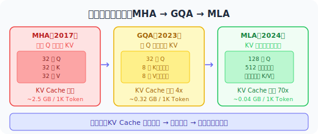

# 3.7 基础模型架构深度解析

> 🏗️ *"了解模型的工作原理让你做出更好的判断，而了解模型的架构演进，能让你理解整个行业在朝哪里走。"*

在 3.1 节中，我们用直觉理解了 LLM 的基本原理——Transformer、注意力机制、Token 预测。本节将深入一层，带你看看**模型的"骨架"长什么样**——从 Decoder-Only 架构到注意力机制的变体、归一化方案、位置编码、MoE 路由，再到 2024—2026 年各大开源模型的具体架构选择。

这些知识不是"学术装饰"——当你要为 Agent 选择部署模型、评估推理成本、或理解为什么某个模型在长文本上表现更好时，**对架构的理解就是你的底层判断力**。

## 现代 LLM 的标准"骨架"：Decoder-Only Transformer

2023 年以来，几乎所有主流 LLM 都采用了 **Decoder-Only** 架构。这与最初 Transformer 的 Encoder-Decoder 结构不同——它只保留了解码器部分，通过**因果注意力掩码（Causal Mask）**保证每个 Token 只能"看到"它左边的内容。

```python
# 因果注意力掩码的直觉
# 在生成 "我 喜欢 吃 苹果" 时：
#
#        我  喜欢  吃  苹果
#  我    [✓]  [✗]  [✗]  [✗]     ← "我" 只能看到自己
#  喜欢  [✓]  [✓]  [✗]  [✗]     ← "喜欢" 能看到 "我" 和自己
#  吃    [✓]  [✓]  [✓]  [✗]     ← "吃" 能看到前面所有词
#  苹果  [✓]  [✓]  [✓]  [✓]     ← "苹果" 能看到整个序列
#
# 对角线以上的 [✗] 就是因果掩码——防止"偷看未来"
```

为什么选 Decoder-Only？

| 架构 | 代表模型 | 适合任务 | 为何 LLM 不用 |
|------|---------|---------|-------------|
| Encoder-Only | BERT | 理解类（分类、NER） | 不能自回归生成 |
| Encoder-Decoder | T5, BART | 翻译、摘要 | 复杂度高，不利于超大规模扩展 |
| **Decoder-Only** | **GPT, Llama, DeepSeek** | **所有生成任务** | ✅ 架构简洁，易扩展，训练高效 |

一个标准的 Decoder-Only Transformer 层长这样：


```python
class TransformerDecoderLayer:
    """现代 LLM 一层的标准结构（2024+ 共识版）"""
    
    def forward(self, x):
        # 1. Pre-Norm + 注意力
        residual = x
        x = self.norm1(x)                  # RMSNorm (Pre-Normalization)
        x = self.attention(x)              # 因果自注意力 (GQA/MLA)
        x = residual + x                   # 残差连接
        
        # 2. Pre-Norm + FFN
        residual = x
        x = self.norm2(x)                  # RMSNorm
        x = self.ffn(x)                    # SwiGLU 前馈网络
        x = residual + x                   # 残差连接
        
        return x
```

接下来，我们逐个拆解每个组件的技术演进。

## Tokenizer：文本进入模型之前发生了什么

在讲 Transformer 内部之前，有一个常被忽视但至关重要的前置步骤：**Tokenizer**。

LLM 不直接处理字符或单词，而是处理 **Token**——文本被切割成的基本单元，每个 Token 对应词表中的一个整数 ID。

### BPE：字节对编码

现代 LLM 普遍使用 **BPE（Byte Pair Encoding）** 或其变体（如 SentencePiece、tiktoken）。算法思路：

```
初始词表 = 所有单个字符
重复执行：
  1. 统计语料中所有相邻 Token 对的频次
  2. 合并频次最高的那对 → 形成新 Token
  3. 直到词表大小达到目标（如 32000、128256）
```

**直觉示例**（简化）：

```
原始文本：  "unbelievable"
初始切分：  [u, n, b, e, l, i, e, v, a, b, l, e]
第1次合并：  "ab" 高频 → [u, n, b, e, l, i, e, v, ab, l, e]
第2次合并：  "le" 高频 → [u, n, b, e, l, i, e, v, ab, le]
...
最终结果：  ["un", "believ", "able"]   ← 3 个 Token
```

```python
import tiktoken  # OpenAI 的 BPE 实现

enc = tiktoken.get_encoding("cl100k_base")  # GPT-4 使用的分词器

# 一句话的 Token 化
text = "Hello, 你好！Agent development is fascinating."
tokens = enc.encode(text)
print(f"Token 数量: {len(tokens)}")          # 约 15 个 Token
print(f"Token IDs: {tokens[:8]}...")          # [9906, 11, 220, ...]

# Token 还原
decoded = enc.decode(tokens)
print(f"还原文本: {decoded}")               # 完全一致

# 不同语言的 Token 效率差异
print(enc.encode("Hello"))          # [15339] → 1 个 Token
print(enc.encode("你好"))           # [57668, 53901] → 2 个 Token  ← 中文效率较低
print(enc.encode("مرحبا"))          # 阿拉伯文 → 更多 Token
```

### 词表大小的权衡

| 词表大小 | 代表模型 | Token 效率（中文）| 内存开销 |
|---------|---------|-----------------|---------|
| 32,000  | Llama 2 | 低（中文 3-4 字/Token）| 低 |
| 65,536  | Qwen 2  | 中（约 2 字/Token）| 中 |
| 128,256 | Llama 3/4 | 中高 | 较高 |
| 150,000+ | DeepSeek V3 | 高（接近 1 字/Token）| 高 |

> 💡 **为什么词表大小重要？** 更大的词表意味着中文等非英语语言能用更少的 Token 表达相同内容，直接降低推理成本。DeepSeek 和 Qwen 系列专门为中文扩充了词表。

### Token 经过 Embedding 层

Token ID → 词嵌入向量（Embedding），这是模型的第一层：

```python
class TokenEmbedding:
    """将 Token ID 转为稠密向量"""
    def __init__(self, vocab_size=128256, d_model=4096):
        # Embedding 矩阵：形状 [vocab_size × d_model]
        # 每个 Token 对应一行 → 一个 4096 维向量
        self.embed = nn.Embedding(vocab_size, d_model)
    
    def forward(self, token_ids):
        # 输入: [batch_size, seq_len] 的整数 ID
        # 输出: [batch_size, seq_len, d_model] 的浮点向量
        return self.embed(token_ids)

# 示例
token_ids = torch.tensor([[9906, 11, 220, 57668]])  # "Hello, 你..."
embeddings = embedding(token_ids)
# shape: [1, 4, 4096] → 每个 Token 变成一个 4096 维向量
```

Embedding 矩阵本身就是模型参数的重要组成部分。对于词表 128K、维度 4096 的模型，Embedding 层就有 **128K × 4096 ≈ 5 亿参数**。

---

## Scaled Dot-Product Attention：注意力的核心计算

在讲注意力变体之前，我们先把**最核心的计算**讲透。

### Q、K、V 从哪来？

输入序列的每个 Token 向量 $x$，通过三个**独立的线性投影**得到 Q、K、V：

$$Q = xW_Q, \quad K = xW_K, \quad V = xW_V$$

直觉上：
- **Q（Query）**："我想找什么信息？" 
- **K（Key）**："我能提供什么信息的'标签'？"
- **V（Value）**："我实际携带的信息内容"

```python
class SelfAttention:
    """最简单的自注意力实现"""
    def __init__(self, d_model=512, d_k=64):
        # 三个投影矩阵（可学习参数）
        self.W_Q = nn.Linear(d_model, d_k, bias=False)
        self.W_K = nn.Linear(d_model, d_k, bias=False)
        self.W_V = nn.Linear(d_model, d_k, bias=False)
    
    def forward(self, x):
        # x shape: [batch, seq_len, d_model]
        Q = self.W_Q(x)  # [batch, seq_len, d_k]
        K = self.W_K(x)  # [batch, seq_len, d_k]
        V = self.W_V(x)  # [batch, seq_len, d_k]
        return scaled_dot_product(Q, K, V)
```

### Scaled Dot-Product Attention 完整推导

$$\text{Attention}(Q, K, V) = \text{softmax}\!\left(\frac{QK^T}{\sqrt{d_k}}\right) V$$

**逐步拆解：**

```
步骤 1: QKᵀ → 相似度矩阵
  Q:  [seq_len, d_k]   → 每行是一个 Token 的"查询向量"
  Kᵀ: [d_k, seq_len]  → 每列是一个 Token 的"键向量"
  QKᵀ: [seq_len, seq_len] → 矩阵 (i,j) 项 = Token_i 和 Token_j 的点积相似度

步骤 2: ÷ √d_k → 缩放（防止点积过大）
  为什么要缩放？
  - d_k 维度下，随机初始化的点积方差是 d_k
  - 不缩放时，softmax 输入过大 → 梯度消失（softmax 饱和区）
  - ÷ √d_k 将方差归一化为 1

步骤 3: softmax → 注意力权重（概率分布）
  每行变成 0-1 之间的权重，和为 1
  "Token_i 应该把多少注意力分配给 Token_j"

步骤 4: × V → 加权求和
  用注意力权重对 V 做加权平均
  输出: [seq_len, d_k] → 每个 Token 的新表示（融合了它关注的信息）
```

```python
import math

def scaled_dot_product_attention(Q, K, V, mask=None):
    """
    Q, K, V: [batch, heads, seq_len, d_k]
    mask:    [batch, 1, seq_len, seq_len]（因果掩码）
    """
    d_k = Q.size(-1)
    
    # 步骤 1+2: 计算缩放后的相似度
    scores = torch.matmul(Q, K.transpose(-2, -1)) / math.sqrt(d_k)
    # shape: [batch, heads, seq_len, seq_len]
    
    # 步骤 3: 因果掩码（把未来位置设为 -∞，softmax 后变 0）
    if mask is not None:
        scores = scores.masked_fill(mask == 0, float('-inf'))
    
    # 步骤 4: softmax 得到注意力权重
    attn_weights = torch.softmax(scores, dim=-1)
    # shape: [batch, heads, seq_len, seq_len]
    
    # 步骤 5: 加权求和 V
    output = torch.matmul(attn_weights, V)
    # shape: [batch, heads, seq_len, d_k]
    
    return output, attn_weights

# 一个具体的例子：
# seq_len=4 ("I love AI deeply"), d_k=64, n_heads=8
Q = torch.randn(1, 8, 4, 64)
K = torch.randn(1, 8, 4, 64)
V = torch.randn(1, 8, 4, 64)

# 创建因果掩码（下三角矩阵）
mask = torch.tril(torch.ones(4, 4))
output, weights = scaled_dot_product_attention(Q, K, V, mask)
# weights[0, 0] 大致是这样：
# "I"     → [1.00, 0.00, 0.00, 0.00]  只看自己
# "love"  → [0.55, 0.45, 0.00, 0.00]  看"I"和自己
# "AI"    → [0.30, 0.35, 0.35, 0.00]  看前两个词
# "deeply"→ [0.20, 0.25, 0.30, 0.25]  看所有词
```

### 为什么需要"多头"？

单头注意力只能关注一种"关系"（如主谓关系）。多头并行计算，每个头可以学习不同的关系模式：

```python
class MultiHeadAttentionFull:
    """多头注意力的完整实现"""
    def __init__(self, d_model=512, n_heads=8):
        self.n_heads = n_heads
        self.d_k = d_model // n_heads  # 每头维度 = 64
        
        # 所有头共用一个大矩阵，实际上等价于 n_heads 个独立的 W_Q/W_K/W_V
        self.W_Q = nn.Linear(d_model, d_model)
        self.W_K = nn.Linear(d_model, d_model)
        self.W_V = nn.Linear(d_model, d_model)
        self.W_O = nn.Linear(d_model, d_model)  # 输出投影
    
    def forward(self, x, mask=None):
        batch, seq, d = x.shape
        
        # 1. 投影并拆分为多头
        Q = self.W_Q(x).view(batch, seq, self.n_heads, self.d_k).transpose(1, 2)
        K = self.W_K(x).view(batch, seq, self.n_heads, self.d_k).transpose(1, 2)
        V = self.W_V(x).view(batch, seq, self.n_heads, self.d_k).transpose(1, 2)
        # 形状: [batch, n_heads, seq, d_k]
        
        # 2. 每头独立计算注意力
        attn_out, _ = scaled_dot_product_attention(Q, K, V, mask)
        # 形状: [batch, n_heads, seq, d_k]
        
        # 3. 拼接所有头的输出
        concat = attn_out.transpose(1, 2).contiguous().view(batch, seq, d)
        # 形状: [batch, seq, d_model]
        
        # 4. 最终线性投影
        return self.W_O(concat)
```

> 🎯 **直觉理解**：  
> - 头1 可能学到：**语法依存关系**（主语 → 动词）
> - 头2 可能学到：**共指关系**（"它" → 指代哪个名词）
> - 头3 可能学到：**局部位置关系**（相邻词的搭配）
> - 头8 可能学到：**长距离语义关联**

---

## KV Cache：推理加速的关键

**KV Cache 是 LLM 推理效率最重要的机制**，但它也是显存的最大消耗者之一。

### 为什么需要 KV Cache？

自回归生成时，每生成一个新 Token，都需要重新计算**整个序列**的注意力。如果不缓存：

```
生成 "我 爱 吃 苹果 和"：

第1步 生成"我"：   计算长度1的注意力  → 1次计算
第2步 生成"爱"：   计算长度2的注意力  → 4次计算（1+2+3+...）  
第3步 生成"吃"：   计算长度3的注意力  → ...
第N步 生成第N词：  计算长度N的注意力  → O(N²) 总计算量！
```

**有了 KV Cache**，只需计算新 Token 的 Q，历史 Token 的 K 和 V 已经缓存好了：

```python
class KVCacheAttention:
    """带 KV Cache 的推理注意力"""
    
    def __init__(self):
        self.k_cache = []  # 存储历史 Key
        self.v_cache = []  # 存储历史 Value
    
    def forward(self, x_new, is_prefill=False):
        """
        prefill 阶段：处理完整 prompt（一次性）
        decode 阶段：每次只处理 1 个新 Token
        """
        # 计算当前 Token（或 prefill 时整个序列）的 Q/K/V
        Q_new = self.W_Q(x_new)  # [batch, new_len, d_k]
        K_new = self.W_K(x_new)
        V_new = self.W_V(x_new)
        
        if is_prefill:
            # Prefill：首次处理完整 prompt，初始化 cache
            self.k_cache = K_new
            self.v_cache = V_new
        else:
            # Decode：拼接到已有 cache
            self.k_cache = torch.cat([self.k_cache, K_new], dim=1)  # ← 只追加！
            self.v_cache = torch.cat([self.v_cache, V_new], dim=1)
        
        # 用新 Q 对全部 cached K/V 做注意力
        output = scaled_dot_product_attention(
            Q_new, self.k_cache, self.v_cache
        )
        return output
```

### KV Cache 的显存计算

```python
# KV Cache 显存公式（每 1K Token）：
# 
# 显存 = 2 × n_layers × n_kv_heads × head_dim × dtype_bytes × seq_len
#        ↑      ↑            ↑           ↑           ↑
#       K+V   层数      KV头数      每头维度     数据类型

def kv_cache_memory_gb(n_layers, n_kv_heads, head_dim, 
                        seq_len, dtype_bytes=2):
    total_bytes = 2 * n_layers * n_kv_heads * head_dim * seq_len * dtype_bytes
    return total_bytes / (1024 ** 3)

# 几个模型的 KV Cache 对比（每 1K Token，bfloat16）：
#
# Llama 2-70B (MHA): 80层, 64头, 128维
print(kv_cache_memory_gb(80, 64, 128, 1024))  # ≈ 2.5 GB/1K Token ← 巨大！

# Llama 3-70B (GQA): 80层, 8头, 128维  
print(kv_cache_memory_gb(80, 8, 128, 1024))   # ≈ 0.32 GB/1K Token ← 8倍优化

# DeepSeek-V2 (MLA): 仅缓存 512 维潜在向量
# 等效 KV Cache ≈ 0.04 GB/1K Token ← 约 70倍优化
```

### Prefill vs Decode：推理的两个阶段

```
┌─────────────────────────────────────────────────────────┐
│  Prefill 阶段（处理 Prompt）                              │
│  ──────────────────────────                             │
│  输入: "请写一首关于秋天的诗："（批量并行计算）           │
│  输出: KV Cache 初始化完毕，生成第1个 Token              │
│  特点: 计算密集型，GPU 利用率高                          │
├─────────────────────────────────────────────────────────┤
│  Decode 阶段（逐 Token 生成）                             │
│  ──────────────────────────                             │
│  每步: 只计算 1 个新 Token 的 Q，用 cache 的 K/V         │
│  输出: 逐字生成 "秋 风 轻 抚 梧 桐 叶 ..."               │
│  特点: 内存带宽密集型，受 KV Cache 读取速度限制           │
└─────────────────────────────────────────────────────────┘
```

> 💡 **对 Agent 开发的启示**：  
> - KV Cache 是按 **Token 数量** 线性增长的，长对话 = 高显存  
> - 这就是为什么许多 Agent 框架需要做**上下文截断/压缩**（见第8章）  
> - 服务商按 **Input Token** 收费，也部分因为 prefill 阶段的 KV Cache 计算成本

---

## 注意力机制的演进：MHA → GQA → MLA



注意力机制是 Transformer 的"心脏"。从 2017 到 2025 年，它经历了三代关键变体——驱动力是**推理效率**，尤其是 **KV-Cache 的显存压力**。

### MHA：经典多头注意力

最初 Transformer 使用的多头注意力（Multi-Head Attention），每个头都有独立的 Query、Key、Value 投影：

```python
class MultiHeadAttention:
    """MHA: 每个头都有独立的 Q、K、V"""
    def __init__(self, d_model=4096, n_heads=32):
        self.n_heads = n_heads
        self.head_dim = d_model // n_heads  # 128
        
        # 每个头独立的 Q、K、V 投影
        self.wq = Linear(d_model, n_heads * self.head_dim)  # 32 组 Q
        self.wk = Linear(d_model, n_heads * self.head_dim)  # 32 组 K ← 这很多！
        self.wv = Linear(d_model, n_heads * self.head_dim)  # 32 组 V ← 这也很多！
    
    # KV Cache 大小 = n_layers × n_heads × seq_len × head_dim × 2
    # 对于 Llama-2-70B (80层, 64头, 128维): 
    # 每 1K token 的 KV Cache ≈ 2.5 GB！
```

**问题**：推理时要缓存所有层、所有头的 K 和 V——当序列长度增长时，显存爆炸。

### GQA：分组查询注意力

Llama 2（2023）引入了 **Grouped-Query Attention**——让多个 Query 头共享一组 Key-Value：

```python
class GroupedQueryAttention:
    """GQA: 多个 Q 头共享一组 KV，大幅减少 KV Cache"""
    def __init__(self, d_model=4096, n_q_heads=32, n_kv_heads=8):
        self.n_q_heads = n_q_heads     # 32 个 Query 头
        self.n_kv_heads = n_kv_heads   # 8 个 KV 头（每 4 个 Q 共享 1 个 KV）
        self.head_dim = d_model // n_q_heads
        
        self.wq = Linear(d_model, n_q_heads * self.head_dim)   # 32 组 Q
        self.wk = Linear(d_model, n_kv_heads * self.head_dim)  # 只有 8 组 K！
        self.wv = Linear(d_model, n_kv_heads * self.head_dim)  # 只有 8 组 V！
    
    # KV Cache 缩小为 MHA 的 1/4（32→8 头）
    # Llama 3 70B: KV Cache 从 2.5GB/1K → ~0.6GB/1K
```

GQA 几乎**不损失模型质量**（大量消融实验验证），却将 KV Cache 减少了 4~8 倍。这就是为什么 2023 年之后几乎所有主流模型都采用了 GQA。

**哪些模型用了 GQA？**
- Llama 2/3/4、Qwen 2/2.5/3、Gemma 2/3、Mistral/Mixtral、Phi-3/4

### MLA：多头潜在注意力（DeepSeek 创新）

DeepSeek-V2（2024）提出了更激进的方案——**Multi-head Latent Attention**。它不是减少 KV 头的数量，而是**把整个 KV 压缩到一个低维潜在空间**：

```python
class MultiHeadLatentAttention:
    """
    MLA: DeepSeek 的核心创新
    不是"共享头"，而是"压缩 KV 到低维空间"
    """
    def __init__(self, d_model=7168, n_heads=128, kv_lora_rank=512):
        self.n_heads = n_heads
        self.kv_lora_rank = kv_lora_rank  # KV 压缩到 512 维
        
        # KV 先下投影到低维空间
        self.kv_down_proj = Linear(d_model, kv_lora_rank)     # 7168 → 512
        # 推理时按需上投影恢复
        self.kv_up_proj = Linear(kv_lora_rank, n_heads * 128 * 2)  # 512 → 全尺寸 KV
    
    def forward(self, x, kv_cache=None):
        # 压缩 KV：只缓存 512 维的潜在向量！
        compressed_kv = self.kv_down_proj(x)  # [batch, seq, 512]
        
        # 推理时存入缓存的是压缩后的向量
        if kv_cache is not None:
            kv_cache.store(compressed_kv)  # 只存 512 维！
        
        # 计算注意力时实时解压
        full_kv = self.kv_up_proj(compressed_kv)
        k, v = full_kv.chunk(2, dim=-1)
        # ... 正常注意力计算
```

**效果有多惊人？**

| 注意力类型 | KV Cache / Token | 对比 MHA |
|-----------|-----------------|---------|
| MHA（Llama 2 级别） | ~2.5 GB / 1K tokens | 基准 |
| GQA（Llama 3 级别） | ~0.6 GB / 1K tokens | 减少 75% |
| **MLA（DeepSeek-V3）** | ~0.04 GB / 1K tokens | **减少 98.6%** |

MLA 让 DeepSeek-V3（671B 参数）可以在相对有限的硬件上处理极长上下文——这是 GQA 无法做到的。

### 三代注意力机制对比

```
MHA:    Q₁ → K₁,V₁    Q₂ → K₂,V₂    Q₃ → K₃,V₃    Q₄ → K₄,V₄
        每个 Q 对应独立 KV                 → KV Cache 最大

GQA:    Q₁ ─┐          Q₃ ─┐
        Q₂ ─┤→ K₁,V₁   Q₄ ─┤→ K₂,V₂
        多个 Q 共享一组 KV                  → KV Cache 缩小 4~8x

MLA:    Q₁ ─┐
        Q₂ ─┤→ [压缩向量 c] → 实时解压 → K,V
        Q₃ ─┤   (512 维)
        Q₄ ─┘
        所有 KV 压缩为低维潜在表示           → KV Cache 缩小 ~70x
```

## 归一化的演进：LayerNorm → RMSNorm + Pre-Norm

### 从 Post-Norm 到 Pre-Norm

最初的 Transformer 使用 **Post-Normalization**——先计算注意力/FFN，再做归一化。GPT-2（2019）发现把归一化放在注意力/FFN**之前**（Pre-Normalization）能显著改善深层网络的训练稳定性：

```python
# Post-Norm (原始 Transformer，已淘汰)
x = x + Attention(x)
x = LayerNorm(x)        # 归一化在后面

# Pre-Norm (现代标准)
x = x + Attention(RMSNorm(x))  # 归一化在前面
# 梯度可以通过残差连接直接回传，不会被归一化层"阻断"
```

### 从 LayerNorm 到 RMSNorm

标准 LayerNorm 需要计算均值和方差：

```python
# LayerNorm: 减均值，除标准差
def layer_norm(x, gamma, beta):
    mean = x.mean(dim=-1, keepdim=True)
    var = x.var(dim=-1, keepdim=True)
    return gamma * (x - mean) / sqrt(var + eps) + beta

# RMSNorm: 只除 RMS（均方根），去掉均值中心化
def rms_norm(x, gamma):
    rms = sqrt(mean(x ** 2) + eps)
    return gamma * x / rms
    # 没有 mean 计算，没有 beta 偏置 → 更快！
```

RMSNorm 的优势：
- **更快**：省去了均值计算和偏置参数
- **效果相当**：大量实验证明在 LLM 训练中与 LayerNorm 表现持平
- **硬件友好**：更简单的计算 → 更好的 GPU 核优化

> 📊 **行业共识**：在 53 个被分析的 Transformer 模型中，**77.4%** 采用了 RMSNorm。2023 年后发布的主流模型几乎 100% 使用 Pre-Norm + RMSNorm。

## 位置编码的演进：绝对编码 → 相对编码 → RoPE

Transformer 架构本身对 Token 的顺序是"无感"的——注意力机制只看 Q 和 K 的点积，不知道"苹果"在"吃"的前面还是后面。位置编码就是告诉模型"Token 在序列中的位置"。

### 三代位置编码的演进

```
第一代：绝对位置编码（Sinusoidal）
├── 原始 Transformer 使用
├── 为每个位置 m 生成固定的正弦波向量
└── 局限：无法学习相对位置关系，外推到长序列时效果差

第二代：可学习绝对位置编码（Learned Absolute）
├── BERT、GPT-2 使用
├── 直接把位置 ID 当做 Embedding 学习
└── 局限：最大序列长度被训练长度限制，无法外推

第三代：相对位置编码（ALiBi、RoPE）
├── 不编码绝对位置，而是编码 Token 之间的相对距离
├── RoPE（2021）：绝大多数现代 LLM 使用
└── 优势：外推能力强，适合超长上下文
```

### 第一代：Sinusoidal 编码（原始 Transformer）

为位置 $m$，维度 $i$，原始论文定义：

$$PE(m, 2i) = \sin\!\left(\frac{m}{10000^{2i/d}}\right), \quad PE(m, 2i+1) = \cos\!\left(\frac{m}{10000^{2i/d}}\right)$$

```python
def sinusoidal_encoding(max_len, d_model):
    """原始 Transformer 的正弦位置编码"""
    pe = torch.zeros(max_len, d_model)
    position = torch.arange(0, max_len).unsqueeze(1).float()
    
    # 频率：从低频（长波长）到高频（短波长）
    div_term = 10000 ** (torch.arange(0, d_model, 2).float() / d_model)
    
    pe[:, 0::2] = torch.sin(position / div_term)   # 偶数维：sin
    pe[:, 1::2] = torch.cos(position / div_term)   # 奇数维：cos
    
    return pe  # [max_len, d_model]

# 直觉：
# 低维（第0,1维）：波长很长，变化慢 → 区分"大致位置"（前、中、后）
# 高维（最后几维）：波长很短，变化快 → 区分相邻位置
```

**为什么用正弦/余弦？** 任意相对偏移 $k$ 对应的位置向量 $PE(m+k)$ 可以用 $PE(m)$ 的线性变换表示——这就是"位置差可以被感知"的几何基础。

### 第二代：ALiBi（2021，推理时外推的先驱）

ALiBi 不给 Token 加位置向量，而是直接在注意力分数上**减去一个随距离增大的惩罚项**：

$$\text{Attention}_{ij} = \frac{q_i \cdot k_j}{\sqrt{d_k}} - m \cdot |i - j|$$

```python
# ALiBi 的核心：在注意力分数上加"距离惩罚"
def alibi_bias(seq_len, n_heads):
    """为每个注意力头生成 ALiBi 偏置矩阵"""
    # 不同头的惩罚斜率 m 不同（几何级数）
    slopes = 2 ** (-8 * torch.arange(1, n_heads+1) / n_heads)
    
    # 构建距离矩阵：[i-j] 对每对 Token
    positions = torch.arange(seq_len)
    distance = positions.unsqueeze(0) - positions.unsqueeze(1)  # [seq, seq]
    
    # 每个头用自己的斜率缩放距离
    bias = slopes.unsqueeze(-1).unsqueeze(-1) * distance.abs()
    return -bias  # 加到 attention scores 上（负数，越远惩罚越大）
```

ALiBi 的优点是**外推能力**：它在短序列上训练，推理时能泛化到更长序列。但相比 RoPE，它缺乏对精确相对位置的编码，在超长上下文上仍有精度损失。

### 第三代：RoPE 旋转位置编码——完整推导

**RoPE（Rotary Position Embeddings）** 由 Su 等人提出（2021），2023 年后成为事实标准。

#### 核心思想：用旋转编码相对位置

如果能设计一个函数 $f$，使得：

$$\langle f(q, m),\, f(k, n) \rangle = g(q, k, m-n)$$

即**两个向量的内积（注意力分数）只依赖于它们的相对位置差 $m-n$**，那么模型就自然具备了相对位置感知能力。

#### 二维情形的推导（直觉基础）

考虑二维向量 $q = (q_1, q_2)$，给位置 $m$ 加一个旋转角 $m\theta$：

$$f(q, m) = \begin{pmatrix} \cos(m\theta) & -\sin(m\theta) \\ \sin(m\theta) & \cos(m\theta) \end{pmatrix} \begin{pmatrix} q_1 \\ q_2 \end{pmatrix}$$

计算两个旋转后向量的内积：

$$\langle f(q, m), f(k, n) \rangle = q_1 k_1 \cos\big((m-n)\theta\big) + q_2 k_2 \cos\big((m-n)\theta\big) + \ldots$$

最终只含 $(m-n)\theta$，**完美满足相对位置条件** ✅

#### 推广到高维（实际实现）

对于 $d_k$ 维向量（$d_k$ 为偶数），将维度两两分组，每组做一次二维旋转，旋转角度按不同频率设置：

$$\theta_i = \frac{1}{10000^{2i/d_k}}, \quad i = 0, 1, \ldots, \frac{d_k}{2}-1$$

完整的 RoPE 变换（对 $d_k=8$ 的向量，分 4 组）：

$$\begin{pmatrix} q_0 \\ q_1 \\ q_2 \\ q_3 \\ q_4 \\ q_5 \\ q_6 \\ q_7 \end{pmatrix} \xrightarrow{\text{RoPE}(m)} \begin{pmatrix} q_0 \cos(m\theta_0) - q_1 \sin(m\theta_0) \\ q_0 \sin(m\theta_0) + q_1 \cos(m\theta_0) \\ q_2 \cos(m\theta_1) - q_3 \sin(m\theta_1) \\ q_2 \sin(m\theta_1) + q_3 \cos(m\theta_1) \\ q_4 \cos(m\theta_2) - q_5 \sin(m\theta_2) \\ q_4 \sin(m\theta_2) + q_5 \cos(m\theta_2) \\ q_6 \cos(m\theta_3) - q_7 \sin(m\theta_3) \\ q_6 \sin(m\theta_3) + q_7 \cos(m\theta_3) \end{pmatrix}$$

```python
import torch

def precompute_rope_freqs(d_k: int, max_seq_len: int, base: float = 10000.0):
    """预计算 RoPE 的 cos/sin 频率矩阵"""
    # 每组的旋转频率（从低频到高频）
    # θ_i = 1 / 10000^(2i/d_k)，i = 0, 1, ..., d_k/2-1
    theta = 1.0 / (base ** (torch.arange(0, d_k, 2).float() / d_k))
    # shape: [d_k/2]，例如 d_k=128 → 64 个频率
    
    # 每个位置对应的角度 = 位置 × 频率
    positions = torch.arange(max_seq_len).float()       # [max_seq_len]
    freqs = torch.outer(positions, theta)               # [max_seq_len, d_k/2]
    # freqs[m, i] = m * θ_i
    
    # 预计算 cos 和 sin
    cos = torch.cos(freqs)   # [max_seq_len, d_k/2]
    sin = torch.sin(freqs)   # [max_seq_len, d_k/2]
    return cos, sin


def apply_rope(x: torch.Tensor, cos: torch.Tensor, sin: torch.Tensor):
    """
    将 RoPE 应用到 Q 或 K
    x:   [batch, n_heads, seq_len, d_k]
    cos: [seq_len, d_k/2]
    sin: [seq_len, d_k/2]
    """
    # 将 d_k 维度拆成两半：[x1, x2] = [前半, 后半]
    x1 = x[..., :x.shape[-1] // 2]   # 偶数维
    x2 = x[..., x.shape[-1] // 2:]   # 奇数维
    
    # 广播 cos/sin 到 batch 和 heads 维度
    cos = cos[:x.shape[2], :].unsqueeze(0).unsqueeze(0)  # [1, 1, seq, d_k/2]
    sin = sin[:x.shape[2], :].unsqueeze(0).unsqueeze(0)
    
    # 旋转变换：(x1, x2) → (x1·cos - x2·sin, x1·sin + x2·cos)
    rotated = torch.cat([
        x1 * cos - x2 * sin,
        x1 * sin + x2 * cos,
    ], dim=-1)
    return rotated


# 在注意力计算中使用 RoPE
class RoPEAttention:
    def __init__(self, d_model=4096, n_heads=32):
        self.n_heads = n_heads
        self.d_k = d_model // n_heads
        self.W_Q = nn.Linear(d_model, d_model, bias=False)
        self.W_K = nn.Linear(d_model, d_model, bias=False)
        self.W_V = nn.Linear(d_model, d_model, bias=False)
        
        # 预计算频率（只算一次）
        self.cos, self.sin = precompute_rope_freqs(
            self.d_k, max_seq_len=131072  # 128K 上下文
        )
    
    def forward(self, x):
        B, S, D = x.shape
        Q = self.W_Q(x).view(B, S, self.n_heads, self.d_k).transpose(1, 2)
        K = self.W_K(x).view(B, S, self.n_heads, self.d_k).transpose(1, 2)
        V = self.W_V(x).view(B, S, self.n_heads, self.d_k).transpose(1, 2)
        
        # ← 关键：只对 Q 和 K 应用 RoPE（不对 V 应用）
        Q = apply_rope(Q, self.cos, self.sin)
        K = apply_rope(K, self.cos, self.sin)
        
        # 之后正常计算注意力
        return scaled_dot_product_attention(Q, K, V)
```

#### 为什么 RoPE 能外推？

```
频率与波长的关系：
  低频维度（i=0）：θ ≈ 1/10000，波长 ≈ 62831 → 区分很远的位置
  中频维度（i=32）：θ ≈ 0.01，波长 ≈ 628 → 区分中等距离
  高频维度（i=63）：θ ≈ 1.0，波长 ≈ 6 → 区分相邻位置

训练长度 8192 时，高频维度旋转了 ~1365 圈，低频维度旋转了 ~0.13 圈
外推到 131072 时，低频维度旋转了 ~2 圈 → 模型见过类似的模式
```

**高频维度处理相邻关系**（已充分训练），**低频维度编码大局位置**（圈数少，需要外推辅助）。

### 上下文扩展：YaRN 与 NTK-aware 缩放

RoPE 的一个关键实践问题是**如何将模型推理到训练时没见过的更长序列**：

```python
# 模型训练时 max_seq_len = 8192
# 但你想在 128K 甚至 1M 上下文下使用它

# 方法 1: NTK-aware 缩放（调整频率基数）
def ntk_scaled_rope(dim, max_position, base=10000, scaling_factor=16):
    """NTK-aware 缩放：提高 base，让高频分量保持精度"""
    new_base = base * (scaling_factor ** (dim / (dim - 2)))
    freqs = 1.0 / (new_base ** (torch.arange(0, dim, 2) / dim))
    return freqs

# 方法 2: YaRN（Yet another RoPE extensioN）
# 结合了 NTK 缩放 + 注意力分数温度修正
# Llama 4 Scout 用 YaRN 实现了 10M token 上下文！
```

### 三代位置编码对比总结

| 方法 | 来源 | 位置信息 | 外推能力 | 训练参数 | 代表模型 |
|------|------|---------|---------|---------|---------|
| Sinusoidal | 2017 原版 | 绝对位置 | 有限 | ❌ 无 | 原始 Transformer |
| Learned Abs | BERT/GPT | 绝对位置 | ❌ 无 | ✅ 有 | BERT, GPT-2 |
| ALiBi | PaLM, MPT | 相对距离惩罚 | ✅ 较好 | ❌ 无 | MPT-7B |
| **RoPE** | **LLaMA+** | **相对位置（旋转）** | **✅ 很好** | **❌ 无** | **Llama/Qwen/DeepSeek 全系** |

> 📊 **行业共识**：在被分析的 53 个模型中，**69.8%** 采用了 RoPE。2022 年后的 Decoder-Only LLM 中，RoPE 是绝对的主流选择。

## 激活函数与 FFN：SwiGLU 的统治

Transformer 中每一层除了注意力之外，还有一个**前馈网络（FFN/MLP）**。它的激活函数经历了显著演进：

```python
# 经典 FFN：两层线性变换 + ReLU
class ClassicFFN:
    def forward(self, x):
        return self.w2(F.relu(self.w1(x)))
        # 参数量: 2 × d_model × d_ff (通常 d_ff = 4 × d_model)

# 现代 FFN：SwiGLU (Swish-Gated Linear Unit)
class SwiGLU_FFN:
    def forward(self, x):
        gate = F.silu(self.w_gate(x))    # Swish 激活 = x * sigmoid(x)
        up = self.w_up(x)                 # 上投影
        return self.w_down(gate * up)      # 门控 × 上投影 → 下投影
        # 参数量: 3 × d_model × d_ff (多了一个 gate 投影)
        # 但通常 d_ff 从 4d 缩减到 ~2.67d 来保持总参数量
```

SwiGLU 的核心是**门控机制**——它让网络自己决定"哪些信息通过、哪些被抑制"，比简单的 ReLU 有更强的表达能力。

```
ReLU:     max(0, x)              → 简单截断
GeLU:     x · Φ(x)              → 概率性门控
SwiGLU:   Swish(Wx) ⊙ (Vx)     → 学习到的门控 × 内容
```

> 📊 **行业共识**：**71.7%** 的被分析模型使用 SwiGLU 或 GeGLU。LLaMA 之后，这几乎成了不成文的标准。

## MoE 架构：稀疏的力量

我们在 3.6 节从"趋势"角度介绍了 MoE。这里深入看看它的**架构细节**。

### MoE 的基本结构

MoE 将标准 FFN 层替换为多个"专家"网络 + 一个"路由器"：

```python
class MoELayer:
    """混合专家层：替代标准 FFN"""
    def __init__(self, d_model, n_experts=64, n_active=8):
        # 64 个专家，但每个 token 只激活 8 个
        self.experts = [SwiGLU_FFN(d_model) for _ in range(n_experts)]
        self.router = Linear(d_model, n_experts)  # 路由器：决定激活哪些专家
    
    def forward(self, x):
        # 1. 路由决策：每个 token 独立选择专家
        router_logits = self.router(x)              # [batch, seq, n_experts]
        weights, indices = router_logits.topk(k=8)  # 选 top-8 专家
        weights = F.softmax(weights, dim=-1)         # 归一化权重
        
        # 2. 专家计算：只激活被选中的专家
        output = 0
        for i, (expert_idx, w) in enumerate(zip(indices, weights)):
            output += w * self.experts[expert_idx](x)
        
        return output
```

### 不同模型的 MoE 配置差异很大

| 模型 | 总专家数 | 激活专家数 | 共享专家 | 路由方式 | 负载均衡 |
|------|---------|----------|---------|---------|---------| 
| **Mixtral 8×22B** | 8 | 2 | 无 | Top-2 softmax | 辅助损失 |
| **DeepSeek-V3** | 256 | 8 | 1 个共享 | Top-8 sigmoid | **无辅助损失**（偏差项） |
| **DeepSeek V4** | 256 | 8 | 1 个共享 | Top-8 sigmoid | 无辅助损失 + **mHC 超连接** |
| **Kimi K2** | 128+ | ~8 | 有 | Top-K | MuonClip 优化器稳定训练 |
| **Llama 4 Scout** | 16 | 1 | 无 | Top-1 | 辅助损失 |
| **Llama 4 Maverick** | 128 | 1 | 无 | Token-choice | 辅助损失 |
| **Qwen 3 (235B)** | 128 | 8 | 有 | Top-8 | 辅助损失 |
| **Qwen3.5-Plus** | 128 | 8 | 有 | Top-8 | 优化辅助损失 |
| **MiniMax M2.5** | — | — | — | — | Lightning Attention 混合 |

### DeepSeek 的两个关键创新

**1. 共享专家（Shared Expert）**

DeepSeek 指定一部分专家为"始终激活"，提供稳定的通用知识基底：

```python
class DeepSeekMoE:
    """DeepSeek 的 MoE：共享专家 + 路由专家"""
    def __init__(self):
        self.shared_expert = SwiGLU_FFN()     # 始终参与计算
        self.routed_experts = [SwiGLU_FFN() for _ in range(256)]
        self.router = Linear(d_model, 256)
    
    def forward(self, x):
        # 共享专家：所有 token 都经过
        shared_out = self.shared_expert(x)
        
        # 路由专家：每个 token 选 top-8
        indices, weights = self.route(x)
        routed_out = weighted_sum(self.routed_experts, indices, weights)
        
        return shared_out + routed_out
```

**2. 无辅助损失的负载均衡**

传统 MoE 的一个难题是"路由坍塌"——所有 token 都涌向少数几个专家。通常的解决方案是添加辅助损失函数来惩罚不均衡，但这会干扰主要训练目标。

DeepSeek-V3 引入了一个简洁的替代方案——**给每个专家添加一个可学习的偏差项**：

```python
# 传统方式：辅助损失（会干扰主训练目标）
loss = main_loss + alpha * load_balance_loss

# DeepSeek 方式：偏差项（不干扰主训练目标）
router_logits = self.router(x) + self.expert_bias
# expert_bias 不参与梯度更新，而是通过规则调整：
# 如果某专家负载过高 → 降低其 bias
# 如果某专家负载过低 → 提高其 bias
```

## 开源模型架构全景对比

现在我们把所有技术模块放在一起，看看 2024—2026 年主流开源模型的完整架构选择：

| 架构组件 | Llama 3 (2024) | Llama 4 (2025) | DeepSeek-V3 | DeepSeek V4 | Qwen 3 | Qwen3.5 | Kimi K2 | Kimi K2.5 |
|---------|----------------|----------------|-------------|-------------|--------|---------|---------|-----------|
| **基本架构** | Dense | MoE | MoE | MoE | Dense/MoE | MoE | MoE | MoE |
| **注意力** | GQA | GQA | **MLA** | **MLA** + DSA 2.0 | GQA | **Gated DeltaNet 混合** | GQA | **Kimi Linear 混合** |
| **归一化** | RMSNorm | RMSNorm | RMSNorm | RMSNorm | RMSNorm | RMSNorm | RMSNorm | RMSNorm |
| **残差连接** | 标准加性 | 标准加性 | 标准加性 | **mHC 超连接** | 标准加性 | 标准加性 | 标准加性 | **Attention Residuals** |
| **位置编码** | RoPE | RoPE+YaRN | RoPE | RoPE | RoPE+YaRN | RoPE+YaRN | RoPE | RoPE |
| **激活函数** | SwiGLU | SwiGLU | SwiGLU | SwiGLU | SwiGLU | SwiGLU | SwiGLU | SwiGLU |
| **优化器** | AdamW | AdamW | AdamW | AdamW | AdamW | AdamW | **MuonClip** | **MuonClip** |
| **MoE 专家数** | — | 16/128 | 256+1 | 256+1 | 128 | 128 | 128+ | — |
| **总参/激活** | 8B~405B | 109B~400B | 671B/~37B | 671B/~37B | 0.6B~235B | 397B/17B | **1T/32B** | 48B/3B |
| **上下文** | 128K | 10M | 128K | **1M+** | 32K~128K | 262K | 128K | 256K |

### 一个关键观察：架构正在"分化"

如果说 2024—2025 年的主题是架构**收敛**（共识堆栈），那 2026 年的主题是架构**分化**——在共识堆栈的基础上，各大模型开始探索截然不同的创新路径：

```
"共识堆栈" (2024—2025，仍然是基础):
├── Decoder-Only 架构
├── Pre-Normalization + RMSNorm
├── RoPE 位置编码
├── SwiGLU 激活函数
├── GQA 或 MLA 注意力
├── 无偏置 (No Bias)
└── 大规模模型 → MoE

"分化前沿" (2026 新突破):
├── 混合注意力 ── Gated DeltaNet (Qwen3.5) / Kimi Linear / Lightning Attention (MiniMax)
├── 残差连接重写 ── Attention Residuals (Kimi K2.5) / mHC 超连接 (DeepSeek V4)
├── 优化器革新 ── MuonClip 替代 AdamW (Kimi K2/K2.5)
├── 知识-推理分离 ── Engram 内存架构 (DeepSeek V4)
└── 多 Token 预测 ── 同时预测多个 token (DeepSeek V4 / Qwen3.5)
```

差异化的竞争正从"训练数据和规模"向**架构创新**回归：
1. **混合注意力设计**（线性注意力 + 全注意力的混合比例和方式）
2. **信息流优化**（残差连接、超连接等层间信息传递机制）
3. **训练效率**（优化器创新、多 Token 预测等）
4. **推理效率**（知识卸载、稀疏注意力、KV-Cache 优化）
5. **MoE 的具体设计**（专家数量、路由策略、负载均衡）
6. **长上下文扩展技术**（YaRN、NTK 缩放、线性注意力）

## FlashAttention：让长上下文成为可能的硬件魔法

以上都是"模型架构"层面的创新。但有一个**计算层面**的技术突破对 LLM 的实际能力影响巨大——**FlashAttention**。

标准注意力的问题在于需要**实例化整个注意力矩阵**（N×N），当 N 到百万级时，显存直接爆炸：

```python
# 标准注意力：O(N²) 内存
def standard_attention(Q, K, V):
    scores = Q @ K.T / sqrt(d)  # [N, N] ← N=1M 时需要 1TB 内存！
    weights = softmax(scores)
    return weights @ V

# FlashAttention：分块计算，O(N) 内存
def flash_attention(Q, K, V, block_size=256):
    """
    核心思想：不实例化完整的 N×N 矩阵
    而是分块计算 + 在线 softmax 更新
    """
    output = zeros_like(Q)
    for i in range(0, N, block_size):
        for j in range(0, N, block_size):
            q_block = Q[i:i+block_size]
            k_block = K[j:j+block_size]
            v_block = V[j:j+block_size]
            # 只计算这个小块的注意力
            block_score = q_block @ k_block.T / sqrt(d)
            # 在线更新 softmax（无需完整矩阵）
            output[i:i+block_size] = online_softmax_update(
                output[i:i+block_size], block_score, v_block
            )
    return output
    # 内存从 O(N²) 降到 O(N)
    # 速度提升 2~4 倍（更好的 GPU 内存层次利用）
```

FlashAttention 的三代演进：

| 版本 | 年份 | 关键改进 |
|------|------|---------|
| FlashAttention-1 | 2022 | IO-aware 分块计算，O(N²) → O(N) 内存 |
| FlashAttention-2 | 2023 | 更好的并行化，速度再提升 2x |
| FlashAttention-3 | 2024 | 利用 Tensor Core 异步执行，接近硬件理论峰值 |

> 💡 **对 Agent 的影响**：FlashAttention 是支撑百万级上下文窗口的底层功臣。没有它，Gemini 2.5 Pro 的 2M 上下文和 Llama 4 Scout 的 10M 上下文都不可能实现。作为 Agent 开发者，你不需要自己实现它（各大推理框架已经内置），但了解它有助于理解模型的能力边界。

## 2026 年架构新突破

2025 年底到 2026 年初，基座模型架构迎来了一波重要创新——打破了此前"架构已结晶"的判断，多个组件被重新设计。以下是最值得关注的四个方向。

### 混合注意力：线性 + 全注意力

2026 年最重要的架构趋势是**混合注意力**——用线性复杂度的注意力变体替代大部分全注意力层，仅保留少量全注意力层处理需要全局信息的场景。

```python
# 混合注意力的核心思想
class HybridAttentionBlock:
    """
    2026 年主流设计：每 4 层中 3 层用线性注意力，1 层用全注意力
    
    Qwen3.5:  Gated DeltaNet : Gated Attention = 3:1
    Kimi K2.5: KDA (Kimi Delta Attention) : Full Attention = 3:1
    MiniMax M2.5: Lightning Attention : Full Attention = 混合
    """
    def __init__(self, layer_idx, d_model):
        if layer_idx % 4 == 3:  # 每 4 层一个全注意力层
            self.attn = FullAttention(d_model)      # O(N²) 但保留全局建模能力
        else:
            self.attn = GatedDeltaNet(d_model)       # O(N) 线性复杂度
    
    def forward(self, x):
        return self.attn(x)
```

**Gated DeltaNet（Qwen3.5 采用）**：结合了 Delta Rule（增量学习规则）和门控机制，既有线性注意力的 O(N) 复杂度，又通过门控保留了对重要信息的选择性记忆：

```python
class GatedDeltaNet:
    """
    Gated DeltaNet：Qwen3.5 的线性注意力变体
    核心思想：用"增量更新"替代"全局注意力矩阵"
    
    对比：
    - 全注意力：每个 token 都和所有 token 计算注意力 → O(N²)
    - Gated DeltaNet：维护一个压缩状态，增量更新 → O(N)
    """
    def forward(self, x):
        # 1. 计算查询、键、值
        q, k, v = self.qkv_proj(x).split(3)
        
        # 2. 门控：决定"记住多少旧信息，接收多少新信息"
        gate = torch.sigmoid(self.gate_proj(x))  # 门控信号
        
        # 3. Delta Rule 增量更新状态矩阵
        # S_{t} = gate * S_{t-1} + (1 - gate) * k_t ⊗ v_t
        state = gate * prev_state + (1 - gate) * torch.outer(k, v)
        
        # 4. 用查询向量从状态中提取信息
        output = q @ state
        return output
    
    # 关键优势：
    # - 推理时不需要 KV-Cache（状态矩阵固定大小）
    # - 128K~1M 上下文下，解码速度提升 5~6 倍
    # - 通过门控保留了对重要信息的选择性注意
```

**Kimi Linear（Kimi K2.5 采用）**：Moonshot AI 提出的 KDA（Kimi Delta Attention），以 3:1 比例混合线性注意力和全局注意力，在 128K~1M 范围内实现 5~6 倍解码加速。

**效果对比**：

| 注意力类型 | 复杂度 | 128K 解码速度 | 1M 解码速度 | 质量损失 |
|-----------|--------|-------------|------------|---------|
| 全注意力（标准 Transformer） | O(N²) | 基准 | 基准 | — |
| GQA | O(N²)（KV 更小） | ~1.2x | ~1.2x | 几乎无 |
| Gated DeltaNet 混合 3:1 | O(N)（大部分层） | ~4x | **~5x** | 极低 |
| Kimi Linear 混合 3:1 | O(N)（大部分层） | ~5x | **~6x** | 极低 |

> 💡 **对 Agent 的影响**：混合注意力让**长上下文 Agent 变得经济可行**。之前在 1M 上下文下运行 Agent 的推理成本极高，现在推理延迟降低 5~6 倍意味着成本也大幅降低。这对需要处理整个代码仓库、长文档的 Agent 场景至关重要。

### Attention Residuals：重写残差连接

Kimi K2.5 在 GTC 2026 上提出了一个大胆的架构修改——**Attention Residuals（AttnRes）**，重写了自 ResNet 以来沿用 10 年的标准残差连接。

```python
# 标准残差连接（2015 年至今的默认设计）
class StandardResidual:
    """
    x_{l+1} = x_l + F_l(x_l)
    所有前序层的输出以固定权重 1 累加 → 深层网络中信号会"稀释"
    """
    def forward(self, x, layer_output):
        return x + layer_output  # 简单加法，权重固定为 1

# Attention Residuals（Kimi K2.5 提出）
class AttentionResiduals:
    """
    用 Softmax 注意力替代固定权重的残差累加
    每一层可以"主动选择"从哪些前序层获取信息
    
    效果：等效于 1.25 倍计算量的标准训练，但几乎零额外开销
    """
    def forward(self, x, all_previous_outputs):
        # 计算当前层对所有前序层输出的注意力权重
        # （而不是固定权重 1 的累加）
        scores = self.query(x) @ self.key(all_previous_outputs).T
        weights = F.softmax(scores, dim=-1)
        
        # 有选择地组合前序层的表示
        aggregated = weights @ all_previous_outputs
        return aggregated

# Block AttnRes（实用变体，减少内存开销）
class BlockAttentionResiduals:
    """
    将层划分为块，在块级别进行注意力聚合
    结合缓存流水线通信，几乎零额外开销
    """
    pass
```

**为什么重要？** 标准残差连接的"加法累积"会导致深层网络的隐藏状态不可控增长，稀释每一层的贡献。AttnRes 让每一层用**学习到的、依赖于输入的权重**有选择地组合前序信息，训练更稳定，下游任务表现更好。

### MuonClip：优化器革新

Kimi K2 引入的 **MuonClip 优化器**是 2025—2026 年训练层面最重要的创新。它挑战了 AdamW 长达 11 年的统治地位：

```python
# AdamW（2014 年至今的行业标准）
# 基于一阶梯度 + 动量 + 自适应学习率

# MuonClip（Kimi K2 提出）
# 基于 Muon 动量 + Newton-Schulz 迭代 + QK-Clip 稳定机制
class MuonClipOptimizer:
    """
    核心创新：
    1. 将 Muon 优化器扩展到万亿参数规模
    2. Newton-Schulz 迭代 + QK-Clip 解决 logits 爆炸
    3. 分布式 Muon 适配大规模 GPU 集群
    
    效果：token 训练效率比 AdamW 提升 2 倍
    含义：同等算力预算下，模型能力翻倍
    """
    def __init__(self, params, lr, max_logit=100):
        self.max_logit = max_logit  # QK-Clip：限制最大 logits
    
    def step(self):
        # 1. Muon 动量更新
        momentum = self.compute_muon_momentum()
        
        # 2. Newton-Schulz 迭代（解决大规模训练不稳定性）
        update = self.newton_schulz_iterate(momentum)
        
        # 3. QK-Clip：将 logits 严格限制在 100 以内
        # 防止万亿参数训练中的 logits 爆炸
        update = self.clip_qk(update, self.max_logit)
        
        # 4. 应用更新
        self.apply_update(update)
```

**影响**：MuonClip 的成功意味着 AdamW 不再是唯一选择。如果这种训练效率提升能泛化到其他架构，可能从根本上改变整个行业的训练经济学——用一半的计算量达到相同的模型能力。

### Engram 内存架构（DeepSeek V4）

DeepSeek V4 提出了一个全新概念——**Engram 内存**，将知识存储与推理计算解耦：

```python
class EngramMemory:
    """
    DeepSeek V4 的 Engram 内存架构
    核心思想：静态知识不应该占用昂贵的 GPU 显存
    
    传统方式：所有知识编码在模型参数中 → 全部加载到 GPU
    Engram 方式：静态知识存储在 CPU 内存 → GPU 专注推理计算
    """
    def __init__(self, vocab_size, embedding_dim):
        # N-gram 嵌入存储在 CPU 内存中
        self.ngram_embeddings = CPUStorage(vocab_size, embedding_dim)
        # O(1) 哈希查找，不占用 GPU 显存
        self.hash_table = HashIndex()
    
    def lookup(self, input_tokens):
        """从 CPU 内存中 O(1) 查找知识嵌入"""
        hashed = self.hash_table(input_tokens)
        knowledge = self.ngram_embeddings[hashed]  # CPU → GPU 传输
        return knowledge
    
    def forward(self, x, input_tokens):
        # 1. 从 Engram 获取静态知识
        knowledge = self.lookup(input_tokens)
        
        # 2. GPU 上进行推理计算
        reasoning_output = self.transformer_layers(x + knowledge)
        
        return reasoning_output
    
    # 效果：
    # - 释放 GPU 显存用于推理 → 更长上下文、更大批次
    # - 知识基准测试显著提升
    # - 推理和知识存储可独立扩展
```

**mHC（Manifold-Constrained Hyper-Connections）**是 DeepSeek V4 的另一个创新——用 Sinkhorn-Knopp 算法约束残差混合矩阵，在仅增加 6.7% 训练开销的情况下，维持数百层网络的信号稳定性。

> 💡 **对 Agent 的影响**：Engram 内存的"知识-推理分离"范式特别适合 Agent 场景——Agent 需要大量的领域知识（存在 CPU 内存中），同时需要强大的推理能力（GPU 专注计算）。这让在受限硬件上运行知识密集型 Agent 成为可能。

---

## 本节小结

| 架构组件 | 演进方向 | 现代共识 | 前沿突破（2026） |
|---------|---------|---------|---------| 
| **整体架构** | Encoder-Decoder → Decoder-Only | Decoder-Only | MoE 成为大模型标配 |
| **注意力机制** | MHA → GQA → MLA | GQA / MLA | **混合注意力**：Gated DeltaNet / Kimi Linear（延迟降 5~6x） |
| **归一化** | Post-Norm → Pre-Norm + RMSNorm | Pre-Norm + RMSNorm | 收敛完成，几乎无争议 |
| **残差连接** | 固定加性残差 | 标准残差 | **Attention Residuals**（Kimi K2.5）/ **mHC**（DeepSeek V4） |
| **位置编码** | 绝对编码 → RoPE | RoPE | YaRN/NTK 扩展到 10M+ |
| **激活函数** | ReLU → GeLU → SwiGLU | SwiGLU | 门控机制成为标准 |
| **MoE** | 密集 → 稀疏混合专家 | Top-K 路由 + 共享专家 | 万亿参数级开源 MoE（Kimi K2） |
| **优化器** | SGD → Adam → AdamW | AdamW | **MuonClip**（训练效率翻倍） |
| **知识存储** | 全部编码在参数中 | 参数化存储 | **Engram 内存**（知识-推理分离） |
| **KV Cache** | 全量存储 | GQA 减少 8x | **TurboQuant**（2026.04，6x 内存压缩，无精度损失）🆕 |
| **推理加速** | 标准注意力 → FlashAttention | FA-2/3 | 分块 + IO 优化接近硬件极限 |

> 📖 *理解这些架构组件不是为了让你去训练模型——而是为了在模型选型、推理优化、成本估算时有底层判断力。当有人说"这个模型用了 Gated DeltaNet 混合注意力"时，你就知道它在长文本场景下的推理延迟会非常低；当有人说"用了 Engram 内存"时，你就知道它可以在更小的 GPU 上处理知识密集型任务；当有人说"用了 TurboQuant"时，你就知道部署成本会大幅下降。2026 年，架构创新重新回到了竞争的前沿。*

---

*下一节：[3.8 SFT 与强化学习训练数据准备](./08_training_data.md)*
