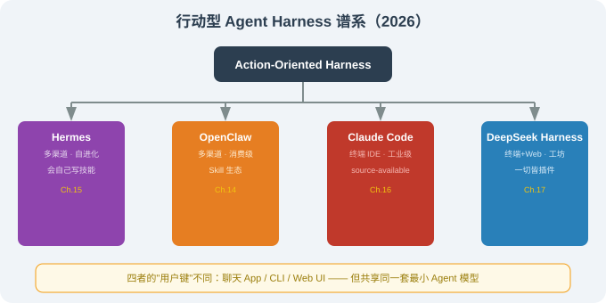
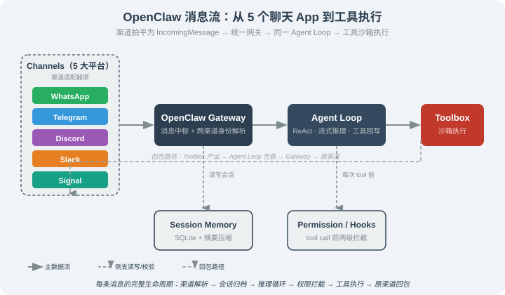

# 14.1 OpenClaw 全景：从 Clawdbot 到 OpenClaw 的演变

> 🦞 *一个周末项目如何变成现象级开源——以及它的名字为什么改了三次。*

---

## 一、为什么 OpenClaw 重要

在 2025 年之前，Agent 给人的印象大多是"技术演示"——你能在 GitHub 上看到 AutoGPT、BabyAGI 这类项目，但它们大多停留在 CLI 或者一个简陋的 Web UI。**真正把 Agent 推到日常生活的，是一类住在聊天 App 里的"行动型 Agent"**——你在 WhatsApp 里 @它，它就能替你搜资料、改文件、跑命令。

**OpenClaw** 就是这类项目的代表之一。它是一个周末项目起步、却在极短时间内成为 GitHub 上增长最快的开源项目之一（具体规模以仓库主页为准，动态数字不做引用）。这样一个项目到底是怎么诞生的？它和 Claude Code 这种"工业级 Harness"有什么根本不同？它的存在对你理解"行动型 Agent"生态有什么意义？这一节给你一个全景答案。

---

## 二、一段简短的演变史

OpenClaw 的命名史是开源史里非常少见的一段——**同一个代码库，在不到两个月里改了三次名字**：

| 时间 | 项目名 | 关键事件 |
|------|--------|---------|
| 2025-12 | `claw-relay` / 早期原型 | Peter Steinberger 在 GitHub 上创建最初仓库，最早的设想是一个"WhatsApp 转发器"——把收到的消息转发给 LLM，再把回复发回去 |
| 2026-01 上旬 | **Clawdbot** | 第一个"通用"版本的名字。灵感来自 Claude Code + "claw"（龙虾爪）的社区梗；具备多渠道接入、Sandbox、LSP、Voice 三件套 |
| 2026-01-27 | **Moltbot** | 因 Anthropic 商标顾虑（"Clawd" 与 Claude 拼写太近）被迫改名；功能与 Clawdbot 完全等价 |
| 2026-01-30 之后 | **OpenClaw** | 抛弃版权冲突、强调开源性 / 长线品牌定位；当前官方名称 |

这段历史不只是八卦，它告诉我们三件事：

1. **开源的命名是工程**——和"你这个项目准备做多大"密切相关；选错名字会反复遇到商标 / SEO / 社区认知的连锁成本。
2. **克隆 / 改写 / 移植在 OpenClaw 之后非常活跃**——nanobot（Python 约 4000 行）、ZeroClaw（Rust）、NanoClaw（Go + Apple 容器）、IronClaw（Rust + WASM 沙箱）、NullClaw（Zig，678KB 静态二进制）等数十个改写 / 移植版，都把"OpenClaw 的核心架构"作为起跑线。这本身就是对项目设计的一种"集体质量审查"——能 fork 出这么多语言版本，说明核心抽象做对了。
3. **OpenClaw 选择了"社区驱动"路线**——这是它和 Claude Code（闭源）最大的分野；前者追求"被所有人拥有"，后者追求"被某一个团队完成"。

---

## 三、OpenClaw 在 Harness 谱系中的位置

本部分后面四章会各讲一个项目（OpenClaw / Hermes / Claude Code / DeepSeek Harness）。它们之间的差异可以用一张图说明：

四者在"用户键"上的差异尤其关键：

| Harness | 主要交互界面 | 用户键 |
|---------|------------|--------|
| OpenClaw | 聊天 App | 在 WhatsApp / Telegram / Discord / Slack / Signal 中 `@bot` 发消息 |
| Hermes Agent | 聊天 App + CLI + TUI | 同上 + `hermes` 命令 |
| Claude Code | 终端 CLI | 在 shell 里 `claude "修这个 bug"` |
| DeepSeek Harness | Web UI + CLI + TUI | 在浏览器 127.0.0.1:3080 / `dsh` 命令 |

> 📌 **核心观察**：OpenClaw 把"用户键"从 CLI 推到了聊天 App——这一点**对 Agent 的产品形态有结构性影响**：输入变得更短、更口语化、需要更强的"上下文摘要"与"歧义容忍"能力；本节后续段落会分析这件事。

---

## 四、与"工业级 Harness"（Claude Code）的三个根本差异

很多读者可能已经用过 Claude Code。我们把它和 OpenClaw 并排对比，差异会更清楚：

| 维度 | OpenClaw | Claude Code |
|------|----------|-------------|
| **许可** | MIT 开源 | source-available（未采用开源协议） |
| **目标场景** | 个人助理、生活类任务 | 软件工程任务（编码、Review、调试） |
| **交互入口** | 聊天 App + CLI + TUI | 终端 CLI |
| **典型能力** | 邮件 / 日历 / 航班 / 笔记 / 多平台对话 | 代码读写、命令执行、MCP 接入、长上下文工程 |
| **技能系统** | Skills（Markdown） + 插件（TypeScript） | Skills（`SKILL.md`）/ MCP / Hooks / Plugins |
| **扩展方式** | 社区贡献 + ClawHub 技能市场 | 私有 + 团队配置 |
| **默认沙箱** | 终端安全 + Docker（推荐） | 权限模式（`plan`/`default`/`bypassPermissions` 等） |
| **典型用户** | 想"有个 Agent 陪着我"的人 | 想"AI 帮我写代码"的工程师 |

要点提炼：

1. **场景而非能力是分界线**：两个 Harness 的核心能力集大致重叠（都能读文件、跑命令、调用工具）；区分它们的是**典型任务画像**。
2. **许可 ≠ 安全**：很多人误以为"开源=不安全"或者"闭源=安全"；事实上二者在设计上各有取舍——开源透明但需要用户自己运营安全边界，闭源集中但需要信任单一团队。
3. **入口决定设计**：聊天 App 的入口意味着"消息必须能在 1.6K 字以内表达清楚"，进而催生"消息压缩 / 会话摘要 / 多步任务拆解"等专门的子模块——这是 CLI 入口不一定需要的。

---

## 五、OpenClaw 的核心模块

不管名字怎么改、fork 出多少语言版本，OpenClaw 的核心架构惊人地稳定。下面是核心模块的一览——**详细实现与逐行代码讲解见下一节 14.3**：

| 模块 | 一句话职责 | 详细讲解 |
|--------|-----------|---------|
| **Channel Adapters** | 渠道适配器：把各平台协议拍平成统一消息 | [14.3 第二层](./03_architecture.md) |
| **Gateway** | 消息中枢：统一协议 + 跨渠道身份解析 | [14.3 第三层](./03_architecture.md) |
| **Agent Loop** | 推理循环：调 LLM → 跑工具 → 回写结果 | [14.3 第四层](./03_architecture.md) |
| **Toolbox** | 工具集：文件 / Shell / 网络 / 消息 / 日程 / 记忆 | [14.3 第五层](./03_architecture.md) |
| **Skills Registry** | 扩展接口：SKILL.md 注册新能力（可选第 5 层） | [14.5 Skills 与 ClawHub](./05_skills_and_plugins.md) |

> 💡 **核心洞察**：这些模块与本书第 8 章 Harness Engineering 的"六大工程支柱"高度对应——Gateway ⊂ Channels；Agent Loop ⊂ Agent 循环 + 上下文；Toolbox ⊂ 工具；Skills ⊂ 技能系统。**读 OpenClaw 等于读第 8 章的"实例化"**。这里先建立全景，14.3 节会逐个拆开讲透。

---

## 六、社区生态：从 OpenClaw 派生出的改写版

OpenClaw 的代码质量与抽象边界在一个重要指标上极为出色——**社区能用不同语言重写它**。下面这些是公开存在的 fork / 改写（数据以各自仓库 `main` 分支为准，时间锚为 2026-08）：

| 项目 | 语言 | 主要差异 | 链接 |
|------|------|---------|------|
| **OpenClaw 主体** | TypeScript | 官方主仓 | `github.com/openclaw/openclaw` |
| **nanobot** | Python（≈4000 行） | 极简化、适合教学 | （OpenClaw 社区分支） |
| **ZeroClaw** | Rust | 重写为系统级性能 | （社区改写） |
| **NanoClaw** | Go + Apple 容器 | 利用 macOS 容器隔离 | （社区改写） |
| **IronClaw** | Rust + WASM 沙箱 | WASM 沙箱 + 高安全性 | （社区改写） |
| **NullClaw** | Zig | 678KB 静态二进制，单文件部署 | （社区改写） |

> ⚠️ 数据来源：以上链接与语言描述以各自仓库 `main` 分支 README 为准；规模（行数、二进制大小）由仓库自述。具体规模会随时间变化，引用时请以仓库最新描述为准。

**为什么这件事很重要？**——当一个项目的核心抽象做对了，多种语言的"再实现"成本极低，意味着**它找到了真正的不变量**。这是一个判断框架/库设计是否扎实的可靠信号。

---

## 七、本节小结

| 主题 | 关键要点 |
|------|---------|
| 项目定位 | 跨平台开源个人 AI 助理，住在你所有聊天 App 里 |
| 命名史 | Clawdbot → Moltbot → OpenClaw（避开商标 + 强调开源） |
| 谱系坐标 | 多渠道 · 消费级 · 社区驱动；与 Hermes（同源兄弟）、Claude Code（工业 IDE）、DeepSeek Harness（开发者工坊）并列 |
| 核心子系统 | Gateway / Agent Loop / Toolbox / Skills & Plugins |
| 与 Claude Code 差异 | 入口不同（聊天 vs CLI）、场景不同（生活 vs 编程）、许可不同（MIT vs source-available） |
| 生态 | Python / Rust / Go / Zig 多种改写，证明核心抽象扎实 |

---

*下一节：[14.2 安装与四种部署方式](./02_install_and_deploy.md)*
