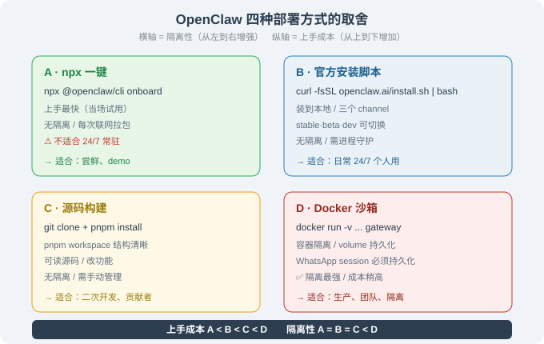

# 14.2 安装与四种部署方式

> 🦞 *"四种姿势把 OpenClaw 跑起来——从'尝鲜'到'生产'。"*

---

## 一、四种部署方式一览

OpenClaw 支持从"一条命令尝鲜"到"容器化生产"的完整光谱。选哪种，取决于你的目标——**是只想花 5 分钟看它长什么样，还是要一个 24/7 不挂、出问题能秒回滚的生产实例**：

| 方式 | 命令 | 适合 | 持久化 | 隔离 |
|------|------|------|--------|------|
| **A. npx 一键** | `npx @openclaw/cli onboard` | 尝鲜 / demo | 本地 `~/.openclaw/` | 无 |
| **B. 官方安装脚本** | 见下 | 日常长期使用 | 本地 | 无 |
| **C. 源码构建** | `git clone` + `pnpm install` | 二次开发 / 读源码 | 本地 | 无 |
| **D. Docker 沙箱** | `docker run` | 生产 / 隔离 | volume 挂载 | ✅ |



**这四个方式的本质区别，只有两个维度**：① 要不要常驻（决定是否值得配守护进程）；② 要不要隔离（决定是否用 Docker）。其余都是细节。

---

## 二、方式 A：npx 一键（尝鲜）

这是最快的上手方式，一条命令起一个交互式向导：

```bash
$ npx @openclaw/cli onboard
```

`onboard` 向导会**依次**问你几个问题，每个问题都对应一个配置项，最终写进 `~/.openclaw/config.yaml`：

| 向导问题 | 写入的配置 | 为什么必须问 |
|---------|-----------|-------------|
| LLM provider（Anthropic / OpenAI / OpenRouter / 本地 Ollama） | `llm.provider` | 决定 Agent 的"大脑"用谁 |
| 至少一个 Channel（WhatsApp / Telegram / Discord…） | `channels.*` | 决定 Agent 从哪里收消息 |
| persona（人设）+ 语言 + 时区 | `persona` / `locale` / `timezone` | 决定 Agent 的"性格"和"作息" |
| 是否启用 self-evolving | `self_evolving.enabled` | 决定是否让 Agent 自己攒技能 |

跑完后，`npx @openclaw/cli` 直接进交互式会话。

**但有个关键坑**：`npx` 方式每次启动都要从 npm registry 拉包，**不适合 24/7 常驻**。它的定位是"当场试用"——你试完觉得好，就该换下面的方式 B。

```bash
# 试用的完整流程
$ npx @openclaw/cli onboard   # 1. 跑向导，配置好
$ npx @openclaw/cli            # 2. 进入交互式会话
# 你会看到类似：
#   OpenClaw v2.x ready. Say hello!
#   > 你好
#   🦞 你好！我是你的个人助理，需要我做什么？
```

---

## 三、方式 B：官方安装脚本（推荐日常使用）

这是 24/7 常驻的首选。脚本会**自动装 Node.js 运行时 + 所有依赖 + 配置 PATH**，装完后 `openclaw` 就是系统级命令了。

### 3.1 macOS / Linux / WSL2

```bash
# 1) 下载并执行官方安装脚本
curl -fsSL https://openclaw.ai/install.sh | bash

# 2) 运行 onboarding 向导（同方式 A）
openclaw onboard
```

**`curl | bash` 安全吗？** 这是很多人第一次装会犹豫的地方。它的风险在于"你执行了一个还没看过内容的远程脚本"。稳妥做法是先下载、读一遍、再执行：

```bash
# 更稳妥的两步法
curl -fsSL https://openclaw.ai/install.sh -o install.sh   # 先下载
less install.sh                                          # 读一遍，确认没猫腻
bash install.sh                                          # 再执行
```

### 3.2 Windows（PowerShell）

```powershell
powershell -c "irm https://openclaw.ai/install.ps1 | iex"
```

原理和 macOS 一样：`irm`（Invoke-RestMethod）下载脚本，`iex`（Invoke-Expression）执行它。

### 3.3 三个更新 channel

装好后可以用 `openclaw update --channel <name>` 切换更新通道。**这是很多新手忽略、但生产很重要的一项**：

| channel | 定位 | 适合谁 |
|---------|------|--------|
| `stable` | 稳定版，经过充分测试 | 生产 / 日常（**默认，别乱切**） |
| `beta` | 新特性，基本稳定 | 想提前用新功能的尝鲜者 |
| `dev` | 前沿构建，可能坏 | 贡献者 / 想跟踪最新代码的人 |

> 💡 **生产环境永远用 `stable`**。`beta`/`dev` 可能引入未测试的破坏性变更，你不想让一个 24/7 跑着的个人助理在某次自动更新后悄悄挂掉。

---

## 四、方式 C：源码构建（读源码 / 二次开发）

如果你想**读源码**（本书第 14.3/14.4/14.5 的架构讲解就建立在这上面）或**改功能**，就该从源码跑：

```bash
$ git clone https://github.com/openclaw/openclaw.git
$ cd openclaw
$ corepack enable          # 启用 pnpm（corepack 是 Node 自带的包管理器切换器）
$ pnpm install             # 安装所有依赖（pnpm workspace 会一次性装完所有子包）
$ pnpm openclaw onboard    # 从源码运行 onboarding
```

**为什么用 `corepack enable`？** OpenClaw 是 **pnpm workspace**（monorepo），不同子包之间有相互依赖。`corepack` 是 Node.js 自带的工具，能按 `package.json` 里声明的版本自动激活 pnpm，避免你手动装错 pnpm 版本导致依赖树不一致。

源码结构（以 `main` 分支为准，目录名可能随版本微调）：

```
openclaw/
├── src/
│   ├── agent/            # Agent Loop + 工具实现（14.3 节 Layer 3/4）
│   ├── gateway/          # 消息中枢 + 渠道适配器（14.3 节 Layer 1/2）
│   ├── config/           # 配置加载 + schema 校验
│   ├── memory/           # 记忆系统（SQLite + 摘要）
│   └── ...
├── extensions/           # 各平台的渠道插件（Telegram/WhatsApp/Discord...）
├── skills/               # 内置 Skills（14.5 节讲）
└── packages/             # 共享工具包
```

> 📌 **读源码的正确姿势**：从 `src/gateway/` 和 `src/agent/` 开始——这是第 14.3 节四层架构的落点，也是理解"消息怎么流动"最直接的入口。

---

## 五、方式 D：Docker 沙箱（生产 / 隔离）

方式 A/B/C 都直接跑在宿主机上——Agent 执行 `run_command` 时，权限和你的账号一样大。如果你让 Agent 处理敏感数据、或担心它误操作，就该用 **Docker 把 Agent 关进容器**。

```bash
# 1) 拉官方镜像
$ docker pull ghcr.io/openclaw/openclaw:latest

# 2) 运行：挂载持久化目录 + 传入 API key
$ docker run -d --name openclaw \
    -v ~/.openclaw:/home/node/.openclaw \      # ① 配置 + 会话持久化
    -v ~/workspace:/workspace \                # ② 工作区（Agent 能碰的文件）
    -e ANTHROPIC_API_KEY=sk-... \              # ③ LLM 密钥（不写进镜像）
    ghcr.io/openclaw/openclaw:latest gateway   # ④ 启动 gateway 进程

# 3) 看日志
$ docker logs -f openclaw
```

**逐行解读这个 `docker run`**：

| 参数 | 作用 | 不写会怎样 |
|------|------|-----------|
| `-v ~/.openclaw:/home/node/.openclaw` | 把宿主机的配置目录挂进容器 | 容器一删，所有配置、会话、记忆全没 |
| `-v ~/workspace:/workspace` | 把工作区挂进去（Agent 只能碰这个目录） | Agent 读写不了你的文件 |
| `-e ANTHROPIC_API_KEY=...` | 用环境变量传密钥 | 密钥写进镜像会泄露；写进 `docker run` 命令行会被 `ps` 看到 |
| `ghcr.io/...:latest gateway` | 启动 gateway 进程（而非默认交互） | 容器起来就退出了 |

### 5.1 WhatsApp 的特殊性：为什么 session 必须持久化

这是 Docker 部署最容易踩的坑。**WhatsApp 渠道用"扫码绑定"**（类比网页版微信扫码登录），扫码后产生一个 session 文件。如果这个文件不持久化到 volume：

1. 容器重启 → session 文件丢失 → WhatsApp 掉线
2. 掉线后你必须**重新扫码**才能恢复

所以 `-v ~/.openclaw:/home/node/.openclaw` 这行**不是可选的，是 WhatsApp 渠道能正常工作的前提**。

---

## 六、验证安装：`openclaw doctor`

装完先跑自检，别急着上线。`doctor` 会逐项检查依赖、配置、渠道、记忆、沙箱：

```bash
$ openclaw doctor
```

典型输出（逐项解读）：

```
✓ Node.js      v22.22.2
    # 运行时版本，太旧会导致语法报错

✓ pnpm         9.x
    # 包管理器（仅源码方式需要）

✓ Anthropic    API key set (sk-ant-...)
    # LLM 密钥已配置，Agent 能调模型了

✓ Config       /Users/you/.openclaw/config.yaml
    # 配置文件存在且能解析

✓ Memory       SQLite ok (0 sessions)
    # 记忆库正常（0 sessions 表示还没有历史会话）

✓ Channels
    Telegram   ● online (bot @openclaw_bot)     # 这个渠道已连上
    WhatsApp   ○ not configured                 # 这个渠道还没配

✓ Skills       28 loaded                        # 内置 Skills 加载了 28 个

✓ Sandbox      local (no isolation) — consider Docker for production
    # ⚠️ 关键警告：当前沙箱无隔离，生产建议换 Docker
```

**`doctor` 的核心价值在于最后一行**——它会主动提醒你"当前沙箱等级不足"。很多人在本地跑得好好的，直接照搬上生产，结果 Agent 一个误操作 `run_command` 就把生产环境搞坏了。**上线前看 `doctor` 的 Sandbox 一行，是无沙箱还是 Docker，决定你能不能放心让 Agent 跑。**

---

## 七、部署决策小结

| 目标 | 选方式 | 为什么 |
|------|--------|--------|
| 5 分钟尝鲜 | A（npx） | 最快，但每次联网拉包，不适合常驻 |
| 日常 24/7 个人用 | B（脚本）+ `pm2`/`launchd` 守护 | 系统级命令 + 开机自启 + 崩溃自动拉起 |
| 读源码 / 改功能 | C（源码） | 能直接看到 `src/` 下的实现 |
| 团队 / 生产 / 隔离 | D（Docker） | 容器隔离 + volume 持久化 + 沙箱 |

**一个务实的判断原则**：先 A 尝鲜 → 觉得好用切 B 日常用 → 要改功能才上 C → 涉及敏感数据/多人共享才上 D。**不要一上来就 Docker**——它带来的隔离是有代价的（配置、日志、调试都更麻烦），个人本地用方式 B 完全够。

---

*下一节：[14.3 架构深度解析：Gateway / Agent Loop / Skills](./03_architecture.md)*
