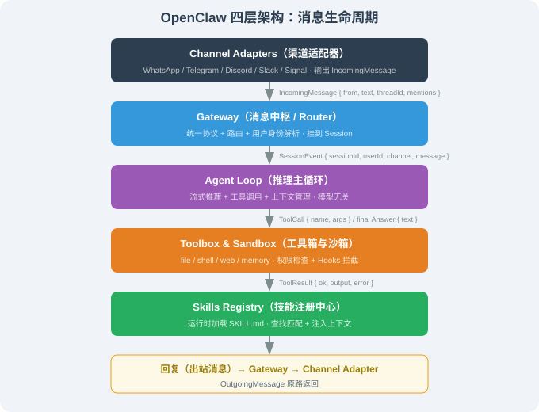

# 14.3 架构深度解析：Gateway / Agent Loop / Skills

> 🦞 *"好的架构能 fork 到 6 种语言而不出错。"—— 这句话不是吹嘘，而是架构质量的试金石。*

---

## 一、先回答一个问题：为什么消息一定要"过一遍网关"？

很多新手做聊天机器人，直觉上会这么写：

```js
// ❌ 直觉写法：渠道逻辑和业务逻辑混在一起
bot.on('text', async (ctx) => {
  const reply = await callLLM(ctx.message.text);   // 直接调 LLM
  await ctx.reply(reply);                          // 直接回包
});
```

这段代码能跑，但有一个致命问题：**它把"从 WhatsApp 收消息"这件事和"Agent 该怎么推理"这件事焊死在一起了**。当你第二天想支持 Telegram、Discord、Slack，你就得把 `callLLM` 的调用逻辑复制三遍；当你想给 Agent 加权限检查、加会话记忆，你又得改四处。

OpenClaw 的核心抽象只有一句话：

> **消息流经一个「网关」，进入「Agent Loop」，跑「工具」，写回「网关」。**



这张图拆成 4 个层，每层只做一件事，层与层之间靠**接口**而不是实现连接：

| 层 | 职责 | 输入 → 输出 | 关键接口 |
|----|------|------------|---------|
| **Layer 1 Channel Adapters** | 把不同渠道的协议拍平 | 渠道原生消息 → `IncomingMessage` | `ChannelAdapter` |
| **Layer 2 Gateway** | 会话级编排、跨渠道身份解析 | `IncomingMessage` → Agent 调用 → 回包 | `Gateway.handle()` |
| **Layer 3 Agent Loop** | 推理循环：调 LLM、跑工具、回写结果 | 上下文 → 最终回复 | `agentLoop.run()` |
| **Layer 4 Toolbox & Sandbox** | 工具执行 + 安全边界 | 工具调用 → 工具结果 | `Tool` |

下面按层拆开，每一层都给出**能跑的最小实现**，而不是"简化示意"。读完这一节，你应该能自己拼出一个能收发消息的最小 OpenClaw。

---

## 二、Layer 1：Channel Adapters（渠道适配器）

### 2.1 为什么要抽象出这一层

不同渠道的 SDK 长得完全不一样：

- **Telegram**：`bot.on('text', ctx => ...)`，消息体是 `ctx.message`
- **Discord**：`client.on('messageCreate', msg => ...)`，消息体是 `msg`
- **Slack**：`app.message(pattern, async ({ message }) => ...)`，消息体是 `message`
- **WhatsApp**：`client.on('message', msg => ...)`，消息体是 `msg.body`

如果你让 Gateway 直接认识这四种消息体，Gateway 的代码就会充斥着 `if (ctx.message) ... else if (msg.body) ...` 的分支判断。**适配器的价值就是把这些差异消灭在进入 Gateway 之前**——无论消息来自哪个渠道，进入 Gateway 时都长一个样。

### 2.2 统一的内部消息协议

适配器把渠道原生消息翻译成两个统一结构：

```ts
// 入站：所有渠道的消息，最终都变成这个结构
interface IncomingMessage {
  channel: 'whatsapp' | 'telegram' | 'discord' | 'slack' | 'signal';
  from: string;          // 用户在渠道内的唯一 ID（如 telegram 的 user id）
  threadId?: string;     // 群聊场景：区分是哪个话题/线程
  text: string;          // 纯文本内容（附件另算）
  attachments?: Attachment[];  // 图片/文件等
  mentions?: string[];   // 被 @ 到的 agent 名字列表
  isGroup: boolean;      // 群聊还是私聊（影响回复策略）
  timestamp: number;     // 毫秒时间戳
}

// 出站：Agent 的回复，也统一成这个结构，再由适配器翻译回渠道原生格式
interface OutgoingMessage {
  text: string;
  attachments?: Attachment[];
  replyToMessageId?: string;  // 回复哪条消息（渠道内引用）
  threadId?: string;
}
```

**为什么 `IncomingMessage` 里要带 `isGroup` 和 `mentions`？** 因为群聊和私聊的回复策略完全不同：私聊里 Agent 说一句话就是给一个人看的；群里 Agent 必须判断"这条消息是不是在叫我"（通过 `mentions` 或 `@bot` 前缀），否则它会对群里所有人的闲聊都做出反应。这两个字段是**渠道层必须透传给 Agent 的上下文**，缺了它们 Agent 在群里就是"话痨"。

### 2.3 完整实现：一个 Telegram 适配器

下面是一个**能真正跑起来**的 Telegram 适配器（用 `telegraf` 库，Node.js 环境）：

```js
// telegram-adapter.js —— 一个最小但完整的 Telegram 适配器
const { Telegraf } = require('telegraf');

// 适配器必须实现统一的 ChannelAdapter 接口
// interface ChannelAdapter {
//   start(handler): Promise<void>   // 启动，注册消息回调
//   stop(): Promise<void>           // 停止
//   send(to, reply): Promise<void>  // 出站：把 OutgoingMessage 发回原渠道
// }

function createTelegramAdapter(token, handler) {
  const bot = new Telegraf(token);

  return {
    async start() {
      // 只监听 text 消息（图片/文件等其他类型这里先忽略）
      bot.on('text', (ctx) => {
        // 1. 把 Telegram 原生消息翻译成 IncomingMessage
        const msg = {
          channel: 'telegram',
          from: String(ctx.from.id),                    // user id 是数字，转字符串统一
          text: ctx.message.text,
          isGroup: ctx.chat.type !== 'private',         // group/supergroup → true
          threadId: ctx.message.message_thread_id
            ? String(ctx.message.message_thread_id)     // 论坛话题 ID
            : undefined,
          // 2. 群聊里提取被 @ 的人名，供 Agent 判断是否在叫它
          mentions: (ctx.message.entities || [])
            .filter(e => e.type === 'mention')
            .map(e => ctx.message.text.slice(e.offset + 1, e.offset + e.length))
            .slice(0, 10),                              // 上限 10 个，防刷屏
          timestamp: ctx.message.date * 1000,           // Telegram 时间戳是秒，转毫秒
        };

        // 3. 交给上层（Gateway）处理，适配器不关心后面发生什么
        handler(msg);
      });

      await bot.launch();
      console.log('✅ Telegram adapter started');
    },

    async stop() {
      await bot.stop('SIGINT');
    },

    async send(to, reply) {
      // 出站：把统一的 OutgoingMessage 翻译回 Telegram API
      await bot.telegram.sendMessage(to, reply.text, {
        // 如果有 replyTo，用 Telegram 的"回复"特性引用原消息
        reply_to_message_id: reply.replyToMessageId,
        message_thread_id: reply.threadId,
      });
    },
  };
}

module.exports = { createTelegramAdapter };
```

**逐段解读**：

| 代码段 | 做了什么 | 为什么这么做 |
|--------|---------|-------------|
| `ctx.from.id → String()` | 数字 user id 转字符串 | 跨渠道 ID 要统一成字符串，否则 WhatsApp 的 `+86138...` 和 Telegram 的 `123456` 类型不一致，Gateway 做身份解析时会出 bug |
| `isGroup` 判断 | 用 `chat.type !== 'private'` | Telegram 的 `chat.type` 有 `private`/`group`/`supergroup`/`channel`，非 private 都按群聊处理 |
| `mentions` 提取 | 遍历 `entities` 找 `mention` 类型 | `@username` 在 Telegram 里不是文本的一部分，而是带 `entity` 标记的，必须解析 entity 才能拿到 |
| `date * 1000` | 秒转毫秒 | Telegram 的 `message.date` 是 Unix 秒，而 JS 的 `Date.now()` 是毫秒，不统一后续所有时间比较都会错 |
| `slice(0, 10)` | 限制 mentions 数量 | 防恶意消息塞几万个 @ 导致内存/上下文膨胀 |

### 2.4 渠道适配器矩阵

OpenClaw 支持 5 大渠道，实现细节如下（协议与依赖以各仓库 `main` 分支为准）：

| 渠道 | 协议 | 关键依赖 | 群聊支持 | 消息获取方式 |
|------|------|---------|---------|-------------|
| **WhatsApp** | WhatsApp Web 多设备协议 | `whatsapp-web.js`（社区库） | ✅ | WebSocket 长连 |
| **Telegram** | Bot API（HTTP long-polling / webhook） | `telegraf` | ✅（@bot 触发） | 长轮询或 webhook |
| **Discord** | Gateway API（WebSocket） | `discord.js` | ✅ | WebSocket 事件 |
| **Slack** | Events API + Socket Mode | `@slack/bolt` | ✅ | Socket Mode 或 HTTP |
| **Signal** | signal-cli（外部进程） | `signal-cli` | ✅ | 子进程通信 |

**关键设计**：每个适配器都实现同一个 `ChannelAdapter` 接口。这意味着**新增一个渠道 = 写一个新文件 + 在配置里注册一行**，主干逻辑（Gateway / Agent Loop / Toolbox）一行都不用改。

### 2.5 本层小结

| 要点 | 说明 |
|------|------|
| 适配器的价值 | 把渠道差异消灭在 Gateway 之前 |
| 统一协议 | `IncomingMessage` / `OutgoingMessage` |
| 必须透传的字段 | `isGroup`、`mentions`（决定 Agent 是否该响应） |
| 类型统一 | 所有 ID 转字符串、时间转毫秒 |

---

## 三、Layer 2：Gateway（消息中枢）

### 3.1 为什么中间还要加一层 Gateway？

适配器解决了"协议差异"，但还有两个问题没解决：

1. **跨渠道身份**：同一个人可能既在 WhatsApp 又在 Telegram 找你。如果两边的 user id 不同（`+86138...` vs `123456`），Agent 会以为是两个人，记忆、技能、人格就割裂了。
2. **会话编排**：一条消息进来，要"建会话 → 写历史 → 调 Agent → 回包"，这套流程每个渠道都一样，不该在每个适配器里各写一遍。

Gateway 就是干这两件事的：**把适配器交上来的消息，编排成一个完整的会话处理流程**。

### 3.2 核心难题：resolveSession（跨渠道身份解析）

这是 Gateway 里最有技术含量的一步。看这个需求：

> 用户在 WhatsApp 用 `+8613800138000` 发消息，在 Telegram 用 user id `987654321` 发消息。怎么知道这是同一个人？

OpenClaw 的答案是：**不靠猜，靠显式配置的身份解析器（identity resolver）**。默认配置里，用户要主动声明"我的 WhatsApp 号是 X，Telegram 号是 Y"，系统才把它们合并成一个会话：

```js
// 身份解析：把「渠道 + 渠道内 ID」映射到统一的 user key
function resolveSession(incoming, identityMap) {
  // identityMap 形如：
  // { "phone": "+8613800138000",     ← 统一身份 key（手机号）
  //   "telegram": "987654321",        ← Telegram 渠道下的 ID
  //   "whatsapp": "+8613800138000" }  ← WhatsApp 渠道下的 ID
  //
  // 默认策略：按「渠道名 + 该渠道的 ID」判断是否命中声明的身份。
  // 显式声明过才算同一个人，否则默认独立会话（保护隐私）。

  const declaredId = identityMap[incoming.channel];  // 该渠道声明的 ID
  if (declaredId === incoming.from) {
    // 命中：归到统一的 phone key（而不是渠道 ID！）
    return `user:${identityMap.phone}`;
  }
  // 未命中：当作独立匿名会话（不强行合并，避免错误关联）
  return `anon:${incoming.channel}:${incoming.from}`;
}
```

**关键点**：命中的时候返回的是 `identityMap.phone`（统一 key），**不是** `declaredId`（渠道 ID）。这样 Telegram 用户（`987654321`）和 WhatsApp 用户（`+8613800138000`）才会归到**同一个** `user:+8613800138000` 会话——跨渠道人格一致才真正成立。如果返回 `user:${declaredId}`，两个渠道会各建一个 session，合并就失效了。

**为什么默认不自动合并？** 因为"猜"会出错——两个不同的人可能在 Telegram 和 WhatsApp 用了相同的昵称，自动合并会让 A 的隐私泄露给 B。所以 OpenClaw 的默认策略是 **opt-in（显式声明才合并）**，而不是 opt-out。

### 3.3 完整实现：Gateway + 会话处理流程

```js
// gateway.js —— 消息中枢：编排一次完整的消息处理
class Gateway {
  constructor(agentLoop, adapters, identityMap) {
    this.agentLoop = agentLoop;
    this.adapters = adapters;       // { telegram: adapter, whatsapp: adapter, ... }
    this.identityMap = identityMap; // 跨渠道身份声明
    this.sessions = new Map();      // userKey -> Session（内存态，生产用 SQLite）
  }

  // 处理一条入站消息（由适配器回调触发）
  async handle(incoming) {
    // 1. 解析会话：这条消息属于谁？
    const sessionKey = resolveSession(incoming, this.identityMap);
    let session = this.sessions.get(sessionKey);

    // 2. 没会话就建一个（懒加载）
    if (!session) {
      session = { key: sessionKey, messages: [] };
      this.sessions.set(sessionKey, session);
    }

    // 3. 把用户消息写入历史（Agent 需要完整上下文）
    session.messages.push({ role: 'user', content: incoming.text });

    // 4. 触发 Agent Loop，并注入「渠道元数据」（群聊/私聊、@了谁）
    const reply = await this.agentLoop.run({
      session,
      metadata: {
        channel: incoming.channel,
        isGroup: incoming.isGroup,
        mentions: incoming.mentions,
      },
    });

    // 5. 把 Agent 的回复也写入历史（下次对话要能看到）
    session.messages.push({ role: 'assistant', content: reply.text });

    // 6. 通过原渠道回包（adapter.send 知道怎么发回 Telegram/WhatsApp）
    const adapter = this.adapters[incoming.channel];
    await adapter.send(incoming.from, reply);

    return reply;
  }
}
```

**这 6 步对应了消息的完整生命周期**，缺一不可：

| 步骤 | 作用 | 少了会怎样 |
|------|------|-----------|
| 1. resolveSession | 确定"这是谁" | 记忆、技能、人格全部割裂 |
| 2. 建会话 | 承载上下文 | Agent 每次都失忆 |
| 3. 写用户消息 | 保留对话历史 | Agent 不知道用户刚才说了啥 |
| 4. 调 Agent Loop | 实际推理 | 没有这一步就没有智能 |
| 5. 写 Agent 回复 | 历史闭环 | Agent 会重复说同样的话 |
| 6. 回包 | 把结果送回用户 | 用户收不到任何东西 |

### 3.4 一个贯穿四层的运行示例

把上面三层的代码连起来，跑一次真实的消息流。假设你在 Telegram 里给 bot 发了一句"帮我查下今天的天气"：

```js
// main.js —— 把适配器、Gateway、Agent Loop 串起来跑一次
const { createTelegramAdapter } = require('./telegram-adapter');

// 一个最简的 Agent Loop（下一节会完整实现，这里先用桩）
const agentLoop = {
  async run({ session, metadata }) {
    const last = session.messages[session.messages.length - 1];
    return { text: `收到你说的："${last.content}"（渠道：${metadata.channel}）` };
  },
};

const gateway = new Gateway(agentLoop, {}, {
  phone: '+8613800138000',
  telegram: '987654321',
});

// 模拟一条 Telegram 入站消息
const incoming = {
  channel: 'telegram',
  from: '987654321',
  text: '帮我查下今天的天气',
  isGroup: false,
  mentions: [],
  timestamp: Date.now(),
};

gateway.handle(incoming).then((reply) => {
  console.log('Agent 回复:', reply.text);
  console.log('会话历史:', JSON.stringify(gateway.sessions.get('user:987654321'), null, 2));
});
```

运行输出：

```
Agent 回复: 收到你说的："帮我查下今天的天气"（渠道：telegram）
会话历史: {
  "key": "user:987654321",
  "messages": [
    { "role": "user", "content": "帮我查下今天的天气" },
    { "role": "assistant", "content": "收到你说的：\"帮我查下今天的天气\"（渠道：telegram）" }
  ]
}
```

**这个输出印证了三件事**：① 消息成功进入会话；② Agent 拿到了完整上下文（能引用 `last.content`）；③ 回复被写回了历史，形成闭环。

### 3.5 本层小结

| 要点 | 说明 |
|------|------|
| Gateway 职责 | 会话编排 + 跨渠道身份解析 |
| resolveSession | 默认 opt-in 合并，避免错误关联 |
| 6 步流程 | 解析 → 建会话 → 写用户 → 调 Agent → 写回复 → 回包 |
| 生产注意 | `sessions` 用 Map 是内存态，生产要换 SQLite（14.4 讲） |

---

## 四、Layer 3：Agent Loop（主循环）

### 4.1 循环骨架：和 ReAct 是什么关系

Agent Loop 就是第 5 章讲的 ReAct 循环的具体实现。核心逻辑一句话：

> **反复「调 LLM → 看输出 → 是工具调用就执行并回写结果 → 是最终回答就返回」，直到拿到答案或达到步数上限。**

```
1. 组装上下文（system prompt + 历史 + 当前用户消息）
2. 循环：
   a. 调 LLM，流式拿到输出
   b. 解析输出：是 final_answer 还是 tool_call？
   c. 若是 final_answer → 返回给用户，循环结束
   d. 若是 tool_call → 权限检查 → 执行工具 → 把结果回写上下文 → 回到 a
   e. 超过 MAX_STEPS 还没结束 → 强制终止，返回"未能完成"
```

### 4.2 完整实现（带逐行注释）

下面是一个**能跑的最小 Agent Loop**。为了不依赖真实的 LLM API，我写了一个"假 LLM"，它会先要求调用一次工具、再给出最终答案——这样你能看到完整的循环过程：

```js
// agent-loop.js —— 最小可运行的 Agent Loop
async function agentLoop({ session, metadata, llm, toolbox, maxSteps = 5 }) {
  // 1. 组装上下文：system + 历史 + 当前消息
  const context = {
    system: '你是一个个人助理。可以调用工具，也可以直接回答。',
    messages: session.messages,        // 完整历史（含用户最新消息）
    metadata,                          // 渠道元数据（群聊/私聊等）
  };

  // 2. 循环，直到拿到 final_answer 或超步数
  for (let step = 0; step < maxSteps; step++) {
    console.log(`\n── 第 ${step + 1} 步 ──`);

    // 3. 调 LLM，拿到原始输出
    const raw = await llm(context);

    // 4. 解析输出：判断是「工具调用」还是「最终回答」
    if (raw.type === 'final_answer') {
      return { text: raw.text };       // 拿到答案，直接返回
    }

    if (raw.type === 'tool_call') {
      // 5. 权限检查（下一节 14.4 细讲，这里先默认放行）
      // 6. 执行工具
      const tool = toolbox[raw.toolName];
      if (!tool) {
        // 工具不存在 → 把错误回写给 LLM，让它自己想办法
        context.messages.push({
          role: 'tool', content: `错误：工具 ${raw.toolName} 不存在`,
        });
        continue;
      }
      const result = await tool.run(raw.args);
      // 7. 把工具结果回写上下文（这是循环能继续的关键）
      context.messages.push({ role: 'tool', content: JSON.stringify(result) });
      console.log(`  工具 ${raw.toolName} 返回:`, JSON.stringify(result));
      continue;                        // 回到第 3 步，让 LLM 看结果再决定
    }
  }

  // 8. 超步数兜底：不能无限循环
  return { text: '抱歉，这个任务比较复杂，我没能在限定步数内完成。' };
}

// —— 一个「假 LLM」：第一次要求调工具，第二次给最终答案 ——
// 这样你能观察到「调工具 → 回写 → 再推理」的完整循环
function makeFakeLLM() {
  let calls = 0;
  return async (context) => {
    calls += 1;
    if (calls === 1) {
      // 第一次：先查天气工具
      return { type: 'tool_call', toolName: 'get_weather', args: { city: '上海' } };
    }
    // 第二次：拿到工具结果后，给出最终答案
    const toolResult = context.messages.find(m => m.role === 'tool');
    return {
      type: 'final_answer',
      text: `上海今天晴，25°C。（工具返回：${toolResult.content}）`,
    };
  };
}

module.exports = { agentLoop, makeFakeLLM };
```

### 4.3 运行示例：观察完整循环

```js
// run-loop.js —— 跑一次 Agent Loop，观察每一步
const { agentLoop, makeFakeLLM } = require('./agent-loop');

const toolbox = {
  get_weather: {
    async run({ city }) { return { city, weather: '晴', temp: '25°C' }; },
  },
};

const session = {
  messages: [{ role: 'user', content: '上海今天天气怎么样？' }],
};

agentLoop({
  session,
  metadata: { channel: 'telegram', isGroup: false },
  llm: makeFakeLLM(),
  toolbox,
}).then((reply) => console.log('\n✅ 最终回复:', reply.text));
```

运行输出：

```
── 第 1 步 ──
  工具 get_weather 返回: {"city":"上海","weather":"晴","temp":"25°C"}

── 第 2 步 ──

✅ 最终回复: 上海今天晴，25°C。（工具返回：{"city":"上海","weather":"晴","temp":"25°C"}）
```

**逐行解读这个输出**：

1. **第 1 步**：LLM 判断"我不知道天气"，于是输出一个 `tool_call`（调 `get_weather`，参数 `上海`）。
2. **工具执行**：`toolbox.get_weather.run()` 被调用，返回 `{weather: 晴, temp: 25°C}`。
3. **结果回写**：这个 JSON 被 push 进 `context.messages`，作为一条 `role: 'tool'` 的消息。
4. **第 2 步**：LLM 带着工具结果再次推理，这次它知道天气了，输出 `final_answer`，循环结束。

**关键点**：如果第 7 步不把工具结果回写进上下文，LLM 在第 2 步就还是不知道天气，会陷入死循环或瞎编——**这就是"工具结果回写"是循环能正确收敛的根本原因**。

### 4.4 上下文压缩：长会话怎么办

上面的实现有一个隐患：`context.messages` 会无限增长。和 Claude Code 一样，OpenClaw 用**三级压缩**策略应对（对应第 16 章的讲解）：

| 触发条件（上下文占用） | 策略 | 做什么 |
|----------------------|------|--------|
| > 70% | 滑动窗口 | 只保留最近 K 轮对话，更早的直接丢弃 |
| > 90% | 摘要压缩 | 调 LLM 把远端历史总结成一段摘要，替换掉原始消息 |
| 接近上限 | 极限裁剪 | 连工具调用的中间过程都删掉，只保留每个工具的最终结果 |

```js
// 二级压缩的示意：超过阈值就把远端历史替换为摘要
async function maybeCompress(context, llm) {
  const estTokens = JSON.stringify(context.messages).length / 4;  // 粗略估算
  if (estTokens < 0.9 * CONTEXT_LIMIT) return;                    // 没到阈值，不动

  const farAway = context.messages.slice(0, -10);                 // 保留最近 10 轮
  const recent = context.messages.slice(-10);
  const summary = await llm({ type: 'summarize', messages: farAway });  // 压缩远端

  context.messages = [
    { role: 'system', content: `【历史摘要】${summary}` },
    ...recent,
  ];
}
```

**为什么要分级而不是一上来就压缩？** 因为压缩是有损的——摘要会丢失细节。所以策略是"能保留就保留，实在放不下了才逐级压缩"，在**上下文长度**和**信息完整性**之间做权衡。

### 4.5 本层小结

| 要点 | 说明 |
|------|------|
| 循环本质 | ReAct 循环的具体实现 |
| 两类输出 | `final_answer`（结束）vs `tool_call`（执行后继续） |
| 收敛关键 | 工具结果必须回写上下文，否则 LLM 无法继续 |
| 防死循环 | `maxSteps` 上限 + 超时兜底 |
| 长会话 | 三级压缩：滑动窗口 → 摘要 → 极限裁剪 |

---

## 五、Layer 4：Toolbox & Sandbox（工具箱与沙箱）

### 5.1 Tool 接口

工具是 Agent 的"手"。所有工具实现同一个接口：

```ts
interface Tool {
  name: string;              // 工具名（LLM 调用时用这个名字）
  description: string;       // 工具描述（写进 system prompt，告诉 LLM 何时用）
  schema: JSONSchema;        // 参数 schema（OpenAI function-call 格式）
  needsPermission: boolean;  // 是否需要在执行前做权限检查
  run(args, ctx): Promise<ToolResult>;  // 实际执行
}
```

**`description` 为什么重要？** 它是 LLM 决定"该不该用这个工具、怎么用"的唯一依据。描述写不清楚，LLM 就会乱用或不用。

### 5.2 完整实现：read_file 工具

```js
// read_file.js —— 一个安全的文件读取工具
const { readFile } = require('node:fs/promises');
const path = require('node:path');

const readFileTool = {
  name: 'read_file',
  description: '读取指定路径的文件内容。用于查看文件、日志、配置。',
  schema: {
    type: 'object',
    properties: {
      path: { type: 'string', description: '绝对路径，或 ~/.openclaw 工作区内的相对路径' },
    },
    required: ['path'],
  },
  needsPermission: false,   // 读文件相对安全，无需权限确认

  async run({ path: filePath }) {
    // 1. 展开 ~ 为用户主目录
    if (filePath.startsWith('~/')) {
      filePath = path.join(process.env.HOME, filePath.slice(2));
    }
    // 2. 读文件（读失败会把错误抛给 Agent，让它自己处理）
    const content = await readFile(filePath, 'utf8');
    return { ok: true, output: content };
  },
};
```

### 5.3 沙箱：run_command 的三档安全

`run_command` 是最危险的工具——它能执行任意 shell 命令。OpenClaw 提供了三档沙箱：

| 沙箱等级 | 实现 | 命令限制 | 适用场景 |
|---------|------|---------|---------|
| **默认（无沙箱）** | 工具直接跑在主进程 | 无 | 个人本地使用 |
| **受限 Shell（--strict）** | 白名单命令 + 参数校验 | 只允许 `ls`/`cat`/`grep` 等 | 中等安全 |
| **Docker 沙箱** | 工具在容器里跑 | 容器与主文件系统隔离 | 生产推荐 |

**受限 Shell** 的实现思路（低工作量、高安全的中庸之道）：

```js
// run_command.js —— 受限 shell：白名单 + 危险命令黑名单
const { exec } = require('node:child_process');
const { promisify } = require('node:util');
const execAsync = promisify(exec);

// 白名单：只允许这些命令（默认拒绝一切）
const ALLOWED_COMMANDS = ['ls', 'cat', 'grep', 'find', 'head', 'tail', 'wc', 'pwd', 'date'];
// 黑名单：即使命令在白名单里，带这些参数也拒绝
const FORBIDDEN_FLAGS = ['rm', '-rf', 'sudo', '>', '>>', '|', ';', '&&'];

const runCommandTool = {
  name: 'run_command',
  description: '在受限 shell 中执行白名单命令。',
  schema: {
    type: 'object',
    properties: {
      command: { type: 'string', description: '要执行的命令' },
    },
    required: ['command'],
  },
  needsPermission: true,   // 执行命令必须过权限检查

  async run({ command }) {
    // 1. 提取命令名（第一个空格前的部分）
    const cmdName = command.trim().split(/\s+/)[0];

    // 2. 白名单校验
    if (!ALLOWED_COMMANDS.includes(cmdName)) {
      return { ok: false, error: `命令 "${cmdName}" 不在白名单内` };
    }

    // 3. 危险标志校验（防止 `ls; rm -rf /` 这种注入）
    if (FORBIDDEN_FLAGS.some(flag => command.includes(flag))) {
      return { ok: false, error: '命令包含危险标志，已拒绝' };
    }

    // 4. 执行（限时 5 秒，防止卡死）
    try {
      const { stdout, stderr } = await execAsync(command, { timeout: 5000 });
      return { ok: true, output: stdout, error: stderr };
    } catch (e) {
      return { ok: false, error: e.message };
    }
  },
};
```

**为什么"黑名单 + 白名单"要同时用？** 因为单独用哪一个都有漏洞：

- 只用白名单：`ls; rm -rf /` 以 `ls` 开头能过白名单，但分号后面藏了危险命令。
- 只用黑名单：黑名单永远列不全（`rm` 有变体 `unlink`、`shred`、`find -delete`...）。

所以正确做法是**白名单（默认拒绝）+ 黑名单（拦截危险标志）双重防线**。

### 5.4 运行示例：验证沙箱拦截

```js
// 测试受限 shell
async function test() {
  const safe = await runCommandTool.run({ command: 'ls -la' });
  console.log('安全命令:', safe);

  const blocked1 = await runCommandTool.run({ command: 'rm -rf /' });
  console.log('拦截 rm:', blocked1);

  const blocked2 = await runCommandTool.run({ command: 'ls; rm -rf /' });
  console.log('拦截注入:', blocked2);
}
test();
```

运行输出：

```
安全命令: { ok: true, output: "total 8\ndrwxr-xr-x ...", error: "" }
拦截 rm:  { ok: false, error: '命令 "rm" 不在白名单内' }
拦截注入: { ok: false, error: '命令包含危险标志，已拒绝' }
```

**解读**：`rm -rf /` 被白名单拦下（`rm` 不在 `ALLOWED_COMMANDS`）；`ls; rm -rf /` 被黑名单拦下（包含 `;` 和 `rm`）——**两个安全防线各自拦截了一类攻击**。

### 5.5 本层小结

| 要点 | 说明 |
|------|------|
| Tool 接口 | name / description / schema / needsPermission / run |
| description 的作用 | 决定 LLM 何时、如何调用工具 |
| read_file | 展开 `~` + 错误回传（让 Agent 自己处理） |
| run_command | 三档沙箱，受限 shell = 白名单 + 黑名单 |
| 双重防线 | 白名单（默认拒绝）+ 黑名单（拦危险标志） |

---

## 六、与第 8 章 Harness Engineering 的对照

第 8 章提出了"一个完整 Agent 系统的六大工程支柱"。OpenClaw 的四层架构恰好是它的实例化：

| 六大工程支柱 | OpenClaw 对应位置 | 本节讲了什么 |
|-------------|------------------|-------------|
| **Agent 循环** | Layer 3 Agent Loop | ReAct 循环 + 工具结果回写 + 三级压缩 |
| **工具系统** | Layer 4 Toolbox | Tool 接口 + read_file + run_command |
| **技能系统** | Layer 1 Skills Registry（14.5 讲） | SKILL.md 扩展机制 |
| **记忆系统** | Layer 2 Gateway 的 session | 会话历史 + 跨渠道身份合并 |
| **沙箱隔离** | Layer 4 三档沙箱 | 无沙箱 / 受限 shell / Docker |
| **权限治理** | Layer 3 的权限检查（14.4 讲） | needsPermission + 权限流水线 |

> 这个对应不是巧合。**读 OpenClaw 的源码，等于读第 8 章"六大工程支柱"的一个可运行实例**——这正是本章把它作为第一个深度案例的原因。

---

## 七、本节小结

| 主题 | 关键要点 |
|------|---------|
| 架构总览 | 4 层：Channel Adapters → Gateway → Agent Loop → Toolbox |
| 分层原则 | 每层只做一件事，层间靠接口连接，不靠实现 |
| 适配器价值 | 把渠道差异消灭在 Gateway 之前，新增渠道 = 加一个文件 |
| 跨渠道身份 | resolveSession 默认 opt-in 合并，避免错误关联 |
| 循环收敛 | 工具结果必须回写上下文，否则 LLM 无法继续推理 |
| 长会话 | 三级压缩：滑动窗口 → 摘要 → 极限裁剪 |
| 工具安全 | 白名单（默认拒绝）+ 黑名单（拦危险标志）双重防线 |

---

*下一节：[14.4 多渠道路由：WhatsApp / Telegram / Discord / Slack / Signal](./04_channels.md)*
