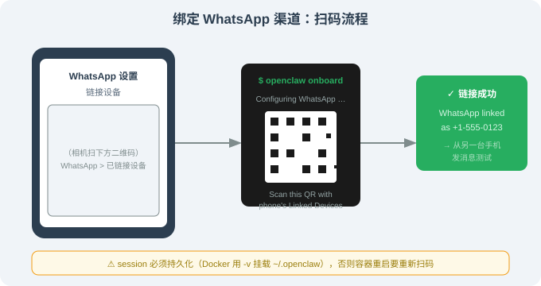
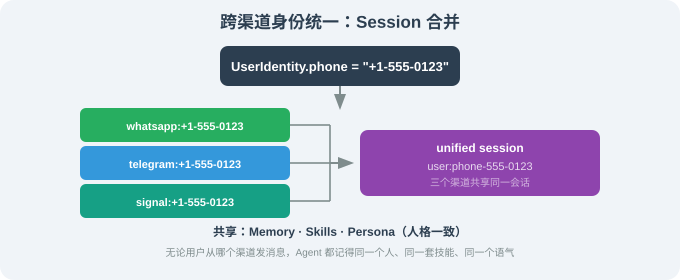

# 14.4 多渠道路由：WhatsApp / Telegram / Discord / Slack / Signal

> 🦞 *"用户键已经在你手机里了——把 Agent 装进那把钥匙。"*

---

## 一、为什么"多渠道"是 OpenClaw 的核心差异化

前面几节我们已经拆完 OpenClaw 的 4 层架构，本节聚焦**最值得研究的一层**：Channel Adapters。

这件事为什么重要？因为"行动型 Agent"自 Claude Code 之后已经很多了，但**真正"把 Agent 推送到用户已经在用的聊天 App"**这件事不是谁都做得好。OpenClaw 是当前生态里渠道覆盖最完整的一个：

- **5 大主流平台**（WhatsApp / Telegram / Discord / Slack / Signal）；
- **群聊与私聊统一抽象**；
- **跨平台人格一致**（同一会话身份在不同渠道的上下文被合并）；
- **消息压缩与多步任务**支持（聊天消息天然短、任务天然长，必须特殊处理）。

这一节我们拆解这 4 个设计点。

---

## 二、5 大渠道特性一览

| 渠道 | 协议 | 绑定方式 | 群聊 | 文件附件 | 单条字数限制 |
|------|------|---------|------|---------|------------|
| **WhatsApp** | Web 多设备 | QR 扫码 | ✅ | ✅（图片 / 视频 / 文档） | 65536 字符 |
| **Telegram** | Bot API | BotFather token | ✅（@bot 触发） | ✅ | 4096 字符 |
| **Discord** | Bot API + Gateway | Bot token | ✅ | ✅ | 2000 字符 |
| **Slack** | Bolt SDK | App token | ✅ | ✅ | 40000 字符 |
| **Signal** | signal-cli | 手机号注册 | ✅ | ✅ | 2000 字符 |

> 字数限制以各平台当前公开文档为准；这些值会随版本变化，部署时以平台官方文档为准。

可以看到：**字数限制差异极大**（从 2000 到 65536）。OpenClaw 内部对这个差异的处理是**自动分块**（auto-chunking）——长回复被自动切成多段发送。

---

## 三、绑定渠道：一步步上线 WhatsApp

下面演示把 WhatsApp 渠道绑定到 OpenClaw。其他渠道步骤类似。

### 3.1 准备

- 一台能 24/7 跑的机器（VPS / Mac mini / 家用 Linux）；
- 一个**新注册的 WhatsApp 号码**（强烈建议不绑个人号——给 Agent 单独号）；
- 一个 anthropic / openai 的 API key。

### 3.2 用 onboarding 绑定

```bash
$ npx @openclaw/cli onboard

🦞 Channels
  ? Which channels do you want to enable?  ( ) WhatsApp  ( ) Telegram  ( ) Discord  (•) Slack  ( ) Signal
  Space to toggle, Enter to confirm

  Configuring WhatsApp …
  Scan this QR code with your phone's WhatsApp > Linked Devices
```



扫码完成后，OpenClaw 会显示：

```
  ✓ WhatsApp linked as +1-555-0123
  → Test: send a message to that number from another phone
```

### 3.3 第一次互通

从另一台手机给这个号发条消息"hi"，你会在终端看到：

```
[whatsapp] +1-555-0123: "hi"
[agent] Reasoning step 1 …
[agent] Calling tool  send_message
[whatsapp] ↪  "你好！我是 OpenClaw，已经绑定到这个号码。有什么能帮你的？"
```

> 注意：`send_message` 是 OpenClaw 的"出站工具"——它的存在让"Agent 自己也能给自己发消息"，这是"提醒 / 自进化"等功能的基础。

### 3.4 配置文件长什么样

绑定完成后，`~/.openclaw/config.yaml` 多出一段：

```yaml
channels:
  whatsapp:
    enabled: true
    phone: "+1-555-0123"
    dm_policy: "open"        # open | contacts | closed
    group_policy: "mention_only"  # open | mention_only | closed
    rate_limit: "5/m"        # 每分钟最多 5 条（防止 Agent 故障刷屏）
  telegram:
    enabled: false
  # …
```

> ⚠️ **`group_policy: closed` 是强烈建议的默认值**：这意味着 Agent 只在群里被 `@` 时才响应，避免被陌生人触发。

---

## 四、群聊 / 私聊 / 跨渠道人格一致

### 4.1 群聊三种策略

| 策略 | 含义 | 风险 |
|------|------|------|
| `open` | Agent 对所有消息响应 | 高（易被刷屏） |
| `mention_only` | Agent 只在被 `@` 时响应 | 中（推荐默认） |
| `closed` | Agent 完全不在群里说话 | 低 |

每种策略都可以按渠道独立设置。

### 4.2 跨渠道用户身份解析

同一个人在不同渠道的 ID 完全不同：

| 渠道 | 该用户的 ID |
|------|-----------|
| WhatsApp | `whatsapp:+1-555-0123` |
| Telegram | `telegram:123456789` |
| Discord | `discord:987654321098765432` |

OpenClaw 默认**不会**自动把"同一个真人"的不同账号合并——它假设每个渠道 ID 是独立的用户。如果你想要"跨渠道人格一致"（同一个真人在所有平台的对话被同一个 Agent 连续承接），需要打开 `cross_channel_identity`:

```yaml
session:
  cross_channel_identity: true   # 默认 false（保护隐私）
  identity_resolver: "phone"     # 用手机号匹配
```

启用后，OpenClaw 会用手机号（如果有）作为同一个真人的内部 ID。这意味着：

> 你在 WhatsApp 上说"提醒我明早 8 点买菜"，10 分钟后在 Telegram 上 @它说"那条提醒还在吗？"——Agent 会把这两条对话当作同一个用户的事件历史。

### 4.3 私聊策略：`dm_policy`

| 策略 | 含义 |
|------|------|
| `open` | 任何给 Agent 发消息的号码都会被处理（风险：高） |
| `contacts` | 只处理通讯录里的号码 |
| `closed` | 不响应 |

经验：**`contacts`** 是"既要可用、又要防滥用"的最佳默认。

---

## 五、自动分块：处理回复字数限制

聊天 App 的字数限制差异巨大（2000~65536），Agent 的回复可能多段、长段。OpenClaw 内部的处理逻辑大致是：

```ts
// src/gateway/chunker.ts —— 简化
function chunkMessage(text: string, limit: number): string[] {
  const chunks: string[] = [];
  let current = '';
  for (const line of text.split('\n')) {
    // 优先按段落切
    if ((current + '\n' + line).length > limit) {
      chunks.push(current);
      current = line;
    } else {
      current = current ? current + '\n' + line : line;
    }
  }
  if (current) chunks.push(current);
  return chunks;
}

async function sendLongReply(channel: ChannelAdapter, to: string, text: string) {
  const limit = channel.maxMessageLength;  // 每个渠道的字数上限
  for (const chunk of chunkMessage(text, limit)) {
    await channel.send(to, { text: chunk });
  }
}
```

> 这个分块还**没**做"消息合并 / 顺序对齐"——遇到超长技能调用结果时仍可能卡顿。社区已有人贡献 `merge-on-edit` Plugin，把"快速连续发的 3 段"在客户端编辑为一条长消息。

---

## 六、WhatsApp 的特殊性：QR 绑定的工程影响

WhatsApp 用的是"扫码绑定设备"而不是 Token，这与 Telegram / Discord 完全不同。这带来三个工程细节：

1. **OpenClaw 需要在用户本机扫码一次**——所以 Docker 部署方式必须把 session 文件持久化（否则每次容器重启都得重新扫码）。
2. **断线重连**：WhatsApp Web 多设备协议偶尔会主动断开，OpenClaw 需要后台 watchdog 进程，定时检测 session 并自动重连。
3. **封号风险**：WhatsApp 对"短时间内大量群发"的号码会有限速甚至封号。OpenClaw 的 `rate_limit` 配置正是为此设计——但即便如此，**不建议**把 OpenClaw 绑在 WhatsApp 主号上。

工程实践经验：

```yaml
# ~/.openclaw/config.yaml 的健康配置
channels:
  whatsapp:
    enabled: true
    phone: "+15550100"           # 副号
    dm_policy: contacts
    group_policy: mention_only
    rate_limit: "3/m"            # 比默认更保守
  watchdog:
    enabled: true
    check_interval_s: 60         # 每分钟检查一次 session
    reconnect_backoff: "exponential"  # 断线指数退避重连
```

---

## 七、Telegram 的特殊性：Inbox / Thread 一致性

Telegram 的"消息线程"（`message_thread_id`）与"超级群主题"高度相关——同一个群不同主题的消息会落在不同 `threadId`。OpenClaw 把 Telegram 的"话题"建模为独立 session：

| Telegram 位置 | 对应的 session key |
|--------------|-------------------|
| 普通群（主话题） | `tg:chat:123` |
| 主题：技术 | `tg:chat:123:thread:456` |
| 主题：闲聊 | `tg:chat:123:thread:789` |

这种设计的取舍是：

- **优点**：不同主题对话互不干扰，Agent 不会"把 A 主题里的上下文混进 B 主题"；
- **代价**：跨主题的全局搜索需要显式触发（不是默认行为）。

> 经验：如果你希望"Agent 在群里有'全局记忆'"，可以把所有 Telegram session 合并到一个 session（在 config 里设 `telegram.merge_threads: true`）。但这会牺牲隔离性。

---

## 八、Discord / Slack 的特殊性：多频道与权限模型

两个平台都基于"Bot + 多频道"模型，对 Agent 来说有几个特殊点：

- **频道白名单**：默认建议维护 `allowed_channels: [ID1, ID2, ...]`，避免 Agent 被诱导到陌生频道；
- **权限层级**：Bot 在每个频道的权限独立配置（admin / moderator / member）；OpenClaw 用最小权限（只发消息 + 读消息）；
- **Slash Commands**：Discord 的 `/command` 与 Slack 的 `/command` 是天然的用户键接入方式——OpenClaw 都支持。

配置示例：

```yaml
channels:
  discord:
    enabled: true
    bot_token: "${DISCORD_BOT_TOKEN}"
    allowed_channels: ["1234567890", "0987654321"]  # 白名单
    slash_commands:
      - name: "ask"
        description: "Ask OpenClaw a question"
      - name: "summarize"
        description: "Summarize recent messages in this channel"
```

---

## 九、Signal 的特殊性：本地信号守护进程

Signal 没有直接的 Bot API，OpenClaw 通过 `signal-cli`（Java 编写的命令行客户端）做桥接。这意味着：

- 在容器内运行 Signal 渠道**必须**带 `signal-cli` 镜像；
- 手机号注册流程特殊（需短信验证码）；
- 在某些司法辖区（欧盟等），Signal 端到端加密给"机器人"的存在本身带来法律 / 合规问题——按需评估。

如果只是个人 VPS 自用，**Signal 反而是隐私最稳的选择**（不与 Meta / Google 数据生态共享）。

---

## 十、跨渠道人格一致：Session 合并

把上一节说的"跨渠道身份解析"展开，下面是 OpenClaw 内部 session 模型的示意：



打开 `cross_channel_identity: true` 后，效果：

- 你在 WhatsApp 上让 Agent 帮你"建一个名为 'Q3-plan' 的项目文件夹"；
- 5 分钟后在 Telegram 问"刚才那个 Q3-plan 文件夹在哪里？"；
- Agent 会基于**已合并的 session 历史**回答。

这是 OpenClaw 与 Claude Code 的另一个差异——Claude Code 默认每个终端窗口是独立 session（无合并），而 OpenClaw 默认把同一真人在所有渠道的会话合并。

---

## 十一、本节小结

| 主题 | 关键要点 |
|------|---------|
| 渠道矩阵 | 5 大平台（WhatsApp / Telegram / Discord / Slack / Signal） |
| 群聊策略 | `open` / `mention_only` / `closed`；推荐 `mention_only` |
| 私聊策略 | `open` / `contacts` / `closed`；推荐 `contacts` |
| 跨渠道身份 | 默认独立；可开 `cross_channel_identity: true` 合并 |
| 自动分块 | 内部按段落切、自动适配每平台字符上限 |
| WhatsApp 风险 | 不绑主号；启用 `rate_limit`；用 watchdog 监控断线 |

---

*下一节：[14.5 Skills 与插件生态：ClawHub 与社区贡献](./05_skills_and_plugins.md)*
