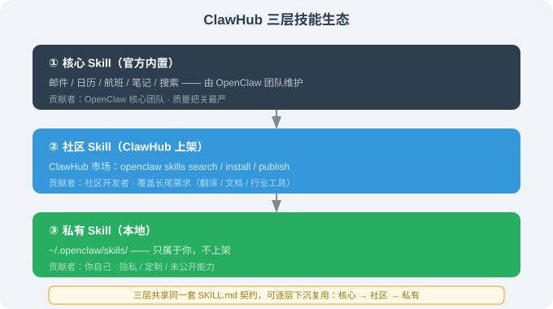

# 14.5 Skills 与插件生态：ClawHub 与社区贡献

> 🦞 *"SKILL.md 不是文档，是公共契约。"*

---

## 一、SKILL.md：OpenClaw 的扩展契约

OpenClaw 的扩展能力通过 **Skill** 提供。每个 Skill 是一个目录，内含 `SKILL.md` 主文件（可选附脚本）：

```
~/.openclaw/skills/
├── send-email/
│   ├── SKILL.md
│   └── send.ts
├── flight-search/
│   ├── SKILL.md
│   └── search.py
└── daily-report/
    ├── SKILL.md
    └── report.sh
```

### 1.1 SKILL.md 结构

```markdown
---
name: send-email
description: 通过 Gmail 发送一封邮件。当用户要求"发邮件/回复邮件"时使用。
tools: [gmail.send]
permissions: [gmail.send]
version: 0.1.0
author: yourname
---

# 触发条件
用户要求发邮件、回复邮件、群发通知时触发。

# 执行流程
1. 收集收件人、主题、正文
2. 调用 gmail.send 工具
3. 返回发送结果（message id / 是否成功）

# 约束
- 正文默认纯文本，除非用户要求 HTML
- 发送前向用户确认收件人与主题
```

frontmatter 的 4 个关键字段：

| 字段 | 作用 | 谁读 |
|------|------|------|
| `name` | 唯一标识 | 注册中心 |
| `description` | LLM 判断"何时用"的依据 | LLM |
| `tools` | 该 Skill 依赖的工具 | 权限系统 |
| `permissions` | 该 Skill 需要的权限 | 权限系统 |

> 📌 **核心洞察**：`description` 是给 **LLM 读的检索索引**——写得好，Agent 才能在正确时机唤起 Skill。这是"SKILL.md 是公共契约"的第一层含义：它同时服务 LLM（检索）、权限系统（授权）、注册中心（发现）、用户（审查）。

---

## 二、ClawHub：技能市场

**ClawHub**（`openclaw/clawhub`）是 OpenClaw 官方技能目录与市场：

```bash
# 浏览技能
$ openclaw skills search "email"
  send-email          gmail 发邮件
  email-summary       收件箱摘要
  email-draft         邮件草稿助手

# 安装
$ openclaw skills install send-email
✓ installed → ~/.openclaw/skills/send-email

# 发布（社区贡献）
$ openclaw skills publish ./my-skill
✓ published → clawhub/skills/my-skill
```

### 2.1 生态的三个层次



| 层 | 内容 | 贡献者 |
|----|------|--------|
| **核心 Skill** | 官方内置（邮件/日历/航班/笔记等） | OpenClaw 团队 |
| **社区 Skill** | ClawHub 上架 | 社区开发者 |
| **私有 Skill** | `~/.openclaw/skills/` 本地 | 你自己 |

---

## 三、社区 fork / 改写：核心抽象的质量证明

OpenClaw 之所以值得研究，一个硬指标是——**它能被多语言重写**。这证明核心抽象足够稳定：

| 项目 | 语言 | 特点 |
|------|------|------|
| OpenClaw（主仓） | TypeScript | 官方实现 |
| nanobot | Python（≈4000 行） | 极简，适合教学 |
| ZeroClaw | Rust | 系统级性能 |
| NanoClaw | Go + Apple 容器 | macOS 容器隔离 |
| IronClaw | Rust + WASM | WASM 沙箱 |
| NullClaw | Zig | 678KB 静态二进制 |

> ⚠️ 各 fork 的行数 / 大小以各自仓库 `main` 分支自述为准。

### 3.1 为什么能 fork 到 6 种语言？

因为 OpenClaw 的核心抽象**足够小且稳定**：整条数据流就是 `IncomingMessage → Gateway → Agent Loop → Toolbox → OutgoingMessage`（完整图见 [14.1 第 5 节](./01_history_and_positioning.md) 和 [14.3 架构](./03_architecture.md)），其中 Gateway 负责会话、Skills 负责扩展。

只要这个骨架不变，语言实现是"翻译"而非"重新设计"——**这就是"核心抽象做对"的标志：换语言重写时，你只需要把每一层的接口翻译成目标语言，而不需要重新想一遍架构该怎么搭**。

---

## 四、写一个自己的 Skill（动手）

场景：给 OpenClaw 加"每天 9 点把 TODO.txt 里的待办推到 Telegram"。

```bash
$ mkdir -p ~/.openclaw/skills/daily-todo
$ cat > ~/.openclaw/skills/daily-todo/SKILL.md <<'EOF'
---
name: daily-todo
description: 把 TODO.txt 的待办推送到 Telegram。当用户要求"推送待办/今日待办"时使用。
tools: [fs.read, telegram.send]
permissions: [fs.read, telegram.send]
version: 0.1.0
---

# 触发条件
用户要求推送待办、今日待办、daily todo 时触发。

# 执行流程
1. 读 ~/TODO.txt
2. 解析每行（格式：优先级|内容）
3. 用 telegram.send 发送汇总
4. 返回已推送的条数
EOF

$ openclaw skills reload
✓ daily-todo registered
```

现在对 OpenClaw 说"推送今日待办"，它就会调用这个 Skill。

---

## 五、本节小结

| 主题 | 关键要点 |
|------|---------|
| SKILL.md | 扩展契约：frontmatter + 触发条件 + 流程 + 约束 |
| 4 字段 | name / description / tools / permissions |
| ClawHub | 技能市场：search / install / publish |
| 三层生态 | 核心 / 社区 / 私有 |
| 社区 fork | 6 种语言重写 = 核心抽象扎实 |

---

*下一节：[14.6 实战：基于 OpenClaw 打造个人助理](./06_practice.md)*
