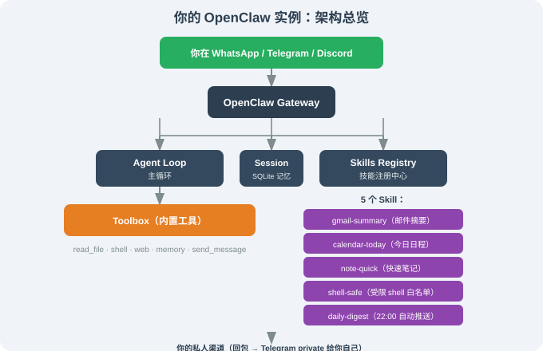

# 14.6 实战：基于 OpenClaw 打造个人助理

> 🦞 *"从'我今天邮件有什么？'到'帮我订明早的机票'，一个助理的本质是把这些重复任务从你的脑子里搬走。"*

---

## 一、本节目标

把前面 5 节学到的 OpenClaw 知识串起来，端到端搭一个**能替你处理"邮件 + 日程 + 笔记 + 命令"的个人助理**。读完这一节，你会有一个**真正能跑、能自检、能熔断**的实例，而不只是一堆零散的命令。

完成后你会拥有：

1. 一个能在 Telegram 接受指令的 OpenClaw 实例；
2. 五个实用 Skill（邮件摘要、日程提醒、笔记记录、命令白名单、每日复盘）——**每一个都给出完整可运行代码 + 逐行解释**；
3. 一份"每日复盘报告"自动推送（每天 22:00 推送给你的私人渠道）；
4. 一组"机器人越界"的自检与熔断手段。

> 本节所有命令基于前面章节描述的 CLI；具体 flag 与 `config.yaml` 字段以仓库 `main` 分支为准。

---

## 二、架构总览：你的 OpenClaw 实例长什么样



部署形态：**方式 D Docker 沙箱部署** + **pm2/systemd 守护**，这样 Agent 24/7 在线、出问题可快速重启。

**为什么选 Docker 而不是方式 B（安装脚本）？** 因为本节的 Agent 会执行 `run_command`（虽然限制了白名单）。Docker 提供了一层额外隔离——即使 Agent 越界，最多破坏容器内的文件系统，伤不到宿主机。这是"让 Agent 碰 shell"的最低安全底线。

---

## 三、第一步：基础部署与配置

### 3.1 启动 OpenClaw

```bash
$ docker run -d --name openclaw \
    -v ~/.openclaw:/root/.openclaw \
    -v ~/workspace:/workspace \
    -e OPENCLAW_LLM=anthropic \
    -e ANTHROPIC_API_KEY=sk-... \
    --restart unless-stopped \
    openclaw/openclaw:latest gateway
```

**逐参数解释**：

| 参数 | 作用 | 为什么必须 |
|------|------|-----------|
| `-d` | 后台运行 | 不占终端，容器独立存活 |
| `-v ~/.openclaw:/root/.openclaw` | 挂载配置目录 | 容器删了配置还在；WhatsApp session 也在这（14.2 讲过） |
| `-v ~/workspace:/workspace` | 挂载工作区 | Agent 读写文件的"领地"，只给它碰这个目录 |
| `-e OPENCLAW_LLM=anthropic` | 指定 LLM 提供商 | 决定 Agent 的"大脑" |
| `-e ANTHROPIC_API_KEY=sk-...` | 传 API key | 用环境变量，不写进镜像 |
| `--restart unless-stopped` | 崩溃自动重启 | 24/7 服务的基础保障 |

### 3.2 绑定一个测试渠道

```bash
$ docker exec -it openclaw openclaw onboard
→ Channels:
    [x] Telegram     (with BotFather token)
```

只绑 Telegram 测试，**不要**绑 WhatsApp / 公众群聊——安全起见。为什么？Telegram 用 BotFather token，可以随时吊销；而 WhatsApp 要绑手机号、有封号风险，测试阶段没必要冒这个险。

### 3.3 最小权限设置

`~/.openclaw/config.yaml`（**这是安全的核心，逐段讲**）：

```yaml
session:
  cross_channel_identity: false    # 先不合并渠道，防误识别
  max_steps: 25                    # Agent 单次任务最多 25 步，防死循环

tools:
  run_command:
    enabled: true
    strict: true                    # ⚠️ 关键：只允许白名单命令
    allowed_commands:               # 白名单——Agent 只能跑这些
      - ls
      - cat
      - grep
      - find
      - wc
      - date
      - df
    blocked_substrings:             # 黑名单——即使命中白名单，含这些也拒绝
      - "rm "
      - "rm -"
      - "mv "
      - "chmod"
      - "curl "
      - "wget "
      - "sudo"

channels:
  telegram:
    enabled: true
    bot_token: "${TELEGRAM_BOT_TOKEN}"
    allowed_chats:
      - "${TELEGRAM_PRIVATE_CHAT_ID}"  # 仅你自己的私聊
    dm_policy: closed                  # 不响应陌生私聊
    group_policy: closed               # 不进任何群
    rate_limit: "3/m"                  # 每分钟最多 3 条，防故障刷屏
```

**三个关键安全设计，缺一不可**：

1. **`strict: true` + 白名单**：Agent 只能跑 `ls`/`cat`/`grep` 等只读命令，`rm`/`mv` 根本不在白名单里。
2. **黑名单兜底**：`blocked_substrings` 拦截 `ls; rm -rf /` 这类"命令注入"——白名单拦不住藏在分号后面的危险命令，黑名单能。
3. **`dm_policy: closed` + `group_policy: closed`**：测试阶段 Agent 只响应你的私聊，任何陌生人都触发不了它。

> 注意 `TELEGRAM_PRIVATE_CHAT_ID` 是你自己的 Telegram 账号与 Bot 对话的 chat ID——**不要分享**。它相当于"Agent 只听你一个人说话"的钥匙。

### 3.4 第一次对话

从你的 Telegram 给 Bot 发消息：

```
你: 你好，今天有什么重要事项？
```

预期响应：

```
bot: 你好！今天你主要有这些事项：
  • (待 Skill 加载) 邮件摘要 / 日程摘要 / 笔记
  当前 OpenClaw 已经启动，但还没装任何 Skill。继续安装吧！
```

**这一步验证了什么**：① Agent 活着、能回消息；② 权限配置生效（只有你的私聊能触发）；③ 但它还没有任何"能力"——因为它还没装 Skill。下面装。

---

## 四、第二步：装 5 个 Skill

这是本节的**核心**。每个 Skill 我都会给：① 完整的 `SKILL.md` ② 完整的后端代码 + **逐行解释** ③ 测试对话 + 输出解读。

### 4.1 Skill 1：邮件摘要（`gmail-summary`）

这是最复杂的一个，因为它要接 Gmail API。完整实现：

#### 4.1.1 SKILL.md（给 LLM 读的"使用说明书"）

```markdown
---
name: gmail-summary
description: 读取今日未读邮件并生成摘要。当用户问"今天有什么邮件/未读/收件箱"时使用。
tools:
  - name: list_today_emails
    description: 读取今天的所有未读邮件（发件人 + 主题 + 时间）
  - name: summarize_email
    description: 对指定邮件 ID 的内容做摘要
version: 0.1.0
---

# 何时使用
用户问"邮件""未读""收件箱""有没有新邮件"时触发。

# 工作流
1. 调用 list_today_emails() 拿到未读邮件列表
2. 如果用户要看某封具体内容，调用 summarize_email(id)
3. 用简洁的列表形式回复用户（发件人 + 主题，最多 5 封，多的折叠）
```

**`description` 字段为什么这么写？** 它是 LLM 判断"该不该调这个 Skill"的唯一依据。注意它列举了触发词（"邮件""未读""收件箱"），并说清楚了输出格式（"最多 5 封"）——**描述越具体，LLM 越不会误触发或乱用**。

#### 4.1.2 后端实现（逐行解释）

```ts
// ~/.openclaw/skills/gmail-summary/index.ts
import { google } from 'googleapis';

// 1. 初始化 Gmail API 客户端
//    auth 是 OAuth2 凭证（第一次运行时走授权流程，之后用 refresh token 刷新）
const gmail = google.gmail({ version: 'v1', auth: oauth2Client });

export async function list_today_emails() {
  // 2. 计算"今天"的时间范围
  const start = new Date();
  start.setHours(0, 0, 0, 0);          // 今天 00:00
  const end = new Date(start);
  end.setDate(end.getDate() + 1);       // 明天 00:00（即今天 24:00）

  // 3. 调 Gmail API，只查未读邮件
  const res = await gmail.users.messages.list({
    userId: 'me',
    q: 'is:unread',                     // Gmail 查询语法：只查未读
    maxResults: 20,                     // 最多 20 封，防结果爆炸
  });

  // 4. 拿到的是 message id 列表，还要逐个取元数据（发件人/主题）
  const messages = res.data.messages ?? [];
  const detailed = await Promise.all(
    messages.map(async ({ id }) => {
      const m = await gmail.users.messages.get({
        userId: 'me',
        id,
        format: 'metadata',             // 只要元数据，不要正文（快）
        metadataHeaders: ['From', 'Subject', 'Date'],  // 只要这三个头
      });
      const headers = m.data.payload?.headers ?? [];
      const get = (name: string) =>
        headers.find(h => h.name === name)?.value ?? '';
      return { id, from: get('From'), subject: get('Subject'), date: get('Date') };
    }),
  );

  return detailed;
}

export async function summarize_email({ id }: { id: string }) {
  // 5. 取指定邮件的全文
  const m = await gmail.users.messages.get({ userId: 'me', id, format: 'full' });
  // 6. 正文可能是 base64，要解码
  const body = m.data.payload?.body?.data ?? '';
  const text = Buffer.from(body, 'base64').toString('utf8');
  // 7. 摘要交给 LLM 做（OpenClaw 会自动把返回值喂给 LLM 让它总结）
  return { id, content: text.slice(0, 4000) };  // 截断，防超上下文
}
```

**关键设计点**：

| 代码行 | 做了什么 | 为什么 |
|--------|---------|--------|
| `format: 'metadata'` | 只取邮件头，不取正文 | 列表页只需要"谁发的、什么主题"，取全文太慢太贵 |
| `metadataHeaders: [...]` | 只取 From/Subject/Date 三个头 | 精确控制返回字段，避免拿到一堆无用 header |
| `maxResults: 20` | 限制结果数量 | 防"几千封未读"导致一次调用超时 |
| `text.slice(0, 4000)` | 截断正文 | 单封邮件可能几万字，全塞给 LLM 会撑爆上下文 |

#### 4.1.3 安装 + 测试

```bash
$ openclaw skills install gmail-summary
   ✓ Loaded 2 tools: list_today_emails / summarize_email
```

测试对话：

```
你: 今天邮件有什么？
bot: 今天有 12 封未读邮件，重要的 5 封：
  1. From boss@company.com — "Q3 plan review"
  2. From alice@… — "Lunch tomorrow?"
  3. From security@… — "External sharing policy update"
  4. From 客户 — "Conference call rescheduled"
  5. From hr@… — "Benefits enrollment deadline"
  （其余 7 封已折叠）
```

**这个回复背后发生了什么**（工具调用 trace，理解 Agent 内部决策）：

```
[agent] 收到消息 "今天邮件有什么？"
[agent] 判断：用户问邮件 → 命中 gmail-summary 的触发词 → 调用 list_today_emails
[tool]  list_today_emails() 返回 12 封邮件的 [from, subject, date]
[agent] 拿到 12 封 → 按"重要性"排序 → 取前 5 封 → 折叠其余
[agent] 生成回复文本 → 发回 Telegram
```

### 4.2 Skill 2：今日日程（`calendar-today`）

```markdown
---
name: calendar-today
description: "读取今日日程并按时间排序展示。"
tools:
  - name: list_today_events
    description: "读取今天的所有日程"
  - name: next_event
    description: "读取下一场即将开始的事件"
version: 0.1.0
---

# 何时使用
"今天有什么会""下一个会几点""日历今天怎样"等。

# 工作流
1. 调用 list_today_events() 返回事件列表；
2. 用 LLM 格式化输出；
3. 若 5 分钟内有事件，调用 next_event() 单独再提醒一次。
```

后端：

```ts
// ~/.openclaw/skills/calendar-today/index.ts
import { google } from 'googleapis';

const calendar = google.calendar({ version: 'v3', auth: oauth2Client });

export async function list_today_events() {
  // 1. 计算今天的起止时间
  const start = new Date();
  start.setHours(0, 0, 0, 0);
  const end = new Date(start);
  end.setDate(end.getDate() + 1);

  // 2. 调 Calendar API
  const res = await calendar.events.list({
    calendarId: 'primary',
    timeMin: start.toISOString(),
    timeMax: end.toISOString(),
    singleEvents: true,     // 展开重复事件（如"每周例会"）
    orderBy: 'startTime',   // 按开始时间排序
  });
  return res.data.items ?? [];
}
```

**`singleEvents: true` 是关键**——Google Calendar 的"每周例会"是一个"重复事件"（recurring event），如果不开这个选项，你只能拿到一个"母事件"，看不到"今天这场"的具体时间。开了之后，API 会把重复事件**展开**成今天实际发生的这一场。

### 4.3 Skill 3：快速笔记（`note-quick`）

```markdown
---
name: note-quick
description: "保存一条 Markdown 笔记到本地 + 远程仓库。"
tools:
  - name: save_note
    description: "保存一条标题 + 内容的笔记"
  - name: search_notes
    description: "在笔记库中搜索关键词"
version: 0.1.0
---
```

```ts
// ~/.openclaw/skills/note-quick/index.ts
import { writeFile } from 'node:fs/promises';
import { join } from 'node:path';

const VAULT = process.env.NOTE_VAULT ?? '~/Notes';

export async function save_note({ title, body }: { title: string; body: string }) {
  // 1. 文件名带日期前缀，方便按天归档
  const date = new Date().toISOString().slice(0, 10);   // 2026-08-17
  // 2. 标题里的特殊字符去掉，避免生成非法文件名
  const safeTitle = title.replace(/[\/\\:*?"<>|]/g, '-');
  const path = join(VAULT, `${date}-${safeTitle}.md`);
  // 3. 写文件（Markdown 格式：一级标题 + 正文）
  await writeFile(path, `# ${title}\n\n${body}\n`);
  return { ok: true, path };
}
```

**为什么要 `safeTitle`？** 标题可能包含 `/`（如"Q3/计划"）或 `:`（如"会议:预算"），这些在文件名里是非法的（Windows 尤甚）。不清理的话，`writeFile` 会抛错，Skill 就挂了。**这类"脏输入清理"是写 Skill 最容易漏、又最容易出 bug 的地方**。

### 4.4 Skill 4：受限 Shell（`shell-safe`）

```ts
// ~/.openclaw/skills/shell-safe/index.ts
import { exec } from 'node:child_process';

const ALLOW = new Set(['ls', 'cat', 'grep', 'find', 'wc', 'date', 'df', 'pwd']);

export async function run_safe({ cmd }: { cmd: string }) {
  // 1. 取命令的第一个词（命令名）
  const tokens = cmd.trim().split(/\s+/);
  if (!ALLOW.has(tokens[0])) {
    return { ok: false, error: `command not allowed: ${tokens[0]}` };
  }
  // 2. 白名单通过才执行，限时 10 秒防卡死
  return new Promise((resolve) => {
    exec(cmd, { timeout: 10_000 }, (err, stdout, stderr) => {
      resolve({ ok: !err, output: stdout, error: stderr });
    });
  });
}
```

测试这个 Skill 的安全边界：

```
你: 帮我删掉 /workspace 里的临时文件
bot: 我尝试执行 `rm /workspace/tmp/*`，但被拒绝了：
  command not allowed: rm
  如果你想清理临时文件，我只能用 find 帮你列出它们，删除需要你手动确认。
```

**这个回复展示了"工具拒绝"的正确姿势**：Agent 没有硬闯，而是如实告诉你"被拒了 + 原因"，并给出一个替代方案。**这就是把安全边界交给代码（白名单）而不是交给 LLM 自律的价值**——LLM 可能会被诱导说"好的我删"，但白名单永远说"不行"。

### 4.5 Skill 5：每日复盘（`daily-digest`）

```ts
// ~/.openclaw/skills/daily-digest/index.ts
import * as gmail from '../gmail-summary';
import * as calendar from '../calendar-today';
import * as note from '../note-quick';

export async function build_digest() {
  // 1. 并行拉取三个数据源（Promise.all 并发，比串行快 3 倍）
  const [emails, events, todayNotes] = await Promise.all([
    gmail.list_today_emails(),
    calendar.list_today_events(),
    note.search_notes({ query: new Date().toISOString().slice(0, 10) }),
  ]);
  // 2. 汇总成一条推送
  return {
    emails: emails.length,
    events: events.length,
    notes: todayNotes.split('\n').length,
    summary: `${emails.length} emails / ${events.length} events`,
  };
}
```

调度（`config.yaml` 里的 cron）：

```yaml
cron:
  - name: "daily digest"
    cron: "0 22 * * *"      # 每天 22:00（cron 五段式：分 时 日 月 周）
    action: "use_skill daily-digest build_digest, send_message"
    channel: telegram
    to: "${TELEGRAM_PRIVATE_CHAT_ID}"
```

**`Promise.all` 为什么重要？** 三个数据源是独立的（互不依赖），串行要等 Gmail 返回才查 Calendar、再查笔记，总耗时是三者的和；并行（`Promise.all`）让它们同时跑，总耗时是三者的最大值。**这种"独立任务并行化"是写 Skill 的基本功**。

---

## 五、第三步：完整流程演示（含工具调用 trace）

下面是一次完整的一天，每个场景我都**同时给出"用户看到的对话"和"Agent 背后的工具调用 trace"**——这才是理解"个人助理怎么工作"的关键。

### 5.1 早 8:30：日程推醒

用户看到的：

```
[Telegram Bot @ 08:30]
bot: ☀ 早安。今天有：
  09:00 [团队周会] (Zoom)
  11:30 [与 Alice 午餐]
  15:00 [Q3 评审汇报]
  17:00 [牙医预约]
你: 把 Q3 评审汇报换成明天下午
bot: 已请求把"Q3 评审汇报"挪到明天下午，发起人是你 ✓
```

Agent 背后的 trace：

```
[agent] cron 触发（08:30 日程推醒）
[agent] 调 calendar-today 的 list_today_events()
[tool]  返回 4 个事件
[agent] 按时间格式化 → 生成早安消息 → 发回
---
[agent] 收到 "把 Q3 评审汇报换成明天下午"
[agent] 判断：这是"改日程"操作，不是查询
[agent] 调 calendar 的 move_event（写操作，需要权限确认）
[perm]  检查：用户在授权白名单 → 放行
[tool]  move_event("Q3 评审汇报", 明天下午) → 成功
[agent] 回包确认
```

### 5.2 中午 12:00：临时查邮件

```
你: 今天有什么紧急邮件？
bot: 我看了你的未读邮件，紧急的 3 封：
  1. From boss — Q3 plan review（请今天回）
  2. From security@… — "External sharing policy update"（今天前需阅读）
  3. From 客户 — "Conference call rescheduled to 14:00"
```

trace 关键点：这次 Agent 不是简单列出邮件，而是**做了"紧急度判断"**——它调 `list_today_emails` 拿到 12 封后，让 LLM 根据主题和发件人**筛出"紧急"的 3 封**，而不是机械地列前 3 封。**这就是"工具 + LLM 判断"的组合：工具负责"拿数据"，LLM 负责"判断什么重要"**。

### 5.3 下午 17:30：捕捉灵感

```
你: 记一下：把 OpenClaw 写进书的第 14 章后，再加一节"实践中的反模式"。
bot: ✓ 已保存笔记：~/Notes/2026-08-17-OpenClaw-反模式.md
```

trace：Agent 调 `note-quick` 的 `save_note`，把标题清洗成 `OpenClaw-反模式`（斜杠等字符被替换），文件名带日期前缀。

### 5.4 晚 22:00：每日复盘

```
[Telegram Bot @ 22:00] —— daily digest 触发
bot: 🌙 今天 2026-08-17 的复盘：
  • 邮件：28 封未读（5 封回了）
  • 日程：8 场（全部按时）
  • 笔记：6 条新增（含 2 条技术 / 4 条工作）
  • 下周要做的：
    - 跟 Alice 确认 lunch 改期
    - 提交 Q3 plan 草稿
    - 处理 security policy 邮件
```

trace：cron 触发 `build_digest` → `Promise.all` 并行拉邮件/日程/笔记 → 汇总 → `send_message` 推送。

---

## 六、第四步：出问题时如何熔断

Agent 会犯错，尤其是它接了 shell、网络、第三方 API。**熔断能力比"让它别犯错"更重要**——因为后者做不到。

### 6.1 监测：日志在哪里

OpenClaw 默认输出到：

- 容器内：`/root/.openclaw/logs/openclaw.log`（按天滚动）
- 如用 journald：`journalctl -u openclaw-gateway -f`

跟踪关键事件（PreToolUse / PostToolUse 是每次工具调用前后的钩子日志）：

```bash
$ docker exec -it openclaw tail -f /root/.openclaw/logs/openclaw.log | grep -E 'PreToolUse|PostToolUse|error'
```

### 6.2 熔断：紧急刹车

```bash
# 1. 立刻停服务（这是最快、最彻底的一刀）
$ docker stop openclaw

# 2. 看最后 N 条决策日志（搞清楚它到底干了啥）
$ docker logs openclaw --tail 200

# 3. 决定：改 config / 删某个 skill / 改 OAuth 凭证 / 直接回滚

# 4. 重新启动
$ docker start openclaw
```

**为什么第一步永远是 `docker stop`？** 因为 Agent 可能正在执行一串工具调用，你改配置、删 skill 都来不及——先让它停下来，再慢慢查。这是"先止血，再诊断"的原则。

### 6.3 回滚 Skill

如果发现某个 Skill 有 bug，可以快速禁用或删除：

```bash
$ openclaw skills disable gmail-summary   # 禁用（保留文件，可再启用）
$ openclaw skills remove gmail-summary    # 彻底删除
```

### 6.4 自我审计：定期审视 Skill 权限

建议每周跑一次，把每个 Skill 的"权能边界"显式打印出来：

```bash
$ openclaw skills audit
? All enabled skills and their permissions:
  - gmail-summary
      ✓ Network: api.gmail.com
      ✓ Credentials: Gmail OAuth
  - calendar-today
      ✓ Network: googleapis.com
      ✓ Credentials: Google OAuth
  - shell-safe
      ✓ Subprocess: ls / cat / grep / find / df
      (no Network, no Credentials)
```

> 把"权限"显式打印出来——可以让 Agent 的"权能边界"清晰可见。**这是"信任 Agent"的前提：你不是信任它"不会越界"，而是能随时查证它"能碰什么"**。

---

## 七、第五步：扩展——给它加一个"密码保险箱"

OpenClaw 的"长期记忆"是 SQLite，但**不适合**存密钥（SQLite 是明文，而且 Agent 自己能读）。推荐借助系统级密钥环：

```yaml
# ~/.openclaw/config.yaml
secrets:
  backend: "keyring"     # macOS Keychain / Linux libsecret / Win Credential Manager
  keys:
    - name: "gmail_oauth_refresh"
      keyring: "openclaw"
    - name: "anthropic_api_key"
      keyring: "openclaw"
```

**为什么不用 SQLite 存密钥？** 三个原因：① SQLite 是明文文件，泄露即全泄；② Agent 能读记忆库，等于密钥对 Agent 自己也不设防；③ 系统 keyring 有操作系统级加密 + 访问控制，即使容器被攻破，密钥也拿不到明文。

---

## 八、本节小结

| 主题 | 关键要点 |
|------|---------|
| 部署形态 | Docker + 持久化卷 + 受限聊天渠道 |
| 安全默认 | `strict` 白名单 + 黑名单 + `dm_policy: closed` |
| 5 个 Skill | gmail-summary / calendar-today / note-quick / shell-safe / daily-digest |
| Skill 设计 | description 决定触发、metadata 省流量、脏输入要清理、独立任务并行化 |
| 工具+LLM 分工 | 工具"拿数据"，LLM"判断什么重要" |
| 熔断 | 先 `docker stop` 止血，再诊断、回滚 |
| 密钥 | 走系统 keyring，不写入 config.yaml / SQLite |

---

*下一节：[14.7 借鉴点：从消费品 Agent 学到的工程经验](./07_lessons_for_engineers.md)*
