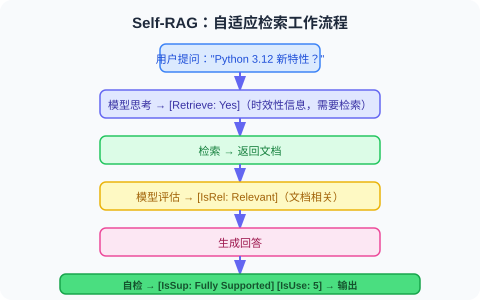
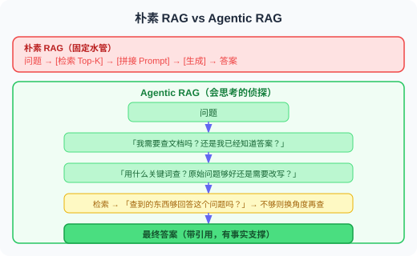

# 6.6 论文解读：RAG 前沿进展

> 📖 *"RAG 是过去两年发展最迅猛的技术方向之一。"*  
> *从朴素 RAG 到 Agentic RAG，本节深入解读推动这一演进的核心论文。*

---

## RAG 原始论文：一切的起点

**论文**：*Retrieval-Augmented Generation for Knowledge-Intensive NLP Tasks*  
**作者**：Lewis et al., Meta AI (Facebook AI Research)  
**发表**：2020 | [arXiv:2005.11401](https://arxiv.org/abs/2005.11401)

### 核心问题

预训练语言模型将知识隐式地编码在参数中，存在三个问题：
1. 无法轻松更新知识（需要重新训练）
2. 对罕见和长尾知识的覆盖不足
3. 无法追溯知识来源

### 方法原理

RAG 的原始方案是**端到端训练**检索模型和生成模型：

论文提出了两种变体：
- **RAG-Sequence**：每个文档独立生成完整回答，然后对所有回答加权
- **RAG-Token**：在生成每个 Token 时，都可以参考不同的文档

### 与今天实践的区别

虽然今天的 RAG 实现方式与原始论文有很大不同（我们通常不做端到端训练，而是将检索和生成解耦），但核心思想完全一致：**让模型在生成回答时能够参考外部知识。**

| 维度 | 原始 RAG (2020) | 现代 RAG (2024-2025) |
|------|-----------------|---------------------|
| 检索模型 | DPR（端到端训练） | 通用嵌入模型（如 OpenAI text-embedding-3） |
| 生成模型 | BART | GPT-4.1 / Claude 等 |
| 训练方式 | 端到端联合训练 | 解耦（检索和生成独立） |
| 向量数据库 | FAISS | ChromaDB / Pinecone / Weaviate |

---

## Self-RAG：自适应检索

**论文**：*Self-RAG: Learning to Retrieve, Generate, and Critique through Self-Reflection*  
**作者**：Asai et al.  
**发表**：2023 | [arXiv:2310.11511](https://arxiv.org/abs/2310.11511)

### 核心问题

传统 RAG 的一个根本缺陷是：**对每个问题都执行检索**。但实际上：
- 有些问题模型本身就能回答，检索反而引入噪音
- 有些问题需要多次检索，一次检索不够
- 检索到的文档质量参差不齐，需要筛选

### 方法原理

Self-RAG 训练模型生成四种**反思标记（Reflection Tokens）**：

> 1. **[Retrieve]**：是否需要检索？→ "Yes" / "No" / "Continue"
> 2. **[IsRel]**：检索到的文档是否相关？→ "Relevant" / "Irrelevant"
> 3. **[IsSup]**：生成的内容是否有文档支持？→ "Fully Supported" / "Partially Supported" / "No Support"
> 4. **[IsUse]**：生成的回答是否有用？→ 1-5 的评分

### 工作流程

### 对 Agent 开发的启示

Self-RAG 的自适应检索思想可以直接应用于 Agent 开发：
- **不是所有请求都需要 RAG**：Agent 应该先判断是否需要检索
- **检索质量验证**：检索到文档后要评估相关性，不盲目使用
- **生成质量自检**：回答生成后要验证是否有文档支持

---

## CRAG：检索结果的纠错机制

**论文**：*Corrective Retrieval Augmented Generation*  
**作者**：Yan et al.  
**发表**：2024 | [arXiv:2401.15884](https://arxiv.org/abs/2401.15884)

### 核心问题

传统 RAG 的另一个痛点是：**检索到低质量文档时怎么办？**
- 向量相似度高不一定意味着真正相关
- 检索到的文档可能过时、片面或有错误
- 一旦注入了低质量上下文，LLM 的回答质量也会下降

### 方法原理

CRAG 引入了一个**轻量级的检索评估器**，根据检索质量采取不同策略：

### 对 Agent 开发的启示

1. **检索不是终点**：检索到文档后还需要质量评估和过滤
2. **降级策略**：当内部知识库不够时，可以降级到 Web 搜索
3. **精细化处理**：大段文档中可能只有几句话是相关的，需要提取关键信息

---

## GraphRAG：知识图谱增强的 RAG

**论文**：*From Local to Global: A Graph RAG Approach to Query-Focused Summarization*  
**作者**：Edge et al., Microsoft Research  
**发表**：2024 | [arXiv:2404.16130](https://arxiv.org/abs/2404.16130)

### 核心问题

传统 RAG 检索的是独立的文本块（Chunk），适合回答**局部问题**（"X 是什么？"），但难以回答**全局问题**（"这个项目中所有团队之间的合作关系是什么？"、"整个文档集合的主要主题有哪些？"）。

### 方法原理

GraphRAG 在传统 RAG 的基础上增加了知识图谱层：

### 实验结果

在全局性问题（需要理解整个文档集合）上，GraphRAG 比朴素 RAG 的回答质量提升了 **30-70%**。

### 对 Agent 开发的启示

1. **结构化知识的价值**：纯文本检索在关系推理方面有天然局限，知识图谱可以弥补
2. **分层检索策略**：局部问题用向量检索，全局问题用图检索
3. **索引成本**：GraphRAG 的索引阶段需要大量 LLM 调用来提取实体和关系，成本较高

---

## Modular RAG：模块化 RAG 架构

**论文**：*Modular RAG: Transforming RAG Systems into LEGO-like Reconfigurable Frameworks*  
**作者**：Gao et al.  
**发表**：2024

### 核心贡献

Modular RAG 不是一个具体的方法，而是一个**系统化的分类框架**，将 RAG 系统的演进分为三个阶段：

### RAG 范式演进总结

| 范式 | 特点 | 代表工作 |
|------|------|---------|
| Naive RAG | 检索 → 生成，简单直接 | 原始 RAG (Lewis et al., 2020) |
| Advanced RAG | 检索前优化 + 检索后优化 | 本书第 6.4 节 |
| Modular RAG | 模块化、可插拔、自适应 | Self-RAG, CRAG |
| Agentic RAG | Agent 主导检索决策，支持多轮检索 | LangGraph + RAG 工作流 |

---

---

## LightRAG：轻量级图增强 RAG

**论文**：*LightRAG: Simple and Fast Retrieval-Augmented Generation*  
**作者**：Guo et al., 香港大学  
**发表**：2024 | [arXiv:2410.05779](https://arxiv.org/abs/2410.05779)

### 核心问题

GraphRAG（微软）虽然通过知识图谱提升了全局问题的回答能力，但存在严重的**成本和效率问题**：
- 索引阶段需要大量 LLM 调用，Token 消耗巨大
- 社区检测和摘要生成耗时长
- 新增文档需要重新构建整个图

### 方法原理

LightRAG 在保持图增强优势的同时大幅降低成本：

> **GraphRAG 的代价**：索引 1000 篇文档 → 可能需要 $50-100 的 LLM 调用费；新增 10 篇文档 → 需要重建整个社区结构
>
> **LightRAG 的改进**：简化实体/关系提取（减少 LLM 调用次数）+ 双层检索（低层精确检索 + 高层抽象检索）+ 增量更新（新文档只需提取新实体并合并）
>
> **成本对比**：GraphRAG $100+ / 1M Token 索引 vs LightRAG $5-10 / 1M Token 索引（降低 10-20 倍）

### 关键发现

1. **图结构 + 双层检索**：在多个数据集上同时优于 GraphRAG 和朴素 RAG
2. **增量更新能力**：可以在不重建图的情况下添加新文档，适合动态知识库
3. **成本大幅降低**：索引和检索成本相比 GraphRAG 降低 10-20 倍

### 对 Agent 开发的启示

对于需要 RAG 能力的 Agent，LightRAG 提供了比 GraphRAG 更实用的选择——在保持图增强优势的同时，大幅降低了部署和运维成本。特别适合知识库频繁更新的场景。

---

## RAG 与推理的融合：Agentic RAG

**综述**：*Agentic RAG: Boosting the Generative AI Capabilities with Autonomous RAG*  
**趋势综述**：多篇论文（2024-2025）

### 核心概念

Agentic RAG 将 RAG 从“被动管道”升级为“Agent 主导的智能检索”：

### 关键技术组件

| 组件 | 学术来源 | 功能 |
|------|---------|------|
| 自适应检索 | Self-RAG (2023) | 判断是否需要检索 |
| 检索纠错 | CRAG (2024) | 评估检索质量并降级 |
| 查询改写 | HyDE, Query Rewriting | 优化检索查询 |
| 多源检索 | Modular RAG (2024) | 动态选择数据源 |
| 迭代检索 | IRCoT (2023) | 多轮检索逐步深入 |
| 推理整合 | LangGraph Workflows | 将检索嵌入推理循环 |

### 对 Agent 开发的启示

Agentic RAG 是 2025 年 Agent 开发中最实用的架构模式之一。LangGraph 是实现 Agentic RAG 的理想框架（详见第 12 章）——可以将检索决策、查询改写、质量评估等步骤编排为状态图中的节点。

---

## 论文对比与发展脉络

| 论文 | 年份 | 解决的核心问题 | 关键创新 |
|------|------|---------------|---------|
| RAG 原始论文 | 2020 | LLM 知识有限 | 检索+生成的融合 |
| Self-RAG | 2023 | 何时需要检索 | 反思标记自适应 |
| CRAG | 2024 | 检索质量不稳定 | 检索评估器 + 降级策略 |
| GraphRAG | 2024 | 全局性问题难以回答 | 知识图谱 + 社区摘要 |
| Modular RAG | 2024 | RAG 系统缺乏灵活性 | 模块化架构框架 |
| **LightRAG** | **2024** | **GraphRAG 成本过高** | **轻量级图索引 + 增量更新** |
| **Agentic RAG** | **2025** | **RAG 流程缺乏智能** | **Agent 主导检索决策** |

**发展脉络**：

> 💡 **前沿趋势（2025-2026）**：RAG 领域的三大趋势：① **Agentic RAG 成为主流**：不再是简单的"检索→生成"管道，而是 Agent 动态决策检索策略、查询改写、多源切换、结果验证的完整推理循环；② **图增强 RAG 走向实用**：LightRAG 等轻量方案解决了 GraphRAG 的成本问题，让图增强 RAG 可以在生产环境大规模部署；③ **RAG + 推理模型**：o3/R1 等推理模型与 RAG 的结合正在被探索——推理模型可以更智能地分解检索需求、评估检索质量。

---

*返回：[第6章 检索增强生成（RAG）](./README.md)*

---

## 📰 最新论文速递

> 🗓️ 本节由每日自动更新任务维护，最近更新：**2026 年 6 月 1 日**

### [MASS-RAG：多智能体合成检索增强生成](https://arxiv.org/abs/2604.18509)

**发表**：2026 年 4 月 21 日 | [arXiv:2604.18509](https://arxiv.org/abs/2604.18509)

**核心贡献**：提出 MASS-RAG 框架，将噪声、不完整或异构上下文下的 RAG 流程分解为三类角色专属智能体（证据摘要、证据抽取、推理）协同工作，最终通过专用合成阶段整合多视角证据后生成答案。在四个基准测试上持续优于强基线，尤其在相关证据分散于多个检索上下文的场景中优势显著。

**与本章关系**：是本章 6.5 节「Agentic RAG」思想的具体论文实现——将单一 RAG 管道演进为多智能体协作推理系统，解决了传统 RAG 无法有效整合噪声异构上下文的核心痛点。

---

### [HaS：基于同源感知的 RAG 投机检索加速框架](https://arxiv.org/abs/2604.20452)

**发表**：2026 年 4 月 22 日 | ICDE 2026 | [arXiv:2604.20452](https://arxiv.org/abs/2604.20452)

**核心贡献**：提出 HaS（Homology-Aware Speculative Retrieval），针对 RAG 检索随知识库规模增大而显著变慢的问题，设计低延迟「投机检索」机制：先在受限范围内快速生成候选文档，再通过「同源查询再识别」验证这些候选是否含所需知识（一旦识别到相同源查询即命中，跳过慢速全库检索）。在两个数据集上将检索延迟分别降低 23.74% 和 36.99%，准确率损失仅 1-2%，作为即插即用方案还可显著加速复杂 Agentic RAG 管道的多跳查询。

**与本章关系**：对应本章「RAG 的效率优化」方向，与 LightRAG 降低图构建成本的思路互补——HaS 专注检索阶段的延迟加速，是 Agentic RAG 生产化部署的重要工程进展。

---

### [SLIDERS：用 SQL 驱动的关系数据库实现超长文档集合的可扩展问答](https://arxiv.org/abs/2604.22294)

**发表**：2026 年 4 月 24 日 | [arXiv:2604.22294](https://arxiv.org/abs/2604.22294)

**核心贡献**：针对真实场景中文档集规模超过任意固定上下文窗口的问题，SLIDERS 将文档内容提取到关系数据库，通过 SQL 查询实现持久化结构化推理，彻底绕开上下文聚合瓶颈；并引入数据调和阶段，借助来源信息、提取依据和元数据自动检测并修复重复、不一致、不完整的记录。在三个已有长上下文基准上超越所有基线（平均高出 GPT-4.1 6.6 分），在 3.9M 和 36M token 规模的两个新基准上分别领先次优基线约 19 和 32 分。

**与本章关系**：与本章「Agentic RAG」和「RAG + 结构化检索」方向高度对应，代表了以结构化状态（关系数据库+SQL）替代扁平向量检索的全新思路，是超长上下文 RAG 的重要突破。

---

*返回：[第6章 检索增强生成（RAG）](./README.md)*

### [LatentRAG：隐空间推理与检索协同的高效 Agentic RAG](https://arxiv.org/abs/2605.06285)

**发表**：2026 年 5 月 7 日 | [arXiv:2605.06285](https://arxiv.org/abs/2605.06285)

**核心贡献**：单步 RAG 难以应对复杂多跳问题，Agentic RAG 虽引入多步检索但开销巨大。本文提出 LatentRAG，让 LLM 在隐空间（latent space）中同步生成中间推理思路与子查询，无需显式切换检索/生成模式，实现推理与检索的深度融合。在多跳 QA 基准上，LatentRAG 在准确率与效率之间取得最优平衡，相比标准 Agentic RAG 减少约 40% 的检索调用次数。

**与本章关系**：直接对应本章 Agentic RAG 多步检索架构，是对"检索-推理交替循环"范式的根本性改进，适合作为第 6.5 节 Agentic RAG 的前沿延伸阅读。

---

### [TGS-RAG：文本-图双向验证与补全的 RAG 框架](https://arxiv.org/abs/2605.05643)

**发表**：2026 年 5 月 7 日 | [arXiv:2605.05643](https://arxiv.org/abs/2605.05643)

**核心贡献**：传统混合 RAG 中，文本检索与图检索各自孤立、相互矛盾，形成"信息孤岛"。TGS-RAG 提出双向协同机制：Graph→Text 通道利用图节点全局投票重新排序文本证据以过滤语义噪声；Text→Graph 通道用记忆基孤立实体桥接算法，将文本信息恢复图中被剪枝的推理路径，实现两路互补而非简单拼接。在多跳推理基准上，检索精度与计算效率均超越现有纯文本或纯图方法。

**与本章关系**：直接扩展了本章 GraphRAG 小节，是文本 RAG + 图 RAG 深度融合的最新实践，有效解决了 GraphRAG 常见的剪枝路径丢失问题。

---

### [Ψ-RAG：层次抽象树索引与多粒度检索 Agent 框架](https://arxiv.org/abs/2605.00529)

**发表**：2026 年 5 月 1 日 | ICML 2026 | [arXiv:2605.00529](https://arxiv.org/abs/2605.00529)

**核心贡献**：现有树状 RAG 方法（如 RAPTOR）在大规模跨文档多步推理场景下存在分布适应性差、结构孤立、抽象过粗三大缺陷。Ψ-RAG 提出层次抽象树索引（通过"合并-折叠"迭代过程自适应保留文档库真实分布）与多粒度代理检索（主动多轮追问 + 混合稀疏-密集检索）两项核心创新，在多项基准上 F1 均值比 RAPTOR 提升 25.9%，比 HippoRAG 2 提升 7.4%，且建索引速度比图谱方法快数十倍。

**与本章关系**：对应本章 6.4 节"Graph RAG 与层次化检索"，展示了树结构索引与 Agent 化检索的深度融合，代表 Agentic RAG 的最新 ICML 2026 顶会成果。

---

### [EPIC：面向端侧个人 Agent 的偏好对齐记忆构建](https://arxiv.org/abs/2605.18271)

**发表**：2026 年 5 月 18 日 | ICML 2026 | [arXiv:2605.18271](https://arxiv.org/abs/2605.18271)

**核心贡献**：本文提出 EPIC（Efficient Preference-aligned Index Construction），针对端侧个人 AI Agent 在隐私、响应速度和存储预算下的 RAG 记忆构建问题，将用户偏好作为紧凑且稳定的个人上下文表示贯穿索引与检索流程。EPIC 选择性保留偏好相关信息，并让检索结果向偏好对齐上下文倾斜；在四类任务上将索引内存降低 2,404 倍、偏好跟随准确率提升 20.17 个百分点，端侧实验中保持低于 1MB 内存占用和 29.35ms/query 延迟。

**与本章关系**：直接对应本章「个性化 RAG」「记忆型 RAG」与「端侧部署」知识点，说明 RAG 索引不应只追求信息量，而应围绕用户偏好构建可持续的个人上下文层。

---

### [Ex-GraphRAG：基于加法分解 GNN 的可解释图增强 LLM 检索](https://arxiv.org/abs/2605.21994)

**发表**：2026 年 5 月 21 日 | [arXiv:2605.21994](https://arxiv.org/abs/2605.21994)

**核心贡献**：GraphRAG 中传统 GNN 编码器将多跳邻居的贡献相互纠缠，无法精确归因。Ex-GraphRAG 采用 M-GNAN（图神经加法网络），将每个节点的贡献以可加形式独立计算，直接从前向传播中提取每个检索实体对最终答案的精确重要性得分，无需后验近似。在知识图谱问答基准上，Ex-GraphRAG 在保持答案质量的同时，每次推理都能提供精准的证据归因，为 GraphRAG 的可解释性与审计提供了新方案。

**与本章关系**：对应本章「GraphRAG」与「检索可解释性」知识点，揭示了在 Agentic GraphRAG 系统中如何通过架构设计实现内禀可解释性，而非依赖事后归因方法。

---

### [DynaTree：面向时效性新闻检索的动态 Agent 检索树](https://arxiv.org/abs/2605.31377)

**发表**：2026 年 5 月 29 日 | [arXiv:2605.31377](https://arxiv.org/abs/2605.31377)

**核心贡献**：传统 RAG 在时效性强的新闻检索场景中面临两大矛盾：静态索引无法追踪快速变化的新闻事件，而频繁全量重索引代价高昂。DynaTree 提出两阶段动态检索树框架：离线阶段构建可重用的层次检索树（将文档聚类组织为多粒度节点），在线阶段仅执行轻量级子树选择和剪枝，无需重建整棵树即可响应最新内容。这种"稳定树骨骼 + 动态叶节点"设计，在检索精度与更新效率上均优于传统 BM25、DPR 及图 RAG 基线。

**与本章关系**：直接对应本章 Agentic RAG 的动态检索与实时知识更新知识点，是层次树 RAG 方法在时效性场景下的最新延伸，与 RAPTOR 树索引方法形成重要对比——DynaTree 专注于在线增量维护而非批量重建。

---
