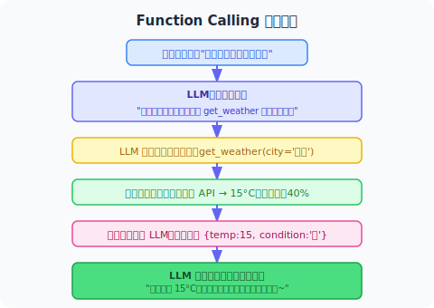

# 3.2 Function Calling 机制

> 🎯 **本节目标**：理解 Function Calling 的完整流程，能写出最小可运行的示例。

---

## 先看懂"发生了什么"

在深入代码之前，让我们用一个日常对话来模拟整个过程：



**注意这个循环中的角色分工**：

| 角色 | 做什么 | 不做什么 |
|------|--------|---------|
| **LLM** | 决定是否需要工具、选择哪个工具、生成参数 | 不实际调用任何 API |
| **你的代码** | 执行真正的函数/API 调用 | 不做决策 |
| **工具定义（JSON Schema）** | 告诉 LLM 有哪些工具可用、每个工具怎么用 | 不包含实现逻辑 |

## 完整流程：5 步


> 🎬 **交互式动画**：观看用户、LLM 和工具引擎之间的消息传递全过程——包含多轮工具调用的完整通信协议。
>
> <a href="../animations/function_calling.html" target="_blank" style="display:inline-block;padding:8px 16px;background:#9C27B0;color:white;border-radius:6px;text-decoration:none;font-weight:bold;">▶ 打开 Function Calling 交互动画</a>


这个流程可能会循环多次。比如用户说"如果下雨就发邮件提醒"——先查天气，再决定是否发邮件。

---

## 最小可运行代码

下面是一个**最精简但完整**的 Function Calling 示例。读懂它，你就懂了整个机制的核心：

```python
import json
from openai import OpenAI

client = OpenAI()

# ① 定义工具函数（真实的执行逻辑）
def get_weather(city: str) -> dict:
    """查询城市天气"""
    # 实际项目中这里调用真实 API
    mock_data = {"北京": "15°C, 晴", "上海": "18°C, 多云", "广州": "25°C, 小雨"}
    return {"city": city, "weather": mock_data.get(city, "未知")}

# ② 定义工具 Schema（告诉 LLM 怎么用这个工具）
# ⚠️ 这是最关键的部分！description 写得好不好，
#    直接决定了 LLM 能不能正确使用工具
tools = [{
    "type": "function",
    "function": {
        "name": "get_weather",
        "description": "获取指定城市的当前天气",
        "parameters": {
            "type": "object",
            "properties": {
                "city": {
                    "type": "string",
                    "description": "城市名，如 北京/上海/广州"
                }
            },
            "required": ["city"]
        }
    }
}]

# ③ Agent 主循环
def run_agent(user_message):
    messages = [{"role": "user", "content": user_message}]

    while True:
        response = client.chat.completions.create(
            model="gpt-4.1",
            messages=messages,
            tools=tools,
            tool_choice="auto"  # 让模型自己决定是否用工具
        )

        msg = response.choices[0].message
        messages.append(msg)  # 把模型回复加入历史

        # 分支A：模型直接回答（finish_reason = "stop"）
        if response.choices[0].finish_reason == "stop":
            print(f"\n🤖 {msg.content}")
            return msg.content

        # 分支B：模型要求调用工具（finish_reason = "tool_calls"）
        for tool_call in (msg.tool_calls or []):
            func_name = tool_call.function.name
            func_args = json.loads(tool_call.function.arguments)

            print(f"\n🔧 调用工具: {func_name}({func_args})")

            # 执行真正的工具函数
            result = get_weather(**func_args)
            print(f"📋 结果: {result}")

            # 将结果反馈给 LLM
            messages.append({
                "role": "tool",
                "tool_call_id": tool_call.id,
                "content": json.dumps(result, ensure_ascii=False)
            })
        # 继续循环，让 LLM 处理工具结果

# 测试
run_agent("北京和上海的天气怎么样？")
```

### 逐段解读

**① 工具函数**：普通的 Python 函数。它可以做任何事——调 API、查数据库、读文件、执行计算。对 LLM 来说，它只是一个"黑盒"：输入参数 → 输出字符串结果。

**② 工具 Schema**：这是整段代码中**最重要的部分**。LLM 看不到你的函数代码，它只能通过这个 JSON 定义来了解工具的能力边界。其中 `description` 字段是核心——它是 LLM 决策的唯一依据。

**③ Agent 循环**：一个 `while True` 循环，每次把完整的对话历史发给 LLM：
- 如果 `finish_reason == "stop"` → 模型已给出最终答案，结束
- 如果 `finish_reason == "tool_calls"` → 执行工具后把结果追加入历史，继续循环

> 💡 **为什么是循环？** 因为一次工具调用可能不够。"查天气然后发邮件"这样的任务就需要两轮：第一轮查天气，第二轮根据天气结果发邮件。

---

## 关键设计决策

### tool_choice：控制模型的工具使用策略

```python
tool_choice="auto"     # 默认 — 让模型自己判断（推荐大多数场景）
tool_choice="none"     # 禁止 — 强制不用工具，只输出文本
tool_choice="required" # 强制 — 必须调用某个工具
tool_choice={"type": "function", "function": {"name": "get_weather"}}  # 指定特定工具
```

| 场景 | 推荐设置 |
|------|---------|
| 通用对话型 Agent | `"auto"` |
| 纯聊天 / 角色扮演 | `"none"` |
| 明确知道需要数据的场景 | `"required"` |
| 测试某个特定工具 | 指定工具名 |

### strict 模式：生产环境必开

OpenAI 在 2024 年推出了 Structured Outputs 功能：

```python
# 开启严格模式后，模型输出的参数保证 100% 符合 JSON Schema
tools = [{
    "type": "function",
    "function": {
        "name": "get_weather",
        "strict": True,                        # ← 关键开关
        "parameters": {
            "type": "object",
            "properties": {...},
            "additionalProperties": False,      # ← 必须配合
            "required": ["city"]
        }
    }
}]
```

开启条件：`strict: true` + `additionalProperties: False` + 所有参数声明类型。**生产环境强烈建议开启**，可以彻底消除因参数格式错误导致的运行时崩溃。

### 并行工具调用：独立任务同时做

当多个工具之间没有依赖关系时，可以让模型一次返回多个调用指令：

> 用户："同时查一下北京、上海、广州的天气" → 模型一次性返回 3 个 tool_calls → 你的代码并行执行 3 个查询（用 ThreadPoolExecutor 或 asyncio）→ 总等待时间 ≈ 最慢的那一个（而不是三个相加）

适用条件：**工具之间互相独立**。如果有依赖（先查天气→再决定是否发邮件），应设 `parallel_tool_calls=False`。

---

## 错误处理：让 LLM 自己解决问题

这是初学者最容易忽略的设计要点：

```python
# ❌ 错误做法：异常冒泡导致程序崩溃
def bad_tool(query):
    results = api.search(query)  # 如果网络超时？
    return results               # 💥 整个 Agent 挂了

# ✅ 正确做法：错误信息返回给 LLM，让它自行决策
def good_tool(query):
    try:
        results = api.search(query)
        return json.dumps(results)
    except TimeoutError:
        return '{"error": "搜索超时，请换更短的关键词"}'
    except Exception as e:
        return f'{{"error": "{str(e)}"}}'
```

**为什么这样设计？** 因为错误信息会出现在 LLM 的上下文中。一个聪明的 LLM 看到"搜索超时"后，可能会尝试缩短关键词重试；看到"API Key 无效"后会告知用户检查配置。这比直接抛异常优雅得多。

---

## Function Calling 与 MCP 的关系

学完基础机制后，你会听到 **MCP（Model Context Protocol）** 这个概念——Anthropic 于 2024 年底推出的工具调用标准协议。

| 对比项 | Function Calling | MCP |
|-------|-----------------|-----|
| 本质 | 单平台的 API 能力 | 跨平台的标准协议 |
| 工具绑定 | 写死在代码里 | 以独立服务运行，任何客户端可用 |
| 适合场景 | 快速原型、单模型项目 | 多模型共享、团队协作、生态复用 |

可以把它们理解为：**Function Calling 是"自己做饭"，MCP 是"点外卖"**。前者灵活自由，后者标准化可复用。掌握了 Function Calling 后，理解 MCP 会非常自然——本质上就是把工具的定义和执行从代码中抽离出来变成独立服务。

详细内容见 [第16章 Agent 通信协议](../chapter_protocol/README.md)。

---

## 📝 动手练习

在继续阅读之前，试着回答以下问题（不要急着写代码，先用自然语言思考）：

**练习 1**：如果要给 Agent 添加一个"当前时间"工具，它的 Schema 应该怎么写？description 中应该包含什么信息？

<details>
<summary>参考答案</summary>

```python
{
    "type": "function",
    "function": {
        "name": "get_current_time",
        "description": "获取当前的日期和时间。适合用于需要知道'现在几点''今天几号'的场景。",
        "parameters": {
            "type": "object",
            "properties": {},
            "required": []  # 无参数
        }
    }
}
```
关键点：description 中说明了"什么时候该用"，即使无参数也要显式声明空对象。

</details>

**练习 2**：下面的工具描述有什么问题？LLM 可能犯什么错？

```json
{"description": "处理邮件相关的事情"}
```

<details>
<summary>参考答案</summary>

问题太多了：
- 太模糊 —— "处理邮件"可能指发送、读取、删除、归档……LLM 不知道具体做什么
- 没有说明何时使用 vs 何时不使用
- 没有参数描述

更好的版本：
```json
{"description": "向指定邮箱发送邮件。仅在用户明确要求发送时调用。不适用于查询邮件或管理邮箱。"}
```

</details>

---

## 小结

| 要点 | 一句话记住 |
|------|-----------|
| 核心思想 | LLM 当大脑做决策，代码当手脚去执行 |
| 5 步流程 | 定义 → 发送 → 决策 → 执行 → 回答 |
| 最重要的事 | **工具的 description 写得好不好，决定了 Agent 的智商** |
| 安全兜底 | 错误信息返回给 LLM 而非抛异常 |
| 生产必开 | `strict: true` + `additionalProperties: false` |
| 进阶方向 | MCP 协议实现跨平台工具复用 |

---

*下一节：[3.3 自定义工具的设计与实现](./03_custom_tools.md)*
