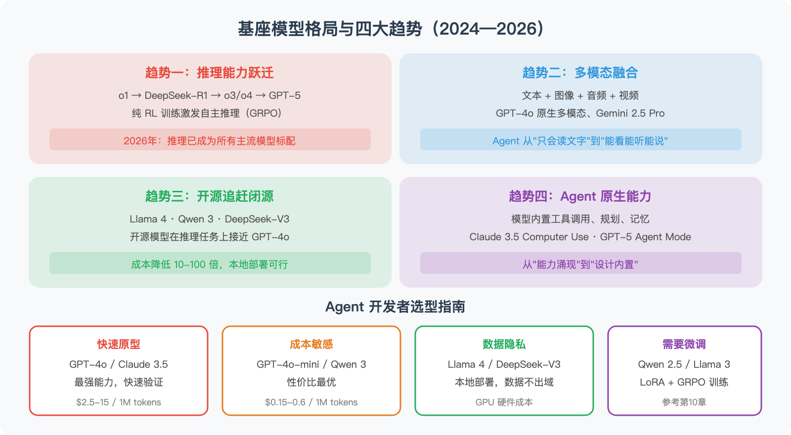
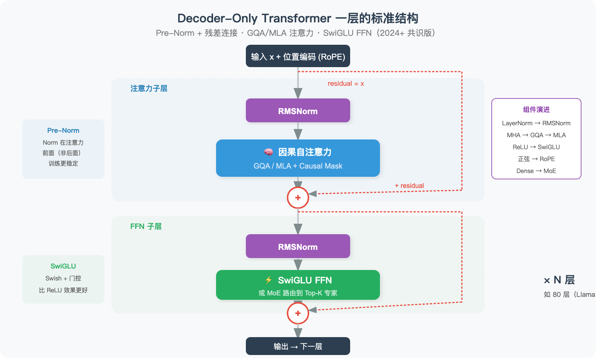
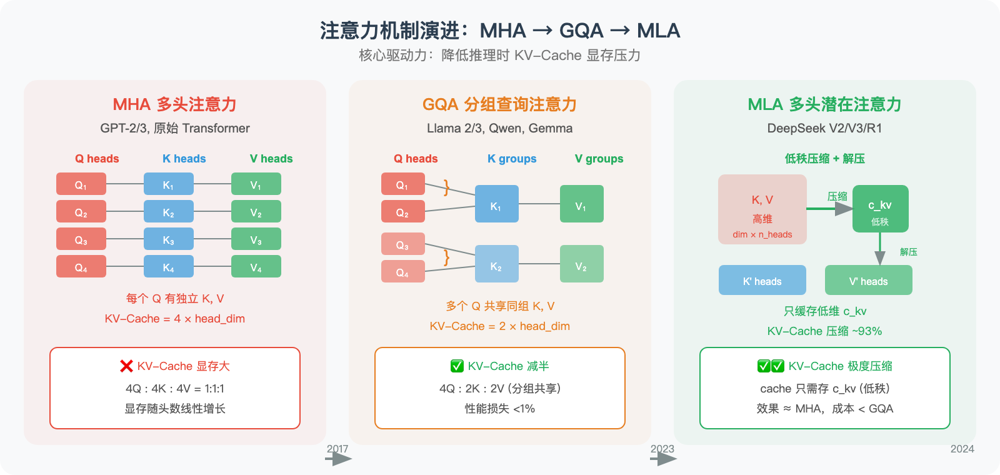

# 2026 年大语言模型全景：从架构演进到选型指南

> 本文整合自《从零开始学 Agent》第 3.6 节（基座模型前沿进展与选型指南）和第 3.7 节（基座模型架构详解），适合已有 LLM 基础的读者，帮助你在模型选型和架构理解上建立"底层判断力"。

全书github地址： https://github.com/Haozhe-Xing/agent_learning
在线阅读地址：https://haozhe-xing.github.io/agent_learning/


## 一、2024—2026：基座模型的八大趋势

> "模型在快速迭代，今天的 SOTA 可能是明天的基线——但理解演进趋势，能让你在变化中做出更好的选择。"

作为 Agent 开发者，你不需要训练自己的基座模型，但**模型的选择直接决定了 Agent 的天花板**。



### 趋势一：推理能力的跃迁

2024 年 9 月，OpenAI 的 o1 首次证明了"用更多推理时间换取更好结果"的可行性。2025 年 1 月，DeepSeek-R1 的开源发布引爆了推理模型的民主化——它首次展示了如何通过纯 RL 训练（GRPO）让模型自发涌现 Chain-of-Thought 能力。

到了 2026 年初，推理已成为所有主流模型的标配：

| 模型 | 发布时间 | 推理模式 | 关键突破 |
|------|---------|---------|---------|
| **GPT-5** | 2025.08 | 内置思考能力 | 数学/科学/金融/法律领域专家级表现 |
| **GPT-5.3-Codex** | 2026.02 | Agent 编程推理 | 首个"自我开发"的编程模型，速度提升 25% |
| **Claude Opus 4.6** | 2026.02 | 自适应思考 | 1M 上下文 + Agent Teams + 自适应推理深度 |
| **Gemini 2.5 Pro** | 2025.03 | 原生多模态推理 | 2M 上下文 + 动态推理深度 |
| **DeepSeek-V3.2** | 2025.12 | 融合思考推理 | 开源 Agent 能力最强，稀疏注意力降本增效 |
| **Kimi K2** | 2025.07 | Agent 推理 | 1T 总参/32B 激活，MuonClip 优化器，开源 Agent SOTA |
| **Kimi K2.5** | 2026.03 | Agent 群组推理 | Kimi Linear + Attention Residuals，多 Agent 编排 |
| **Qwen3.5-Plus** | 2026.02 | 混合推理 | 397B 参数仅激活 17B（~4.3%），Gated DeltaNet 混合注意力 |
| **DeepSeek V4** | 2026.03 | 深度推理 | 671B MoE，Engram 内存架构，1M+ 上下文 |
| **MiniMax M2.5** | 2026.03 | 混合推理 | 229B MoE，Lightning Attention，Agent 实战 SOTA |

> 💡 **对 Agent 的影响**：推理模型让 Agent 在"规划"和"复杂决策"环节获得质的飞跃。GPT-5 和 Claude 4.6 的出现让推理能力内置在通用模型中，"快慢双系统"的切换变得更加无缝。

### 趋势二：MoE 与效率革命

大模型越来越大，但**推理成本却在降低**——背后是**混合专家模型（Mixture of Experts, MoE）**的全面胜利。

MoE 的核心思想：模型总参数量可以很大（数千亿），但每次推理只激活其中一小部分——就像一家大公司有几百名员工，但每个项目只抽调最合适的十几个人。

| 模型 | 总参数 | 激活参数 | 架构特点 |
|------|--------|---------|---------|
| **Kimi K2** | 1T | 32B | MuonClip 优化器，万亿参数开源 MoE |
| **DeepSeek V4** | 671B | ~37B | Engram 内存 + mHC 超连接 + DSA 2.0 |
| **DeepSeek-V3.2** | 685B | ~37B | DSA 稀疏注意力，Agent 能力增强 |
| **Qwen3.5-Plus** | 397B | 17B | Gated DeltaNet 混合注意力，原生多模态 |
| **Llama 4 Maverick** | 400B | 17B | 128 专家，原生多模态 MoE |
| **Llama 4 Scout** | 109B | 17B | 16 专家，10M token 上下文窗口 |
| **MiniMax M2.5** | 229B | ~? | Lightning Attention，200K~1M 上下文 |
| **Kimi K2.5** | 48B | 3B | Kimi Linear 混合注意力 + Attention Residuals |

> 💡 MoE 让"大模型能力 + 小模型成本"成为现实。Kimi K2 以万亿参数开源，DeepSeek V4 的 Engram 内存架构将静态知识卸载到 CPU 释放 GPU，Qwen3.5-Plus 推理延迟大幅降低。

### 趋势三：开源生态的全面崛起

2025—2026 年，开源模型已不仅是"追赶"，而是在多个领域**分庭抗礼**甚至**局部超越**：

**第一梯队（与 GPT-5 竞争）**：
- **Kimi K2**（Moonshot AI，2025.07）：1T 总参/32B 激活 MoE，MuonClip 优化器训练效率翻倍
- **Qwen3.5-Plus**（阿里，2026.02）：397B MoE 原生多模态，Agent 能力全面领先
- **DeepSeek V4**（DeepSeek，2026.03）：671B MoE，编程能力超越 Claude Opus

**第二梯队（轻量高效）**：
- **Kimi K2.5**（48B 总参/3B 激活）：极致效率路线，"小而强"
- **Phi-4**（微软，14B）：小尺寸模型的天花板，推理能力超越许多 70B 模型
- **Qwen 3 全系列**（0.6B~235B）：从手机到服务器全覆盖

**开源 vs 闭源的选择矩阵**：

| 维度 | 闭源模型 | 开源模型 |
|------|---------|---------|
| **最强能力** | 仍有优势（GPT-5, Claude Opus 4.6） | 快速追赶，Qwen3.5/DeepSeek 已局部超越 |
| **成本** | API 按量付费 | 自部署后边际成本极低 |
| **隐私** | 数据发送给第三方 | 数据完全私有 |
| **定制化** | 有限（Fine-tuning API） | 完全可控（LoRA/全参微调） |
| **Agent 能力** | 工具调用成熟稳定 | DeepSeek-V3.2、Qwen3.5 已原生支持 |
| **适合场景** | 快速原型、通用任务 | 生产部署、数据敏感场景 |

### 趋势四：Agent-Native 模型的兴起

2025—2026 年最显著的新趋势是**模型开始专门为 Agent 场景优化**：

- **Kimi K2**：万亿参数开源 MoE，Agent 能力在多个基准上达到开源 SOTA
- **Kimi K2.5**：引入"Agent 群组"模式，中央编排器管理多个专业子 Agent 并行执行
- **DeepSeek V4**：Engram 内存架构，1M+ 上下文下 Agent 能力增强
- **GPT-5.3-Codex**：专为编程 Agent 优化，可连续编程 7 小时以上
- **Claude Opus 4.6**：引入 Agent Teams 概念，多 Agent 协同工作

这意味着 Agent 开发者不再需要"削足适履"——模型本身就是为 Agent 设计的。

### 趋势五：多模态原生化

2026 年的基座模型几乎都是**原生多模态**的，从架构层面就支持文本、图像、音频、视频的混合输入输出：

| 模型 | 输入模态 | 输出模态 | 特色能力 |
|------|---------|---------|---------|
| **GPT-5** | 文本+图像+音频 | 文本+图像+音频 | 实时语音对话，原生图像生成 |
| **Claude Opus 4.6** | 文本+图像+PDF | 文本 | 1M 上下文，Agent Teams |
| **Gemini 2.5 Pro** | 文本+图像+视频+音频 | 文本+图像 | 原生视频理解，2M 上下文 |
| **Qwen3.5-Plus** | 文本+图像+视频 | 文本 | 原生多模态 MoE + Gated DeltaNet |
| **MiniMax M2.5** | 文本+图像+音频 | 文本+语音 | Lightning Attention，200K~1M 上下文 |
| **Phi-4-multimodal** | 文本+图像+语音 | 文本 | 仅 5.6B 参数，统一多模态架构 |

### 趋势六：小模型崛起（SLM）

**小语言模型（SLM）**的进步速度令人瞩目——2025 年的 14B 参数模型已全面超越 2023 年的 GPT-4：

| 模型 | MMLU | HumanEval | GSM8K |
|------|------|-----------|-------|
| Phi-4-reasoning (14B) | 86.2 | 85.1 | 95.8 |
| Phi-4 (14B) | 84.8 | 82.6 | 94.5 |
| Llama 4 Scout (17B act) | 83.5 | 80.1 | 92.1 |
| Qwen 3 (8B) | 81.2 | 79.8 | 91.3 |
| **GPT-4 (2023 参照)** | 86.4 | 67.0 | 92.0 |

> 💡 SLM 让 Agent 可以在**手机、笔记本、边缘设备**上本地运行，实现零延迟、完全隐私的交互。Phi-4-multimodal 更是以 5.6B 参数同时处理语音、视觉和文本。


## 二、关键模型发布时间线（2024—2026）

```
2024.09  OpenAI o1 ──── 推理模型元年
2024.12  Phi-4 (14B) ── 微软发布最强小模型
2025.01  DeepSeek-R1 ── 开源推理模型引爆全球
2025.02  Phi-4-multimodal / Phi-4-mini ── 端侧多模态
2025.03  Gemini 2.5 Pro ── 2M 上下文 + 推理，屠榜
2025.04  Llama 4 Scout/Maverick ── Meta 首个 MoE 开源多模态
2025.04  o3 / o4-mini ── OpenAI 多模态推理
2025.04  Qwen 3 ── 阿里混合推理全系列（0.6B~235B）
2025.05  Claude 4 (Opus/Sonnet) ── 连续编程 7 小时，Agent 新标杆
2025.07  Kimi K2 ── 万亿参数开源 MoE，MuonClip 优化器
2025.08  GPT-5 ── OpenAI "最智能"模型，内置推理
2025.12  DeepSeek-V3.2 正式版 ── Agent 能力增强，融合推理
2026.02  Claude Opus 4.6 / Sonnet 4.6 ── 1M 上下文正式版
2026.02  GPT-5.3-Codex ── "首个自我开发"的编程模型
2026.02  Qwen3.5-Plus (397B-A17B) ── Gated DeltaNet 混合注意力
2026.03  Kimi K2.5 (48B-A3B) ── Attention Residuals + Agent 群组
2026.03  DeepSeek V4 (671B MoE) ── Engram 内存架构，1M+ 上下文
2026.03  MiniMax M2.5 (229B MoE) ── Lightning Attention，Agent 实战 SOTA
```


## 三、Agent 开发者的模型选型指南

| Agent 场景 | 推荐模型 | 理由 |
|-----------|---------|------|
| 编程助手 | Claude Opus 4.6 / GPT-5.3-Codex | 长时间编程稳定，Agent 编程能力最强 |
| 数据分析 | GPT-5 / Gemini 2.5 Pro | 多模态理解 + 函数调用稳定 |
| 客服对话 | GPT-4o-mini / Qwen 3-8B | 成本敏感，响应速度要求高 |
| 深度研究 | Claude Opus 4.6 / GPT-5 | 1M+ 上下文 + 深度推理 |
| 文档处理 | Gemini 2.5 Pro / Claude Opus 4.6 | 2M/1M 超长文档输入，PDF 布局理解 |
| 本地隐私 | Qwen3.5-Plus / DeepSeek-V3.2（自部署） | 数据不出本地，Agent 能力完整 |
| 端侧部署 | Phi-4-mini (3.8B) / Qwen 3 (4B) | 手机/笔记本可运行 |
| 多模态 Agent | GPT-5 / Qwen3.5-Plus | 原生多模态，工具调用 + 视觉理解 |

**快速决策树**：

```
有隐私要求？
├── 是 → 需要复杂推理？
│        ├── 是 → DeepSeek-V3.2（自部署）
│        └── 否 → 延迟要求 < 500ms？
│                 ├── 是 → Phi-4 / Qwen 3-8B（本地部署）
│                 └── 否 → Qwen3.5-Plus / Llama 4 Maverick（自部署）
└── 否 → 预算 > $500/月？
         ├── 是 → Claude Opus 4.6 / GPT-5（顶级体验）
         └── 否 → DeepSeek-V3.2 API / Qwen3.5-Plus API（性价比之选）
```


## 四、基座模型架构详解

> "了解模型的工作原理让你做出更好的判断，而了解模型的架构演进，能让你理解整个行业在朝哪里走。"

### 4.1 现代 LLM 的标准"骨架"：Decoder-Only Transformer

2023 年以来，几乎所有主流 LLM 都采用了 **Decoder-Only** 架构——它只保留解码器部分，通过**因果注意力掩码（Causal Mask）**保证每个 Token 只能"看到"它左边的内容。

| 架构 | 代表模型 | 适合任务 | 为何 LLM 不用 |
|------|---------|---------|-------------|
| Encoder-Only | BERT | 理解类（分类、NER） | 不能自回归生成 |
| Encoder-Decoder | T5, BART | 翻译、摘要 | 复杂度高，不利于超大规模扩展 |
| **Decoder-Only** | **GPT, Llama, DeepSeek** | **所有生成任务** | ✅ 架构简洁，易扩展，训练高效 |

一个标准的 Decoder-Only Transformer 层的结构如下：



每一层的计算流程：

```python
class TransformerDecoderLayer:
    def forward(self, x):
        # 1. Pre-Norm + 注意力
        residual = x
        x = self.norm1(x)           # RMSNorm (Pre-Normalization)
        x = self.attention(x)       # 因果自注意力 (GQA/MLA)
        x = residual + x            # 残差连接
        
        # 2. Pre-Norm + FFN
        residual = x
        x = self.norm2(x)           # RMSNorm
        x = self.ffn(x)             # SwiGLU 前馈网络
        x = residual + x            # 残差连接
        
        return x
```

### 4.2 注意力机制的三代演进：MHA → GQA → MLA

注意力机制是 Transformer 的"心脏"。驱动它演进的核心动力是**推理效率**，尤其是 KV-Cache 的显存压力。



**MHA（多头注意力）**：每个头都有独立的 Q、K、V 投影。Llama-2-70B 每 1K token 的 KV Cache ≈ 2.5 GB，推理时显存爆炸。

**GQA（分组查询注意力）**：Llama 2 引入，让多个 Query 头共享一组 Key-Value，将 KV Cache 减少 4~8 倍，且几乎不损失模型质量。2023 年后几乎所有主流模型都采用了 GQA。

**MLA（多头潜在注意力）**：DeepSeek-V2（2024）提出的更激进方案——把整个 KV 压缩到一个低维潜在空间。

| 注意力类型 | KV Cache / 1K tokens | 对比 MHA |
|-----------|---------------------|---------|
| MHA（Llama 2 级别） | ~2.5 GB | 基准 |
| GQA（Llama 3 级别） | ~0.6 GB | 减少 75% |
| **MLA（DeepSeek-V3）** | **~0.04 GB** | **减少 98.6%** |

MLA 让 DeepSeek-V3（671B 参数）可以在相对有限的硬件上处理极长上下文。

### 4.3 归一化：Pre-Norm + RMSNorm 成为共识

**Pre-Norm vs Post-Norm**：现代标准是把归一化放在注意力/FFN 之前（Pre-Normalization），梯度可以通过残差连接直接回传，训练更稳定。

**RMSNorm vs LayerNorm**：RMSNorm 只除 RMS（均方根），省去了均值计算，更快、硬件更友好。

> 📊 **行业共识**：在 53 个被分析的 Transformer 模型中，**77.4%** 采用了 RMSNorm。2023 年后发布的主流模型几乎 100% 使用 Pre-Norm + RMSNorm。

### 4.4 位置编码：RoPE 成为事实标准

**RoPE（旋转位置编码）**是 2024—2026 年的事实标准，核心优势：

1. **相对位置感知**：注意力分数自然编码了 Token 之间的相对距离
2. **无需学习参数**：纯数学变换，不增加模型参数量
3. **可外推**：通过 YaRN/NTK-aware 缩放，可扩展到训练时未见过的更长序列

Llama 4 Scout 用 YaRN 实现了 **10M token 上下文**！

> 📊 **行业共识**：在被分析的 53 个模型中，**69.8%** 采用了 RoPE。

### 4.5 激活函数：SwiGLU 统治 FFN

```
ReLU:     max(0, x)              → 简单截断
GeLU:     x · Φ(x)              → 概率性门控
SwiGLU:   Swish(Wx) ⊙ (Vx)     → 学习到的门控 × 内容（更强表达能力）
```

SwiGLU 的核心是**门控机制**——让网络自己决定"哪些信息通过、哪些被抑制"。

> 📊 **行业共识**：**71.7%** 的被分析模型使用 SwiGLU 或 GeGLU。LLaMA 之后，这几乎成了不成文的标准。

### 4.6 MoE 架构：稀疏的力量

MoE 将标准 FFN 层替换为多个"专家"网络 + 一个"路由器"，每个 token 只激活 top-K 个专家：

| 模型              | 总专家数 | 激活专家数 | 路由方式 |
|-----------------|---------|----------|---------| 
| **Mixtral 8×22B** | 8 | 2 | Top-2 softmax |
| **DeepSeek-V3** | 256 | 8 | Top-8 sigmoid + 共享专家 |
| **Kimi K2**     | 128+ | ~8 | Top-K + MuonClip 稳定训练 |
| **Llama 4 Scout** | 16 | 1 | Top-1 |
| **Llama 4 Maverick** | 128 | 1 | Token-choice |
| **Qwen3.5-Plus** | 128 | 8 | Top-8 |

**DeepSeek 的两个关键创新**：
- **共享专家**：指定一部分专家为"始终激活"，提供稳定的通用知识基底
- **无辅助损失的负载均衡**：用可学习的偏差项替代传统辅助损失函数，解决"路由坍塌"问题且不干扰主训练目标


## 五、2026 年架构四大新突破

> 2025 年底到 2026 年初，基座模型架构迎来了一波重要创新，打破了"架构已结晶"的判断。

**"共识堆栈"（2024—2025，仍是基础）**：
```
Decoder-Only + Pre-Norm + RMSNorm + RoPE + SwiGLU + GQA/MLA + 大模型 MoE
```

**"分化前沿"（2026 新突破）**：

### 突破一：混合注意力——线性 + 全注意力

2026 年最重要的架构趋势。用线性复杂度的注意力变体替代大部分全注意力层（通常 3:1 比例），仅保留少量全注意力层处理全局信息。

**效果对比**：

| 注意力类型 | 复杂度 | 128K 解码速度 | 1M 解码速度 |
|-----------|--------|-------------|------------|
| 全注意力（标准） | O(N²) | 基准 | 基准 |
| GQA | O(N²) | ~1.2x | ~1.2x |
| Gated DeltaNet 混合 3:1（Qwen3.5） | O(N) | ~4x | **~5x** |
| Kimi Linear 混合 3:1（Kimi K2.5） | O(N) | ~5x | **~6x** |

> 💡 混合注意力让**长上下文 Agent 变得经济可行**。推理延迟降低 5~6 倍意味着成本也大幅降低，这对需要处理整个代码仓库、长文档的 Agent 场景至关重要。

### 突破二：Attention Residuals——重写残差连接

Kimi K2.5 在 GTC 2026 上提出，用 Softmax 注意力替代固定权重（=1）的残差累加。每一层可以用**学习到的、依赖于输入的权重**有选择地组合前序信息——训练更稳定，等效于 1.25 倍计算量的标准训练，但几乎零额外开销。

### 突破三：MuonClip 优化器——挑战 AdamW 的地位

Kimi K2 引入的 **MuonClip 优化器**是 2025—2026 年训练层面最重要的创新：

- 基于 Muon 动量 + Newton-Schulz 迭代 + QK-Clip 稳定机制
- **token 训练效率比 AdamW 提升 2 倍**
- 含义：同等算力预算下，模型能力翻倍

这意味着 AdamW 不再是唯一选择，可能从根本上改变整个行业的训练经济学。

### 突破四：Engram 内存架构——知识与推理分离

- 传统方式：所有知识编码在模型参数中 → 全部加载到 GPU
- Engram 方式：**静态知识存储在 CPU 内存** → GPU 专注推理计算
- 效果：释放 GPU 显存用于推理，知识基准测试显著提升，推理和知识存储可独立扩展

> 💡 特别适合 Agent 场景——Agent 需要大量领域知识（存 CPU 内存），同时需要强大推理能力（GPU 专注计算）。


## 六、主流开源模型架构全景对比

| 架构组件 | Llama 3 | Llama 4 | DeepSeek-V3 | DeepSeek V4 | Qwen3.5 | Kimi K2 | Kimi K2.5 |
|---------|---------|---------|-------------|-------------|---------|---------|-----------|
| **基本架构** | Dense | MoE | MoE | MoE | MoE | MoE | MoE |
| **注意力** | GQA | GQA | MLA | MLA + DSA 2.0 | Gated DeltaNet 混合 | GQA | Kimi Linear 混合 |
| **归一化** | RMSNorm | RMSNorm | RMSNorm | RMSNorm | RMSNorm | RMSNorm | RMSNorm |
| **残差连接** | 标准加性 | 标准加性 | 标准加性 | **mHC 超连接** | 标准加性 | 标准加性 | **Attention Residuals** |
| **位置编码** | RoPE | RoPE+YaRN | RoPE | RoPE | RoPE+YaRN | RoPE | RoPE |
| **激活函数** | SwiGLU | SwiGLU | SwiGLU | SwiGLU | SwiGLU | SwiGLU | SwiGLU |
| **优化器** | AdamW | AdamW | AdamW | AdamW | AdamW | **MuonClip** | **MuonClip** |
| **总参/激活** | 8B~405B | 109B~400B | 671B/~37B | 671B/~37B | 397B/17B | **1T/32B** | 48B/3B |
| **上下文** | 128K | 10M | 128K | **1M+** | 262K | 128K | 256K |


## 七、总结

| 维度 | 现代共识 | 2026 年前沿突破 |
|------|---------|---------------|
| **推理能力** | 推理内置为标配 | GPT-5/Claude 4.6 不再需要独立推理模型 |
| **整体架构** | Decoder-Only | MoE 成为大模型标配 |
| **注意力** | GQA / MLA | **混合注意力**：延迟降低 5~6 倍 |
| **归一化** | Pre-Norm + RMSNorm | 收敛完成，几乎无争议 |
| **残差连接** | 标准加性 | **AttnRes / mHC** 提升训练稳定性 |
| **位置编码** | RoPE | YaRN/NTK 扩展到 10M+ |
| **激活函数** | SwiGLU | 门控机制成为标准 |
| **MoE** | Top-K 路由 + 共享专家 | 万亿参数级开源（Kimi K2） |
| **优化器** | AdamW | **MuonClip**：训练效率翻倍 |
| **知识存储** | 参数化 | **Engram 内存**：知识-推理分离 |
| **开源生态** | 追赶闭源 | 分庭抗礼，局部超越 |

> ⏰ *注：模型技术发展极快，本文数据截至 2026 年 3 月。建议定期关注 LMArena、Open LLM Leaderboard、Chatbot Arena 获取最新信息。*


**🖼️ 图片清单**（发布知乎时请上传）：
- `images/chapter_llm_06_landscape.png` — 基座模型格局与四大趋势
- `images/chapter_llm_07_decoder_layer.png` — Decoder-Only Transformer 标准层结构
- `images/chapter_llm_07_attention_evolution.png` — 注意力机制演进：MHA→GQA→MLA
